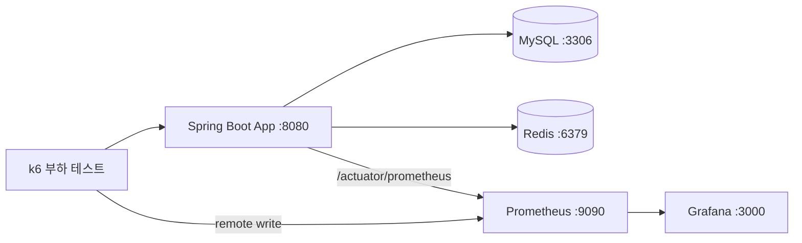

# High Traffic Performance Tuning


대용량 트래픽(목표 **100만 회원 규모**)을 가정한 e-커머스 백엔드 성능 병목 개선 포트폴리오 — 각 시나리오를 `v1~v4` 단계별로 **재현·측정·판단**한다.
기본 측정은 **10만 스케일**(시드 실측 `product` 10만 · `order_item` 15만 · `order` 5만 · `user` 1천)이고, **100만 스케일업 재측정도 완료**했다(`product` 100만 · `order_item` 150만 — 인덱스 25×·랭킹 약 5,700×, Phase 3-6 → [`docs/reports/phase3-6-scale-up.md`](docs/reports/phase3-6-scale-up.md)).

> 목표 규모와 현 측정 규모를 분리해 표기한다. README의 수치는 `results/`의 실측과 어긋나지 않는다 — 측정 규율을 README에서도 그대로 지킨다.

**개발 기간**: 2026-02 ~ (진행 중)

---

## 1. 개요

이 프로젝트는 "가장 고급 기법을 골라 적용했다"가 아니라, **병목을 단계별로 재현하고 통제된 조건에서 측정해, 무엇이 왜 더 나은지 스스로 검증·판단한 기록**이다.

- 각 시나리오는 `v1`(baseline) → `v4`(최종) 버전이 **코드에 공존**해 독립 비교·재측정이 가능하다.
- 성능 비교는 통제변수를 고정한 k6 부하 테스트 / `EXPLAIN` / 정합성 검증으로 뒷받침한다.
- 깊은 수치·분석은 각 `results/`·리포트의 몫이고, 이 README는 그 **지도**다.

---

## 2. 기술 스택

| 구분 | 사용 기술 |
|------|-----------|
| **런타임** | Java 17, Spring Boot 3.5.10 (Web / Data JPA / Validation / Actuator), Gradle |
| **데이터** | MySQL 8.0, Redis 7 (Lettuce), Redisson 3.50 (분산 락 `RLock`) |
| **측정·관측** | k6 1.5, Micrometer + Prometheus, Grafana |
| **인프라** | Docker Compose (MySQL · Redis · Prometheus · Grafana) |

> 상세 측정 환경(머신 사양·버전·표준 테스트 설정)은 [`results/environment.md`](results/environment.md) 참조.

---

## 3. 아키텍처

레이어드 단일 스키마 모놀리식. 패키지는 `com.project.{layer}.{domain}`.

```
src/main/java/com/project
├── api/             # 컨트롤러 + 응답 DTO (엔티티 직접 노출 금지)
│   ├── coupon/  order/  product/  ranking/
├── service/         # 시나리오별 v1~v5 구현 공존
│   ├── coupon/  order/  product/  ranking/
├── domain/          # 엔티티 · 리포지토리
│   ├── coupon/  order/  product/  user/
└── infrastructure/  # redis(랭킹·분산 락), lock
```



> 엔티티 관계 규칙(`Order→User` 무관계 등 의도적 설계)은 [`CLAUDE.md`](CLAUDE.md) 참조.

---

## 4. 시나리오 지도

성능 병목 4개 + 관측 인프라. 각 시나리오는 단계별 버전을 코드에 남겨 비교한다.

| # | 시나리오 | 문제 | 접근 (`v1`→`v4`) | 상태 | 산출물 |
|---|----------|------|------------------|------|--------|
| ① | **인덱스 최적화** | 상품 목록 조회 풀스캔 | no index → category → created_at → **복합 인덱스** (+v5 역순 비교) | ✅ 완료 | [`results/phase3-1-index-optimization/`](results/phase3-1-index-optimization/) (EXPLAIN + k6) |
| ② | **N+1 해결** | 주문 상세 N+1 쿼리 | LAZY → EAGER → `@BatchSize` → **Fetch Join** | ⏳ 미착수 (엔티티만 준비, [ROADMAP](ROADMAP.md)) | — |
| ③ | **실시간 랭킹** | DB `ORDER BY` 정렬 비용 | DB ORDER BY → DB index → Redis String → **Redis Sorted Set** | ✅ 완료 | [`results/phase3-2-ranking-optimization/`](results/phase3-2-ranking-optimization/) |
| ④ | **동시성 제어** | 쿠폰 한정수량 초과발급 | no lock → synchronized → `SELECT FOR UPDATE` → Redis 분산 락 (+v5 커스텀 락) | ✅ 완료 · **DB 행 락(v3) 채택** | **회고 리포트** → [`docs/reports/phase3-3-concurrency-lock.md`](docs/reports/phase3-3-concurrency-lock.md) |
| — | **모니터링 인프라** | before/after 관측 | Actuator + Prometheus 메트릭, k6 remote write, Grafana | ✅ 완료 | [`docker/docker-compose.yml`](docker/docker-compose.yml) |

> ① 인덱스·③ 랭킹은 100만/150만 규모에서도 재측정 완료 — 대용량 거동은 [`docs/reports/phase3-6-scale-up.md`](docs/reports/phase3-6-scale-up.md)(Phase 3-6).
> ② N+1은 의도적으로 미착수 상태다 — 데이터 스케일업과 묶어 최종 규모에서 한 번에 측정할 계획([ROADMAP](ROADMAP.md)). 숨기지 않고 로드맵으로 둔다.

---

## 5. 기술 하이라이트

> 이 프로젝트의 차별점은 "가장 고급 기법을 골랐다"가 아니라 **판단과 측정 규율**이다. ④ 동시성 시나리오가 그 결을 가장 짙게 보여준다 — 아래는 회고 리포트로 가는 티저다.

- **락 전략 5버전 사다리(v1~v5)를 통제변수 핀으로 격리 측정.** 무락은 한정수량 100짜리 쿠폰을 **999개 발급**(10배 초과)했고, v2~v5는 서로 다른 메커니즘으로 초과를 0으로 닫았다. "초과를 막았나"라는 이진 사실만 비교하고, throughput은 버전 간 비교하지 않는다(경합 전략이 같이 움직이는 교란).
- **클라이맥스 — fencing 스톨 데모.** 만료-중간탈취를 주입하니 해제는 거부됐는데도(오해제 차단 ✓) `actual=2 > total=1`. **"안전한 release ≠ 상호배제"** — fencing token 없이는 어느 분산 락도 못 막는 공백을 실측으로 보였다.
- **DB 행 락(v3) 채택 — 더 빨라서가 아니라 더 안전해서.** 락↔데이터가 한 트랜잭션이라 fencing 공백이 구조적으로 없다. "왜 분산 락(트렌드)을 안 썼나"의 답은 트렌드 무지가 아니라 **워크로드 적합성 판단** — 사다리를 커스텀 분산 락까지 끝까지 구현해 보고 내린 기각이다.
- **측정을 함부로 믿지 않는 규율.** 측정 함정을 클래스 A(환경 의존)/B(해석 오독)로 분류해, 자동 판정이 못 거르는 거짓 헤드라인을 닫았다.

> 📖 **회고 리포트** → [`docs/reports/phase3-3-concurrency-lock.md`](docs/reports/phase3-3-concurrency-lock.md) — 판단 서사 · 3축 분석(정합 범위 / 경합 흡수 / 갱신 정책) · 방법론 메타회고. 읽는 데 약 15분.

---

## 6. 로컬 실행

### 6.1 인프라 기동

```bash
docker compose -f docker/docker-compose.yml up -d
```

MySQL(`flashdeal`) · Redis · Prometheus(:9090) · Grafana(:3000)가 뜬다.

### 6.2 ⚠️ 스키마 부트스트랩 (첫 기동 함정)

이 프로젝트는 `application.yml`의 `ddl-auto: validate`로 고정돼 있고, `docker/init-data.sql`은 **의도적으로 비어 있다**(테이블은 Hibernate가 생성). 따라서 **빈 볼륨에서 처음 기동하면 검증할 스키마가 없어 부팅이 실패한다.** 최초 1회만 아래 순서로 스키마를 만든 뒤 `validate`로 되돌린다.

```bash
# 1) src/main/resources/application.yml 에서 1회만:
#    ddl-auto: validate  →  ddl-auto: create

# 2) 앱을 한 번 기동해 스키마 생성
./gradlew bootRun        # 부팅 완료(테이블 생성) 후 종료

# 3) application.yml 을 다시 validate 로 되돌린다 (커밋하지 말 것)
#    ddl-auto: create  →  ddl-auto: validate
```

> `docker compose ... down -v`로 볼륨을 삭제하면 스키마가 사라지므로 이 절차를 다시 거쳐야 한다. `-v` 없는 `down`은 볼륨을 보존한다.

### 6.3 시드 데이터 적재

스키마 생성 후, 목적에 맞는 시드를 **하나** 고른다. 두 스크립트는 시작 시 전 테이블을 `TRUNCATE`하므로 **상호 배타**다(나중에 실행한 쪽이 앞의 데이터를 덮어쓴다).

```bash
scripts/init-seed-data.sh       # 소량 구조 검증용: user 10 · product 100 · order 50 · coupon 3
scripts/generate-test-data.sh   # 측정용 대량: user 1천 · product 10만 · order 5만 · order_item ≈15만 · coupon 3
```

> 헤드라인의 "10만 스케일" 수치는 `generate-test-data.sh`가 적재하는 데이터다. `results/`의 성능 측정도 이 스크립트 기준이다.

### 6.4 앱 실행 & 부하 테스트

```bash
./gradlew bootRun                       # http://localhost:8080
# 부하 테스트 — 시나리오별 스크립트 (test/load/)
k6 run test/load/index-test.js          # ① 인덱스
k6 run test/load/ranking-test.js        # ③ 랭킹
k6 run test/load/coupon-test.js         # ④ 동시성 (→ docs/reports/ 회고 리포트와 연결)
```

> 측정 자동화 스크립트는 `scripts/measure/`에 있다.

---

## 7. 디렉토리 안내

| 경로 | 내용 |
|------|------|
| [`results/`](results/) | 시나리오별 측정 결과 (EXPLAIN · k6 JSON · 정합성). `environment.md`에 측정 환경 |
| [`docs/reports/`](docs/reports/) | 시나리오 회고 리포트 (phase3-3 동시성 락 · phase3-4 비동기 발급 · phase3-6 스케일업) |
| [`docs/`](docs/) | 트러블슈팅 노트, PR 컨벤션 |
| [`specs/`](specs/) | phase별 실행 스펙 |
| [`scripts/`](scripts/) | 시드 생성 · 인덱스 DDL · 측정 자동화 |
| [`ROADMAP.md`](ROADMAP.md) | Now / Next / Later / Done 작업 계획 |
