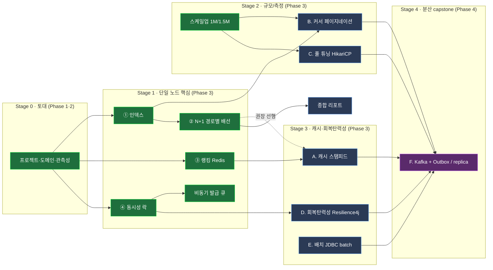

# High Traffic Performance Tuning Roadmap

상품 100만 건·주문 대규모 데이터 트래픽 환경에서 성능 병목을 4개 시나리오(v1~v4 단계별)로 개선·측정하는 포트폴리오 프로젝트의 작업 계획. 세부 실행 지시는 `CLAUDE.md`·`specs/` 각 phase 스펙·`docs/PR_CONVENTION.md`를 참조.

레포: https://github.com/data-sy/high-traffic-performance-tuning

---

## 성능 주제 마스터 체크리스트 (학습 경로)

전체 성능 튜닝 주제를 "단일 노드 → 규모 → 캐시·회복탄력성 → 분산"으로 쌓는 학습 경로. `[x]`=구현·측정 완료, `[ ]`=미착수. **이 체크리스트는 "무엇을 다룰지"의 전체 지형도**이고, 실제 진행 상태(착수/보류)는 아래 Now/Next/Later/Done 칸반이 정본. Done 항목은 칸반에 상세 링크가 있다.

범례: 🟩 완료 · 🟦 미착수 후보 · 🟪 capstone  (다음 착수는 아래 Now/Next 칸반이 정본)

**Phase 매핑:** Stage 0 = Phase 1·2(토대) · **Stage 1~3 = Phase 3**(단일 노드 모놀리식 성능 — 코어 4종 + 캐시·페이지네이션·풀·회복탄력성·배치) · **Stage 4 = Phase 4**(분산·이벤트 토폴로지). phase 경계 기준은 "원래 4종을 다 했나"가 아니라 **단일 노드 vs 분산**이다 — ② N+1(3-7)은 코어 4종을 닫지만 Phase 3의 끝은 아니며, A~E도 단일 노드라 Phase 3(3-8~)에 속한다. phase는 더 잘게 쪼개지 않는다(가벼운 phase-spec 체계 유지, 아래 「작업 단위 분할 원칙」).

> 포폴 관점 우선순위: 측정 가능한 트러블슈팅(아래 A~E)이 1순위, 이벤트 기반(Kafka/Outbox, F)이 capstone, 순수 MSA 분리는 후순위(측정 수치보다 아키텍처 학습용).

**Stage 0 — 토대**
- [x] 프로젝트 셋업 (Phase 1)
- [x] 도메인 엔티티·시드/대량 데이터 (Phase 2)
- [x] 관측성 스택 — Actuator + Prometheus + Grafana(provisioning-as-code)

**Stage 1 — 단일 쿼리/자원 최적화 (핵심 4종 + 심화)**
- [x] ① 인덱스 최적화 — 복합 인덱스 (category, created_at)
- [x] ② N+1 해결 — 경로별 배선 (v1 LAZY→v2 EAGER→v3 @BatchSize→v4 Fetch Join→v5 DTO Projection) · **Phase 3-7 완료**
- [x] ③ 실시간 랭킹 — Redis Sorted Set
- [x] ④ 동시성 제어 — 분산 락 (+ 다중 인스턴스 정합 실증)
- [x] 비동기 발급 — 큐 사다리 (@Async → Redis List → Redis Stream)

**Stage 2 — 규모/측정 심화**
- [x] 데이터 스케일업 재측정 — product 1M / order_item 1.5M
- [ ] B. 커서(keyset) 페이지네이션 — deep offset 문제 (인덱스 시나리오 심화편)
- [ ] C. 커넥션 풀(HikariCP) 튜닝 — 풀 사이즈 역설(Little's law)

**Stage 3 — 캐시·회복탄력성**
- [ ] A. 캐시 전략 + 스탬피드 방어 — look-aside, mutex/PER, TTL jitter, penetration
- [ ] D. 회복탄력성 — Resilience4j (타임아웃·서킷브레이커·벌크헤드)
- [ ] E. 대량 처리 — JDBC batch / rewriteBatchedStatements

**Stage 4 — 분산·이벤트 토폴로지**
- [ ] F. 읽기/쓰기 분리 — replica routing
- [ ] F. 이벤트 기반 비동기 — Kafka + Transactional Outbox (capstone)
- [ ] (선택) MSA 분리 — 측정보다 아키텍처 학습용, 후순위

**문서**
- [ ] 4개 시나리오 측정 결과 종합 리포트 (포트폴리오용)

---

## Now — 진행 중

- (없음 — Phase 3-7 N+1 완료. 코어 시나리오 4종 마무리. 다음 착수는 Next 참조)

---

## Next — 다음 (착수 예정)

- Phase 3-7 N+1 완료(Done). 다음 후보: **4개 시나리오 종합 리포트**(코어 4종 종합)·**신규 단일 노드 주제 A~E**(마스터 체크리스트 Stage 2~3, 권장순 A→B→C→D→E). 우선순위가 오르면 여기로 승격.

---

## Later — 백로그 (아직 미착수, 검토 단계)

- **[문서] 4개 시나리오 측정 결과 종합 리포트** — 포트폴리오용으로 인덱스·N+1·랭킹·동시성 결과를 한 문서로 종합 (각 `results/phaseN-*/` 기반, ①의 Grafana 대시보드 캡처 포함)
- **[Phase 3-5 후속] concurrency 503 분해 패널 실데이터 캡처** — `concurrency.json`의 ⓐ/ⓑ/ⓒ(503 원인) 패널은 정상이나, 503을 내려면 풀 포화/락대기 유발 부하(쿠폰 재고·Hikari 풀 크기 등 파라미터 조정)가 필요. 향후 동시성 재측정 맥락에서 실데이터로 캡처
- **[신규 시나리오 후보군] 마스터 체크리스트 Stage 2~4 미착수 주제** — 상세는 상단 「성능 주제 마스터 체크리스트」 참조. 우선순위 오르면 개별 Phase로 떼어 Next 승격(권장 착수 순: A 캐시 스탬피드 → B 커서 페이지네이션 → C 풀 튜닝 → D 회복탄력성 → E 배치 → F Kafka/Outbox)
  - A. 캐시 전략 + 스탬피드 방어 (look-aside·mutex/PER·TTL jitter)
  - B. 커서(keyset) 페이지네이션 (deep offset)
  - C. 커넥션 풀(HikariCP) 튜닝 (Little's law 역설)
  - D. 회복탄력성 — Resilience4j (타임아웃·서킷·벌크헤드)
  - E. 대량 처리 — JDBC batch
  - F. 분산 토폴로지 — 읽기/쓰기 분리, Kafka + Transactional Outbox (capstone)
- **[기능 폭 / JD 대응] 결제 외부 API 연동 (PG 연동)** — 성능 Stage가 아닌 **기능 경험** 백로그(채용공고에 "결제 연동 경험" 종종 등장). 외부 결제대행사(PG) API 연동 = 결제 승인/취소, **멱등성(idempotency key)**, **웹훅 콜백** 수신·검증, 주문↔결제 상태 정합, 외부 장애 대비(타임아웃·재시도·서킷 → 후보 **D 회복탄력성**과 연결), 보상 트랜잭션
  - 도메인 연계: `Order → Payment @OneToOne` 신규(N+1 후보 #7과도 맞물림). 모의 PG(샌드박스/스텁)로 외부 연동 재현
  - 스펙 미작성 — 착수 시 `specs/`에 별도 phase로 작성
- (아이디어 추가 시 여기로)

---

## Done — 완료

날짜·PR 번호는 git history 기준. 상세 변경 내역은 각 PR 또는 `specs/` 해당 phase 스펙 참조.

- **[Phase 3-7 / 시나리오 ② N+1] 주문 조회 N+1 — v1~v5 사다리·경로별 배선** — 2026-06-23 (PR [#16](https://github.com/data-sy/high-traffic-performance-tuning/pull/16), `phase/3-7-n-plus-one`)
  - 주문 **목록**(컬렉션 N+1)·**상세**(to-one N+1) 두 경로를 v1 LAZY→v2 EAGER→v3 @BatchSize→v4 Fetch Join→v5 DTO Projection으로 해소. **스키마 변경 0·신규 의존성 0**(v5는 QueryDSL 아닌 JPQL 생성자 표현식)
  - **쿼리 수(1차 지표, 격리 VU=1)**: 목록 v1 1150→v4 1·v5 2·v3 27, 상세 v1 7→v2/v4 1. v2 EAGER는 목록 N+1 잔존(1+N, 대표상품 JOIN 흡수)·상세는 `find()`가 흡수(1)
  - **p95(보조)**: 목록 v5 470ms < v4 1586ms < v3 3347ms ≪ v1(콜드 86–154s, 8VU 부하 0건 완료). v5가 쿼리 수는 v4보다 많아도 전송·적재 최소라 최속
  - **EXPLAIN 백스톱**: `order_id`·`user_id` 무인덱스 풀스캔 → p95는 보조, 쿼리 수가 인덱스-무관 1차 지표. **코어 시나리오 4종 완성**(마스터 체크리스트 Stage 1)
  - 결과: `results/phase3-7-n-plus-one/`, 회고 [`docs/reports/phase3-7-n-plus-one.md`](docs/reports/phase3-7-n-plus-one.md), 스펙 `specs/phase3/phase3-7-n-plus-one.md`
- **[정리] 로컬 stale 브랜치·docker 잔여물 일괄 정리** — 2026-06-19
  - 머지 완료 브랜치 3개(`fix/redis-config` #11, `phase/3-3-multi-instance` #10, `phase/3-4-async-issuance` #13) 삭제
  - 로컬 고유 내용 브랜치(`*-mainrun`·`sandbox/*` 5개)는 `git bundle`로 로컬 아카이브 백업 후 워크트리 제거·브랜치 삭제(복원 가능)
  - docker 잉여·고아 볼륨 정리 — 사용 중 4개만 보존(`docker_mysql-data` 1M/1.5M 데이터·`docker_grafana-storage`·redis·prometheus)
- **[Phase 3-6 / 측정] 데이터 스케일업 — 100만/150만 대용량 재측정** — 2026-06-19 (PR [#15](https://github.com/data-sy/high-traffic-performance-tuning/pull/15), `phase/3-6-scale-up`)
  - `product` 1,000,000 / `order_item` 1,500,000 적재 후 시나리오① 인덱스·③ 랭킹을 동일 런 내부에서 재측정(전 step/ver 비포화 게이트 PASS — `http_req_failed≈0`·Hikari `pending==0`·statement-timeout 0)
  - **① 인덱스**: 무인덱스 `type=ALL`+filesort 319.6ms → 복합 인덱스 `type=ref`(no filesort) 12.7ms = **25.2×**. 잘못된 단일 인덱스(step3/5)는 `type=index`라도 무인덱스보다 느림(7~8s)도 재현
  - **③ 랭킹**: DB 1.5M `GROUP BY` 풀스캔(`type=ALL`) 39.3s → Redis Sorted Set 6.9ms = **약 5,700×**
  - cross-scale 정량은 인프라-불변 `EXPLAIN rows`로: 무인덱스 스캔량 100K→1M 약 **10배**(99,742→993,313)
  - 결과: `results/phase3-6-scale-up/`(EXPLAIN + k6 + 비포화 게이트), 회고 [`docs/reports/phase3-6-scale-up.md`](docs/reports/phase3-6-scale-up.md)
  - **전시 캡처는 3-6 범위에서 의도적 제외(descoped):** 랭킹 대시보드 before/after 스크린샷은 헤드라인 수치(k6 p95)와 별개인 avg-latency 데모라 측정·머지를 막지 않도록 제외. 절차는 [`results/phase3-6-scale-up/screenshots-runbook.md`](results/phase3-6-scale-up/screenshots-runbook.md)에 보존 — 전시 보강 시 재개
- **[Phase 3-5 / 인프라·관측성] Grafana 관측 스택 코드화 (provisioning-as-code)** — 2026-06-16 (PR [#14](https://github.com/data-sy/high-traffic-performance-tuning/pull/14), `phase/3-5-monitoring`)
  - datasource(고정 `uid=prometheus`) + 시나리오 4종 대시보드(index/ranking/concurrency/async) + provider를 repo에 정의하고 compose에 bind-mount → `docker compose up`만으로 자동 로드(수동 클릭 0, `grafana-storage` 볼륨 불변)
  - 두 메트릭 소스 대시보드화: (a) actuator 스크레이프(HikariCP·HTTP·executor 큐) (b) k6 remote-write. PoC에서 k6 실명(`k6_`+`_total`/`_p95`·`_p99`) 확정 후 PromQL에 반영
  - 결과: `docker/grafana/`, runbook `docker/grafana/README.md`, PoC `specs/phase3/poc-phase3-5-verification.md`, Step D 스크린샷 `results/phase3-5-monitoring/screenshots/`(랭킹 v1 DB 107ms vs v4 Redis 0.8ms before/after)
- **[시나리오 / 비동기 발급] 쿠폰 비동기 발급 — 큐 구조 사다리** — 2026-06 (PR [#13](https://github.com/data-sy/high-traffic-performance-tuning/pull/13), `phase/3-4-async-issuance`)
  - **v6a** @Async 인메모리 스레드풀 → **v6b** Redis List(BRPOP·ack 없음, 유실 재현) → **v6c** Redis Stream(컨슈머 그룹·PEL·XACK, 재전달 흡수)
  - 동기 발급(v3)의 "줄을 큐로 옮긴" 비용 프로파일 측정: 202 응답 ↔ E2E 발급 지연·큐 깊이·수렴 시간. 동시성 게이트(초과발급 0)는 유지
  - 결과: `results/phase3-4-async/`, 회고 `docs/reports/phase3-4-async-issuance.md`, 스펙(역방향) `specs/phase3/phase3-4-async-issuance.md`
- **[시나리오 ④ / 검증] 다중 인스턴스 정합 실증 (보강#1)** — 2026-06 (PR [#10](https://github.com/data-sy/high-traffic-performance-tuning/pull/10), `phase/3-3-multi-instance`)
  - 동일 v1~v5 락 코드 + 다중 인스턴스 토폴로지(앱 N replica + Nginx LB + Prometheus 타깃 N개), 하네스 무수정 재사용(`-e BASE=<LB>`·`noConnectionReuse` 설정만)
  - 결과: **v2(synchronized) 붕괴 재현** + **v3~v5 경계초월 정합 유지**(Σ 인스턴스 == DB) → "다중서버 = 공유 좌표 필요, v3가 이미 제공"을 데이터로 확정. "단일 JVM 미실증" 정직성 꼬리표 제거
- **[시나리오 ④] 동시성 제어 — 쿠폰 발급 락 사다리** — 2026-06-08 (PR [#8](https://github.com/data-sy/high-traffic-performance-tuning/pull/8), [#9](https://github.com/data-sy/high-traffic-performance-tuning/pull/9), `phase/3-3-concurrency-lock`)
  - **v1** no lock(초과 999 재현) → **v2** synchronized → **v3** SELECT FOR UPDATE(★ 프로덕션 채택) → **v4** Redisson RLock → **v5** 커스텀 SET NX+Lua, + fencing 스톨 데모
  - 워크로드 적합성으로 v3 채택(락↔데이터 동치 → fencing 무공백). throughput 버전 간 직접 비교 금지 규율, 통제변수 핀, 503 ⓐ/ⓑ/ⓒ 분류
  - 결과: `results/phase3-3-concurrency/`(analysis.md 동결), 회고 `docs/reports/phase3-3-concurrency-lock.md`, 스펙 `specs/phase3/phase3-3-concurrency.md`
  - 다중 인스턴스 정합: 보강#1로 분리 실증 완료(아래 항목)
- **[인프라] 모니터링 인프라 구축** — 2026-02-24 (PR [#6](https://github.com/data-sy/high-traffic-performance-tuning/pull/6))
  - Spring Boot Actuator + Prometheus 메트릭 엔드포인트, Docker Compose에 Prometheus·Grafana 추가
  - k6 Prometheus remote write 출력 + step 태깅·trend 통계
- **[시나리오 ③] 실시간 랭킹 — Redis Sorted Set** — 2026-02-09 (PR [#4](https://github.com/data-sy/high-traffic-performance-tuning/pull/4), [#5](https://github.com/data-sy/high-traffic-performance-tuning/pull/5), phase3-2)
  - **v1** DB ORDER BY → **v2** DB index → **v3** Redis String → **v4** Redis Sorted Set(실시간 갱신)
  - Redis 인프라·DTO·리포지토리, PoC 검증, race condition 테스트, 성능 비교 결과 저장
  - 스펙: `specs/phase3/phase3-2-ranking_en.md`, `specs/phase3/poc-phase3-2-verification_en.md`
- **[시나리오 ①] 인덱스 최적화 — 복합 인덱스** — 2026-02-05 (PR [#3](https://github.com/data-sy/high-traffic-performance-tuning/pull/3), phase3-1)
  - **v1** no index → **v2** category → **v3** created_at → **v4** composite(+ v5 reverse composite 비교)
  - 상품 목록 API(카테고리 필터·페이징), EXPLAIN 측정 자동화, k6 부하 테스트, PoC 검증
  - 스펙: `specs/phase3/phase3-1-index-optimization.md`, `specs/phase3/poc-phase3-1-verification.md`
- **[Phase 2] 도메인 엔티티** — 2026-02-03 (PR [#2](https://github.com/data-sy/high-traffic-performance-tuning/pull/2))
  - 4개 시나리오용 엔티티·리포지토리, 시드 데이터 + 대량 테스트 데이터 생성 스크립트, `ddl-auto` create→validate 전환
  - 스펙: `specs/phase2/phase2-domain-entity.md`
- **[Phase 1] 프로젝트 셋업** — 2026-02-03 (PR [#1](https://github.com/data-sy/high-traffic-performance-tuning/pull/1))
  - Spring Boot 설정·디렉터리 구조, Docker Compose(MySQL 8·Redis 7), PR 컨벤션, Claude 프로젝트 가이드라인
  - 스펙: `specs/phase1/phase1-project-setup.md`

---

## 작업 단위 분할 원칙

이 프로젝트는 4개 시나리오를 phase 단위로 진행하는 단일 스키마 모놀리식이라, 무거운 Epic/Milestone 구조 대신 phase-spec 중심의 가벼운 체계를 사용한다.

표준 PM 용어와의 대응(리네이밍이 아니라 매핑 — repo의 작업 단위 명칭은 "Phase"로 통일한다):

| 표준 PM | 이 프로젝트 | 예 |
|---|---|---|
| Epic | 프로젝트 전체 (한 덩어리) | high-traffic-performance-tuning |
| **Milestone** | **Phase** | Phase 1·2(셋업·도메인), Phase 3(시나리오 최적화·측정), Phase 4(대용량 분산처리 — 예정) |
| Task/Story | 시나리오·Spec | 3-1 인덱스, 3-2 랭킹, 3-3 동시성, 3-4 비동기 발급, 3-5 관측성, 3-6 스케일업 |

- Phase가 Milestone 역할을 한다(별도 Milestone 계층 없음). 이미 시작된 넘버링(~3-4)은 유지하고 소급 리네이밍하지 않는다.
- 칸반 상태(Now/Next/Later/Done)는 위 단위들과 직교한다 — 단위는 "무엇"을, 상태는 "어디까지"를 가리킨다.

- **Roadmap** — 모든 작업의 단일 인덱스 (이 문서)
- **Spec** — `specs/phaseN/` 디렉토리별 단계 구현 명세(phase1·phase2·phase3). 각 스펙을 그대로 따라 구현 (`CLAUDE.md` 규칙)
- **PoC** — 도구·접근 사전 검증은 해당 phase 디렉토리의 `poc-*.md`
- **Templates** — 신규 phase 작성 시 `specs/templates/`(phase-spec-template·phase-human-checklist-template) 참조
- **CLAUDE.md** — 프로젝트 규칙·엔티티·관계·API 구조·컨벤션 (불변 규칙)
- **PR_CONVENTION.md** — PR 작성 규칙 (`docs/`)

## 갱신 규칙

- 새 작업 착수 시 Now로 이동, 관련 브랜치명 함께 기록
- 완료 시 Done으로 이동, 완료일·PR 번호 기록
- 새 아이디어는 Later에 먼저 추가하고, 우선순위가 올라가면 Next로 승격
- 보류된 작업은 Next에 두고 "보류 사유" 명시
- 각 시나리오는 v1~v4 모든 버전이 코드에 공존 (독립 비교·재측정용, `CLAUDE.md` API 구조 규칙)
