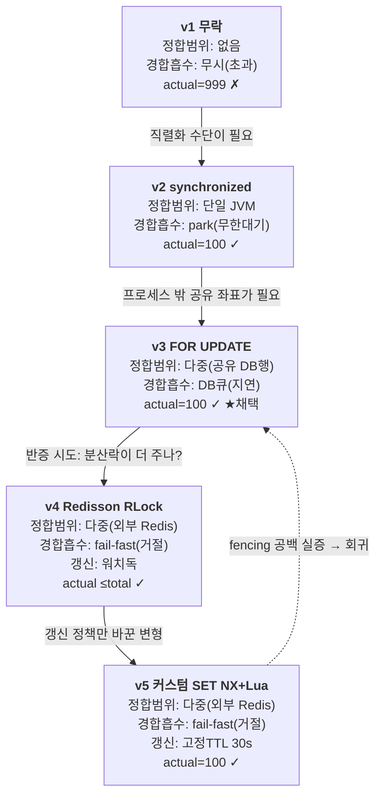
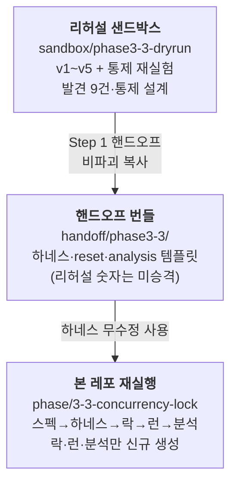
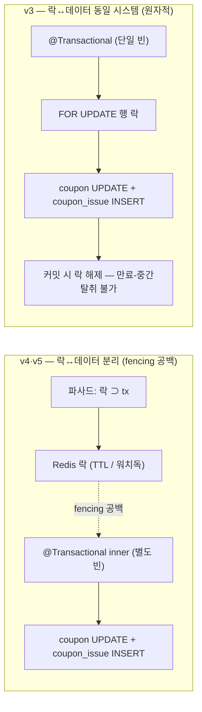

# Phase 3-3 회고 — 쿠폰 발급 동시성 락 사다리

> 쿠폰 초과발급은 정합성 문제다. 락 5단계(v1~v5)로 다루고, 이 워크로드에서는 DB 행 락(v3)을
> 발급 경로에 배선했다. 이 문서는 그 선택의 근거와 측정 과정을 정리한다.

| 항목 | 내용 |
|------|------|
| **범위** | 쿠폰 한정수량 초과발급(over-issuance) 동시성 제어 — 5버전 락 사다리(v1~v5) + fencing 스톨 데모 |
| **브랜치** | `phase/3-3-concurrency-lock` (리허설 `sandbox/phase3-3-dryrun`에서 핸드오프) |
| **핵심 결과** | 5가지 락 전략을 통제변수 핀으로 **격리 측정**하고, 분산 락의 **fencing 공백을 스톨 데모로 실증**해, 프로덕션 발급 경로를 **DB 비관적 행 락(v3)** 으로 결정했다. |
| **상태** | `analysis.md` 확정·동결, 별도 세션 `/audit-doc` Healthy (clean) |
| **성격** | 동시성 정합성 제어의 의사결정·측정 회고 (성능 개선 보고 아님). |

> ⚠️ **측정 규율 하나**: 버전 간 throughput을 직접 비교하지 않는다. "어느 락이 제일 빠른가"라는
> 헤드라인을 세우지 않고, throughput은 각 버전 **정책의 자체 특성**으로만 읽는다. 비교 합법 축
> (정합 actual)과 정책 관찰치(503 거절률)만 시각화한다. 이유는 §9에서 정리한다.

---

## 1. 한 줄 요약

무락(v1)은 한정수량 100짜리 쿠폰을 **999개 발급**(+899, 10배 초과)했다 — 동시성 제어의 부재가
한정 자원에서 곧 정합 붕괴임을 기준선으로 재현했다. v2~v5는 서로 다른 메커니즘으로 **초과 0**을
회복했고, 커스텀 분산 락까지 구현해 비교한 끝에, 이 워크로드(임계 구간이 곧
DB 쓰기)에서는 **Redis 분산 락을 기각하고 v3(DB 비관적 행 락)을 정규 발급 경로에 배선**했다. 근거는
"v3로 충분해서"가 아니라 **락↔데이터가 같은 트랜잭션 안에 있어 fencing 공백이 구조적으로 없다 =
더 안전해서**다. 분산 락은 보호 대상이 DB 밖일 때 본래 자리를 찾는다.

---

## 2. 배경 — 왜 이 문제, 왜 5버전 사다리인가

**도메인 — 한정 자원 동시성.** 쿠폰은 `total_qty=100`의 한정 수량이다. `unique(coupon_id, user_id)`는
*같은 사용자의 중복 발급*을 이미 DB가 막는다. 이 시나리오가 증명하는 문제는 그게 아니라 **서로 다른**
다수 사용자가 동시에 몰릴 때의 **초과 발급**이다. `issued` 카운터의 *read → check(`issued < total`) →
increment*가 비원자라, 500 VU가 stale `issued`를 동시에 읽고 전부 통과한다. 한정 자원에 동시 접근이
걸리는 모든 도메인(재고, 좌석, 선착순)의 축약판이다.

**왜 사다리인가 — 정합 범위를 한 칸씩 넓히며 각 경합 처리의 성격을 드러내려고.** 각 칸은 *더 낫고
못한* 단계가 아니라 **서로 다른 조건에서 각자 정답**인 별개 도구다. 사다리를 끝까지 밟은 건 우열을
매기려는 게 아니라, 분산 락이 v3 대비 무엇을 더 주는지(혹은 못 주는지)를 직접 구현해 확인하기
위해서였다.



세 축으로 읽었다 — **정합 범위**(어디까지 같은 결과를 보장하나) / **경합 흡수**(직렬화 비용을 어떻게
배출하나) / **갱신 정책**(보유 중 만료를 어떻게 다루나). 한 버전이 세 축에서 동시에 움직이므로,
버전 간 단일 숫자 비교는 의미가 무너진다 — 이게 §9 방법론의 출발점이다.

| 버전 | 정합 범위 | 경합 흡수 | 갱신 정책 |
|------|-----------|-----------|-----------|
| v1 무락 | 없음 (초과) | 무시 | — |
| v2 synchronized | 단일 JVM | park (무한 대기) | — |
| **v3 FOR UPDATE ★** | 다중 (공유 DB 행) | DB 큐 (지연) | — |
| v4 Redisson | 다중 (외부 Redis) | fail-fast (거절) | 워치독 |
| v5 커스텀 SET NX | 다중 (외부 Redis) | fail-fast (거절) | 고정 TTL 30s |

---

## 3. 접근 — 측정 유효성을 먼저 깔고 시작했다

수치를 내기 전에, **그 수치를 신뢰할 수 있는 상태**부터 만들었다.

**파이프라인 — 리허설에서 함정을 미리 잡고, 본 실행은 처음부터 재실행.**



리허설이 5세션에 걸쳐 잡은 발견 9건·통제 설계·정성 결론은 본 스펙에 흡수했지만, **리허설의 측정
숫자는 본 실행 결과로 승격하지 않았다.** 하네스(`coupon-test.js`, `run-coupon-concurrency.sh`,
`reset-coupon.sql`)만 비파괴 복사로 무수정 재사용하고, 락 구현·런·분석은 본 레포에서 새로 생성했다.

**통제변수 규율 — 값이 정답이 아니라 "전 버전 동일"이 핵심.** v1~v5에 공통 핀을 박았다:

| 변수 | 핀 값 | 검증 방식 |
|------|-------|-----------|
| HikariCP `maximum-pool-size` | 10 | negative test로 결정적 실측(11로 띄워 메트릭 확인 → 10 복원) |
| HikariCP `connection-timeout` | 30000ms | pool과 동일 바인더 증명 → 형제 키 전이로 닫음 |
| Tomcat `threads.max` | 200 | ⚠️ 런타임 직접 검증 안 함 — 핀이 먹든 기본값이든 결과 동일이라 구별할 시나리오 부재 |
| MySQL `innodb_lock_wait_timeout` | 50s | 하네스 런타임 assert(불일치 abort) |
| MySQL `transaction_isolation` | REPEATABLE-READ | 하네스 런타임 assert(불일치 abort) |

핀 3종 중 2종은 결정적 실측, Tomcat 1종은 무해 미검증이다. "모든 핀을 런타임 실측했다"가 아니라,
검증으로 구별할 시나리오가 있는 핀만 검증했다(없으면 검증 동기 부재).

**성공 시그니처도 코드가 아니라 데이터로 고정했다.** 정합 판정의 단일 진실 소스는
`coupon.issued` 카운터가 아니라 **`SELECT COUNT(*) FROM coupon_issue`(= `actual`) 행 수**다 —
이유는 바로 다음 절 v1에서 드러난다.

---

## 4. 검증 — 3축 서사로 읽은 다섯 버전

### 4.1 정합 범위 축 — 없음 → JVM → DB → Redis

**v1 (무락) — 카운터가 거짓말을 한다.** `@Transactional`은 걸렸으나 동시성 제어가 없다. 실측
`actual=999`(+899, 10배 초과). 여기서 **첫 함정**을 만났다 — `coupon.issued` 카운터는 **100**으로
천장에 캡돼 "한도 지켜짐"으로 보인다(lost update). 카운터만 믿으면 오판한다. 진실은 행 수 999.
이 한 칸이 "정합 판정은 항상 행 수로"라는 규율의 근거가 됐다. **v1의 FAIL은 결함이 아니라 기준선의
성공 신호다 — 여기서 PASS가 났다면 그게 버그다.**

**v2 (synchronized) — 단일 JVM 모니터.** 초과가 100으로 잡혔고(`actual=100` PASS), **카운터까지
100으로 진실과 일치**했다 — 직렬화가 read-modify-write를 원자화하니 `coupon.issued`도 정확해졌다.
단 프록시 함정을 피해야 했다: `@Transactional` 메서드에 `synchronized`를 같이 걸면 커밋이 모니터
밖에서 일어나 단일 JVM에서도 초과가 난다. 그래서 모니터를 tx 경계 바깥(파사드)에 두고 실제 tx는
별도 빈 `CouponIssueServiceV2Inner`를 프록시 호출했다(락 ⊃ tx). **경계**: 모니터는 그 JVM 안까지만
유효 — 다중 인스턴스면 각자 별도 모니터라 깨진다(단일 JVM 측정으론 미실증 — **알려진 한계**).

**v3 (SELECT FOR UPDATE) — 공유 DB 행.** v2와 정반대 구조다. 행 락은 커밋 시 풀리므로 락 획득·검사·
발급을 **하나의 `@Transactional` 안**에서 한다(단일 빈, 파사드 없음). `findByIdForUpdate`로 행 락 후
검사/발급. `actual=100` PASS. 직렬화 좌표가 로컬 모니터(v2) → **공유 DB 행**으로 이동해 다중 인스턴스
경계를 초월한다(개념적 보장; 단일 JVM은 미실증 — 다음 후보).

**v4/v5 (분산 락) — 외부 Redis.** 직렬화 좌표를 DB 밖으로 더 뺐다. 둘 다 `≤ total`(초과 0)로 정합을
회복한다. 단 여기서 더해지는 건 정합의 *범위*가 아니다 — v3가 이미 공유 DB 행으로 다중 인스턴스
정합을 주므로, v4/v5가 넘어 주는 건 *비-DB 임계 구간 보호*뿐이다(§6).

```
정합 actual_issued (total=100, 정확성 축 500VU/10s) — 비교 합법 축: 초과발급 차단 여부

  v1 무락     │████████████████████████████████████████ 999   ✗ (+899, 10배 초과)
  v2 sync     │████ 100                                        ✓
  v3 FORUPD   │████ 100                                        ✓  ★ 채택
  v4 Redisson │██▍  62*                                        ✓ (초과 0; *미충전, 90s→100 수렴)
  v5 SETNX    │████ 100                                        ✓
              └──→ total=100 한도선
```

> 이 막대는 **비교 합법 축**이다 — "초과발급을 막았나"는 모든 버전에 같은 의미를 갖는 이진 질문이라
> 직접 비교가 정당하다. v4의 62는 미달이 아니라 fail-fast의 한도 미충전(§9 정책 의존 오독) — 90s로 늘리면
> 100으로 수렴한다.

### 4.2 경합 흡수 축 — 무시 → park → DB큐 → fail-fast

각 버전이 직렬화 비용을 **어디로 배출하는가**가 다르다. 이게 throughput을 버전 간 비교할 수 없는
근본 이유다(§9).

- **v1**: 무시(초과로 샌다).
- **v2**: **park 무한대기** — 모니터 대기라 거절이 없다 → **503=0**(양축).
- **v3**: **DB 대기열(지연)** — FOR UPDATE가 커넥션을 쥔 채 행 락 대기 → 대기 요청이 커넥션 점유 →
  풀 포화(실측 HikariPool **active=10/10, pending=189, idle=0**). 그런데 **503도 0**이었다.
- **v4/v5**: **fail-fast 거절** — `tryLock(0,…)` 즉시 실패 → 503 ⓒ. 거절률 99%대.

**여기서 v3의 음성 결과(ⓐ/ⓑ)가 서사의 핵심 데이터다.** ⓐ(풀 고갈)/ⓑ(행락 타임아웃) 503 분류는
배선·스모크·풀 포화까지 검증됐으나, **이 핀·부하에선 타임아웃 미발생으로 라우팅이 미주행**(503=0)
했다. 이것은 공백이 아니라 **발견**이다 — 임계 구간이 짧아(check+insert+commit 수 ms) 커넥션이
빠르게 순환 → 어느 대기자도 connTO 30s를, 어느 행락 대기도 50s를 안 넘겼다. 즉 **이 조건에서 DB 행
락은 경합을 거절(503)이 아니라 지연(성공 p95 2.6s)으로 흡수**한다. 503 라우팅·errorCode 분류 코드
자체의 실주행 증거는 v4/v5의 ⓒ(LOCK_NOT_ACQUIRED)에서 확보된다 — 분류 코드는 v4/v5에서 증명,
ⓐ/ⓑ만 이 워크로드에서 음성. **메울 공백이 아니라 기록할 사실이다.**

```
503 거절률 (성능 축) — 우열 아님, "경합 흡수 정책의 이분"을 보이는 관찰치

  블로킹(경합을 지연으로 흡수)            fail-fast(경합을 거절로 흡수)
  ──────────────────────────            ──────────────────────────────
  v1 │ 0%                               v4 │█████████████████ 99.9%  ⓒ 249,563 (미분류 0)
  v2 │ 0% (park 무한대기)               v5 │█████████████████ 99.7%  ⓒ 281,977 (미분류 0)
  v3 │ 0% (음성: ⓐ0/ⓑ0, 지연 흡수)
```

> 이 막대는 throughput 우열이 아니다 — 같은 503이라도 v3의 0은 "지연으로 흡수", v4/v5의 ~100%는
> "단일 핫키+즉시실패의 귀결"이라 의미가 다르다. 거절률 99%대는 **분산 락 일반의 성질이 아니라 이
> 워크로드(단일 핫키 couponId=1) 조건의 산물**이다(범위 한정).

### 4.3 갱신 정책 축 — 워치독(v4) vs 고정 TTL(v5)

v4는 leaseTime 미지정 → **워치독 자동 갱신**, v5는 **고정 TTL 30s 무갱신**. **정상 부하로는 둘을 가를
수 없다(발견8)**: hold(수 ms) ≪ TTL(30s)이라 고정 TTL이 임계 구간 중간에 만료될 일이 없어, 워치독이
막아줄 사건 자체가 없다. 따라서 v5와 v4의 throughput 차이는 **갱신 정책이 아니라 대기/락 구현
아티팩트**(Redisson pub/sub+워치독 스케줄링 vs 커스텀 경량 SET NX)다. "고정 TTL이 빠르다"로 읽으면
틀린다 — 어느 쪽이 빠르다는 인과를 **세우지 않는다.** 갱신 정책의 진짜 효과는 hold>TTL인 스톨
조건에서만 드러난다.

### 4.4 fencing 스톨 데모

`CouponStallDemoService`로 만료-중간탈취를 인위 주입했다. 통제: `total_qty=1`, **`ttl=1s < stall=3s`**.
스톨 중 보유 TTL이 만료되면 다른 홀더가 만료된 락을 훔쳐 같이 발급한다.

- **결과**: A `released=false`(compare-del이 자기 토큰 아님을 보고 **해제 거부 = 오해제 차단 ✓**)
  인데도 **`actual=2 > total=1`**(user 9001·9002 둘 다 발급) = **동시 점유 발생 ✗**.

여기서 핵심 결론이 나온다: **안전한 release(오해제 차단) ≠ 상호배제(동시 점유 차단).**
compare-del은 전자만 준다. 후자, 즉 만료-중간탈취로 인한 동시 점유는 **fencing token(자원 측
단조번호 검증) 없이는 어느 분산 락도 못 막는다** — v4 워치독도 GC pause/네트워크 단절 앞에선 같은
한계다. (이 초과는 데모의 통제 산물 — 정상 v4/v5는 초과 0.) 반면 락↔데이터가 같은 트랜잭션인 v3는
만료-중간탈취 자체가 불가 → 이 공백이 **구조적으로 없다.** 우열이 아니라 **메커니즘의 차이**다 —
락을 데이터에서 떼어냈는지 아닌지.

### 4.5 outcome별 분리 비교표

> ⚠️ throughput·지연·503율은 **버전 간 직접 비교 금지** — 경합 전략이 버전마다 달라 같은 컬럼이라도
> 의미가 다르다. 아래는 **outcome별 분리 + 버전 내 정책 관찰치**로만 읽는다.

| 지표 | v1 | v2 | v3 ★ | v4 | v5 |
|------|----|----|------|----|----|
| **정합** actual (total=100) | **999** | 100 | 100 | ≤total ✓ ¹ | 100 |
| 초과발급 | **+899** | 0 | 0 | 0 | 0 |
| 판정 | FAIL(정답²) | PASS | PASS | PASS ¹ | PASS |
| 경합 처리 | 무시(초과) | park | DB큐(지연) | fail-fast(거절) | fail-fast(거절) |
| 성공(200) throughput ³ | 404.0/s | 263.6/s | 317.5/s | 6.3/s | 28.4/s |
| 성공(200) p95 / p99 ³ | 1838/1935ms | 2971/3478ms | 2630/2778ms | 418/467ms | 106/145ms |
| 락거절(503) p95 / p99 | — | — | — | 50/72ms | 66/83ms |
| 503율(성능, 버전 내) | 0% | 0% | 0% ⁴ | 99.9% | 99.7% |
| 503 분해 | — | — | ⓐ0/ⓑ0 ⁴ | ⓒ 249,563 | ⓒ 281,977 |
| 정합 범위 | 없음 | 단일 JVM | 다중(공유 DB행) | 다중(외부 Redis) | 다중(외부 Redis) |
| 갱신 정책 | — | — | — | 워치독 | 고정 30s |
| fencing | — | — | 구조적 무공백 | 부재 | 부재 |

> ¹ v4 공유부하 10s `actual=62`(미충전 — 대기 큐 부재의 fail-fast 정상 귀결, **≠정합 실패**); 90s 충전 시 100 수렴. 합격식 `≤total`(초과 0) 충족 → PASS.
> ² v1 FAIL = 의도된 결과(무락 기준선의 초과 재현). PASS였으면 버그.
> ³ **throughput·지연 컬럼은 버전 간 비교용이 아니다** — 각 버전 정책의 자체 특성으로만 읽는다(§9). v3>v2·v5>v4 반전은 §9 참조.
> ⁴ v3 503=0 = **음성 결과**(빈칸 아님): 분류는 배선·풀포화(active 10/10·pending 189)까지 검증됐으나 타임아웃 미발생으로 라우팅 미주행. 분류 코드 자체는 v4/v5 ⓒ로 실주행 증명됨.

---

## 5. 락↔데이터 구조 — v3와 v4/v5의 차이

§4.4의 fencing 차이와 §6의 v3 채택 근거는 결국 "락과 데이터가 같은 시스템에 있는가"로 요약된다.



v3는 락(FOR UPDATE 행 락)과 데이터가 **같은 DB·같은 트랜잭션** 안에 있다. 락은 커밋 시 풀리므로
만료-중간탈취 자체가 불가능하다. v4/v5는 락이 Redis, 데이터가 DB로 **다른 시스템에 분리**되고,
그 사이에 §4.4가 실증한 공백이 열린다. 이 구조도가 §6 결정의 한 문장을 그림으로 옮긴 것이다.

---

## 6. 의사결정 — Redis 분산 락 기각, v3 배선

> 전체 의사결정 서사는 **[decision-log-v3.md](../../results/phase3-3-concurrency/decision-log-v3.md)
> (★ 채택본)** 에 있다. 여기서는 §6을 자체 요약한다.

좌표를 고정한다: **단일 스키마 모놀리식 + 단일 핫키(couponId=1) 고경합 + 임계 구간이 곧 DB 쓰기**.
이 좌표에서 정규 발급 경로(`POST /api/coupons/issue` 무버전)를 **v3에 배선했다.** v1·v2·v4·v5는
비교용으로 공존하되 운영 트래픽과 무관하다.

**핵심 근거 — 락↔데이터 동치(원자성).** 보호 대상(coupon 행)이 이미 DB 안에 있다. v3는 락과
데이터가 같은 트랜잭션 안에 있어 원자적이고, **fencing 공백이 구조적으로 없다**(§4.4 `actual=2`가
그 공백의 실측 증거). 그래서 v3는 v4/v5보다 단지 "충분"한 게 아니라 **이 워크로드에선 더 안전하다.**

| 선택지 | 더해주는 것 | 함께 떠안는 것 | 이 워크로드 판정 |
|--------|-------------|----------------|------------------|
| **v3 DB 행 락** | 원자적 정합 + 다중 인스턴스 정합(공유 DB행) | 풀 압박(측정·튜닝 가능) | ★ 채택 — fencing 무공백 |
| v4/v5 Redis 분산 락 | 비-DB 임계 구간 보호 + DB 부하 분리 | Redis SPOF + fencing 공백 | 기각 — 이 좌표엔 이득이 쓸 데 없음 |

- **다중 인스턴스 정합도 이미 v3가 준다** — 공유 DB 행 락이라 인스턴스를 늘려도 모두 같은 행 락
  경유 → 경계 초월. **Redis는 스케일아웃의 전제가 아니다.** (단일 JVM 측정으론 미실증한 개념적
  보장 — **알려진 한계, 다음 후보**.)
- **throughput은 근거로 쓰지 않았다** — 결정 근거는 구조적 안전(fencing 무공백)이지 속도가 아니다.

**범위 한정**: 이 선택은 **인프라 맥락의 함수**다. Redis가 이미 핵심 캐시로 깔려 있고 + DB 부하 분리가
절실하며 + 보호 대상이 **DB 밖**(외부 API 멱등성, 비-DB 자원)이라면 v4로 이전한다. **Redis 분산 락이
맞는 자리는 보호 대상이 DB 밖일 때**다. "왜 분산 락(트렌드)을 안 썼나"의 답은 트렌드 무지가 아니라
**워크로드 적합성 판단**이다 — 사다리를 끝까지 구현해 보고도 이 좌표의 정답은 DB 행 락이라고
단정한다.

---

## 7. 회수한 것

1. **정합 확보** — v1의 999 초과를 v2~v5 다섯 메커니즘으로 모두 초과 0으로 닫았고, 각 메커니즘의
   정합 *범위*가 어디까지인지 분리해 측정했다.
2. **결정** — 사다리를 끝까지 구현하고도 워크로드 적합성으로 v3를 택한, 근거 있는 기각.
3. **방법론 자산** — (a) 통제변수 규율로 비교 유효성을 보존했고, (b) throughput 직접 비교를
   회피했으며, (c) 측정 함정을 환경 의존/정책 의존 두 종류로 나눠 자동 판정이 못 거르는 오독을 닫았다.

---

## 8. 남은 것 (스코프 밖)

- **다중 인스턴스 실증** — v2(JVM 모니터)의 다중 JVM 붕괴 + v3~v5의 경계초월 정합은 단일 JVM
  측정으론 실증 불가. 보강#1(Docker Compose N인스턴스 + Nginx LB + 공유 Redis)에서만 `추론`→`실측`
  승격. **알려진 한계, 다음 후보.**
- **경합 상호작용 실험(phase3-3-3 류)** — 유한대기 vs fail-fast를 같은 락에 거는 단일변수 인과 분해.
  별도 통제 실험에서 확인했고, **본 사다리에선 직접 비교하지 않으며 수치도 인용하지 않는다**(출처만).
- **Redis 장애 Fallback + 서킷브레이커**(v4/v5 → v3 자동 전환), 커밋된 스키마 초기화 경로 — 백로그.

---

## 9. 메타 회고 — 측정 규율

측정값을 신뢰하기 위해 먼저 깐 규율을 세 가지로 정리한다.

**(1) 통제변수 규율이 비교 유효성을 보존했다.** v1~v5에 pool/connTO/Tomcat/innodb/RR을 같은 값으로
핀하고, 검증으로 구별할 시나리오가 있는 핀만 결정적으로 실측했다(없으면 미검증을 정직하게 기록).
이 핀이 없었다면 "v3=커넥션 고갈" 같은 간판이 *측정*이 아니라 두 기본값 대소관계로 **선결정**됐을
것이다.

**(2) throughput 버전 간 직접 비교를 금지했다 — 경합 전략 confound 때문에.** 버전 간 throughput
격차(v3 317 > v2 264, v5 28 > v4 6 등)의 지배 변수는 **락 위치가 아니라 경합 전략이 같이 움직인
교란**이다(v1/v2/v3=대기 흡수, v4/v5=fail-fast 거절). 경합을 유한대기로 통일하면 격차가 작은 단조
락-위치 비용으로 수렴함을 **별도 통제 실험에서 확인**했고(본 사다리엔 그 수치를 끌어오지 않는다),
그래서 v3>v2·v5>v4 반전은 전부 **관측·미증명·단일 런**으로만 적고 서사를 세우지 않았다. throughput
막대그래프를 한 장도 그리지 않은 게 이 규율의 시각적 귀결이다.

**(3) 측정 함정을 두 종류로 나눴다.**

| | 환경 의존 트랩 | 정책 의존 해석 오독 |
|---|---|---|
| 성격 | 핀이 안 먹으면 값이 달라져 결과 왜곡 | 이진 자동판정으론 안 걸리는 human 함정 |
| 방어 | 런타임 assert / negative test로 결정적 차단 | **해석으로만 닫힌다** |
| 실례 | ⓐ/ⓑ 503 비율이 pool·timeout 핀에 의존 | v1 counter=100(lost update로 "한도 지킨 듯") |
| | | **v4 fail-fast 미충전 actual=62(하네스 FAIL 라벨) ≠ 정합 실패 — 90s→100 수렴** |
| | | throughput 반전을 "DB 락이 빠르다"로 읽기 |

환경 의존 트랩은 도구(assert)로 막을 수 있다. **정책 의존 오독은 도구로 못 막는다** — 하네스의 이진 PASS/FAIL은
v4의 `actual=62`를 기계적으로 FAIL로 찍지만, 그건 정합 실패가 아니라 대기 큐 부재의 정상 귀결이고,
duration을 늘리면 100으로 수렴한다. 측정값을 정확히 읽고도 결론을 틀리는 이런 지점을 두 종류로
구분해 닫은 것이 이 작업에서 남길 부분이다.

---

## 10. 참조

- **[results/phase3-3-concurrency/analysis.md](../../results/phase3-3-concurrency/analysis.md)** — 모든 실측의 1차 출처(확정·동결본).
- **[results/phase3-3-concurrency/decision-log-v3.md](../../results/phase3-3-concurrency/decision-log-v3.md)** — 의사결정 서사 ★ 채택본(v1·v2는 톤 비교 기록용 보존).
- **[handoff/phase3-3/phase3-3-concurrency-mainrun.md](../../handoff/phase3-3/phase3-3-concurrency-mainrun.md)** — 본 실행 개정 스펙(방법론·3축·통제 규율·§6 결정).
- 락 구현: `src/main/java/com/project/service/coupon/CouponIssueServiceV1..V5.java`, `CouponStallDemoService.java`.
- PR: _(병합 시 링크 — placeholder)_
