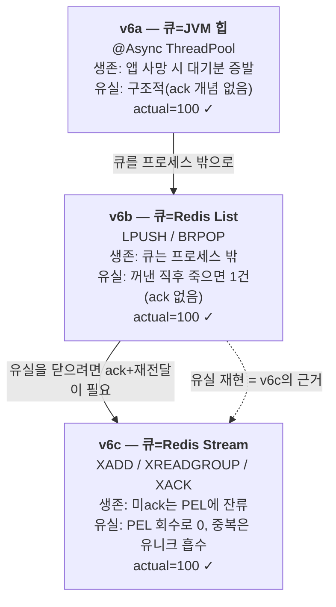
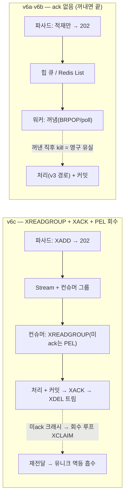

# Phase 3-4 회고 — 비동기 발급 큐 구조 사다리 (v6a → v6c)

> 동기 발급(phase 3-3 v3)을 큐 뒤로 미뤘을 때의 비용과 실패를 측정한다. 큐 매체를 힙(v6a)→Redis
> List(v6b)→Redis Stream(v6c)으로 한 칸씩 올리며, 같은 게이트(초과발급 0)를 통과하는 세 구조의
> **생존·유실·중복 프로파일**을 격리 측정한다. 이 문서는 그 과정과 발견을 정리한다.

| 항목 | 내용 |
|------|------|
| **범위** | 비동기 쿠폰 발급 — 큐 구조 3단 사다리(v6a 힙 / v6b Redis List / v6c Redis Stream) + 카오스(유실·재전달) |
| **브랜치** | `phase/3-4-async-issuance` |
| **핵심 결과** | 세 큐 구조가 같은 게이트(초과발급 0)를 통과하는 **비용·실패 프로파일**을 통제변수 핀으로 격리 측정. 핵심 발견: 컨슈머 죽음의 유실은 **큐 매체의 본질이 아니라 비우아한 종료(kill -9)에 특정**된다(§4.2). |
| **상태** | `results/phase3-4-async/analysis.md` 실측 — 본체 인프라와 분리된 전용 격리 스택(별도 프로젝트·볼륨·포트) |
| **성격** | 비동기 발급의 큐 구조 비용·실패 프로파일 **측정**. **채택 결정이 아니다** — phase 3-3의 v3 발급 경로 결정을 흔들지 않는다. |

> ⚠️ **측정 규율 (이 문서의 전제, §9 정리)**: ① 전 버전 **초과발급 0**이 통과 게이트. ② v6c를
> **exactly-once로 주장하지 않는다**(유실 없음 + 유니크 멱등 흡수의 조합일 뿐). ③ **버전 간 E2E 지연
> 직접 비교 금지**(부하 프로필 상이 + 런별 잡음). ④ **v3 동결본과 직접 비교 금지**(접수 지연 vs 처리
> 지연, 의미가 다름 — 참조만). 비교 합법 축은 **정확성(초과발급 0)** 하나다.

---

## 1. 한 줄 요약

phase 3-3은 v1~v5 락 사다리 끝에 **v3(DB 행 락)을 발급 경로로 배선**하는 *의사결정*이 헤드라인이었다.
phase 3-4에는 그런 결정이 없다 — v6a/b/c는 우열을 가리는 후보가 아니라, **같은 게이트(초과발급 0)를
큐 구조로 통과할 때의 비용·실패 프로파일**을 측정하는 세 좌표다. 동기 발급을 비동기(접수 **202** → 큐
→ 컨슈머가 v3 경로로 발급)로 돌리고 큐 매체를 힙→List→Stream으로 올린 결과, **세 칸 모두 초과발급 0**
으로 게이트를 통과했다. 가장 값진 발견은 유실의 출처다 — **컨슈머가 죽어 생기는 유실은 큐 매체의
성질이 아니라 *종료 방식*에 특정된다**: 같은 v6b도 `kill -9`(halt)면 유실 2, `SIGTERM`(graceful)이면
유실 0이고, v6c는 PEL 회수로 유실 0 + 재전달 중복은 유니크 제약이 멱등 흡수한다.

---

## 2. 배경 — 왜 비동기, 왜 큐 매체 사다리인가

**도메인 — 같은 한정 자원, 다른 처리 시점.** 쿠폰은 phase 3-3과 동일한 `total_qty=100` 한정 수량이고,
초과발급 0이 정합 게이트인 것도 같다. 바뀐 건 *처리 시점*이다. 동기 발급은 요청 스레드가 그 자리에서
재고를 판정하고 발급한다. 비동기 발급은 입구에서 **즉시 발급하지 않고** `202 ACCEPTED`만 돌려준 뒤,
큐에 적재하고, 컨슈머가 뒤에서 처리한다. 재고 판정은 컨슈머가 **DB 앞에서**(phase 3-3의 v3 FOR UPDATE
경로 재사용) 한다 — 이른바 **Fork B(출구 판정)**다. 진실 소스는 여전히 `coupon_issue` 행 수 하나.

**왜 사다리인가 — 큐 매체가 생존·유실·중복을 다루는 방식이 다르기 때문.** 큐를 어디에 두느냐(JVM 힙 /
Redis List / Redis Stream)에 따라 "컨슈머가 죽으면 무엇이 사라지는가", "재전달이 있는가", "중복을 어떻게
막는가"가 달라진다. 사다리를 올린 건 우열을 매기려는 게 아니라, **각 매체가 실패 앞에서 드러내는
성질**을 한 칸씩 더 가혹한 조건으로 노출하기 위해서다.



세 축으로 읽었다 — **생존**(컨슈머/앱이 죽으면 큐의 대기분은 어떻게 되나) / **유실**(꺼냈지만 커밋 못
한 건이 사라지나) / **중복**(재전달이 있을 때 같은 발급이 두 번 박히나). 한 매체가 세 축에서 동시에
움직이므로, 버전 간 단일 숫자(throughput·지연) 비교는 의미가 무너진다 — 이게 §9 규율의 출발점이다.

| 버전 | 큐 매체 | 생존(앱 사망 시) | 유실(꺼낸 후 사망) | 중복(재전달) |
|------|---------|------------------|--------------------|--------------|
| v6a | JVM 힙 | 대기분 통째 증발 | 구조적(ack 개념 없음) | — |
| v6b | Redis List | 큐는 외부 보존 | 1건 유실(ack 없음) | — |
| **v6c** | Redis Stream + 그룹 | 미ack는 PEL 잔류 | PEL 회수로 0 | 유니크 멱등 흡수 |

---

## 3. 접근 — 측정 유효성을 먼저 깔고 시작했다

비동기는 동기보다 측정을 깨뜨리기 쉽다 — 응답(202)과 실제 발급이 분리되기 때문이다. 수치를 내기 전에
**그 수치를 신뢰할 수 있는 상태**부터 만들었다.

**(1) 성공 시그니처를 수렴 게이트로 재정의.** 기존 하네스 판정("부하 종료 직후 `coupon_issue` 행 수 ==
100")은 비동기에서 **거짓이 된다** — 부하가 끝나도 컨슈머가 아직 큐를 소비 중이라 행 수가 100 미만이다.
이건 버그가 아니라 **판정 시점의 의미가 바뀐 것**이다. 그래서 하네스에 **수렴 게이트**를 박았다:

```
converged := 큐 깊이 == 0 && rows(coupon_issue) 연속 3회 동일 (1s 폴링) && 타임아웃 120s 내
            (초과 시 NON_CONVERGED — 별도 FAIL 사유로 분류, "부하 부족" 아닌 "컨슈머 정지" 신호로 우선 해석)
```

부하 종료 직후가 아니라 **수렴 후** 판정한다. "언제 100이 되는가"(수렴 시간 2~4s)가 이번 phase의 데이터다.
자가검증 런으로 게이트의 작동을 실증했다 — 고의 핀 불일치는 실제 `abort`(exit 2), 컨슈머 없는 큐에 1건
적재는 120s 타임아웃 후 `NON_CONVERGED`로 분류됨(정적 코드 확인이 아니라 실행 증거).

**(2) 통제변수 규율 — 값이 정답이 아니라 "전 버전 동일"이 핵심.** v6a/b/c에 공통 핀을 박고 ops
엔드포인트 런타임 assert로 강제(불일치 시 측정 abort):

| 변수 | 핀 값 | 비고 |
|------|-------|------|
| executor core / max | **4 / 4** (max=core 고정) | 관찰 축 큐 만석 구간 오염 방지 — max>core면 v6a만 실효 소비 동시성 증가 |
| 소비 동시성 | 4 (v6a 풀 / v6b 워커 / v6c 컨슈머 c1~c4) | **전 버전 일치 — 사다리 내 단일 변수=큐 매체만 차이** |
| 큐 상한 | 10,000 | 정확성(1,000건) 무손실 수용, 관찰 축 포화→429 |
| 부하 | 정확성 500VU×2iter / 관찰 warmup 5s+steady 30s | 계승 핀(Hikari 10/30s, Tomcat 200, innodb 50s, REPEATABLE-READ) |

**(3) 진실 소스는 코드가 아니라 행 수.** 정합 판정의 단일 진실 소스는 `coupon.issued` 카운터가 아니라
`SELECT COUNT(*) FROM coupon_issue` 행 수다(phase 3-3 계승). 상태 해시(ACCEPTED/ISSUED/SOLD_OUT)는
*관측 전용* — 상태 카운트와 행 수가 어긋나면 행 수가 이긴다. 터미널 회계도 행 수 기준으로 닫는다:
`202_count == terminal_count`(전 건 터미널 도달, 조용한 증발 0)를 PASS 조건에 넣어 탈락분 증발을 막았다.

**(4) 측정은 본체 인프라와 분리된 전용 격리 스택에서.** 측정용 MySQL·Redis를 본체와 별도 프로젝트·
볼륨·포트로 띄워, 측정·reset이 본체 데이터에 닿지 않게 격리했다. 이 격리를 검증하는 과정에서 redis 설정
버그(아래 §9)를 발견·수정했다.

---

## 4. 검증 — 3축 서사로 읽은 세 구조

### 4.1 생존 축 — 정확성: 세 칸 모두 초과발급 0

정상 부하(1,000건 적재 → 수렴 게이트 → 터미널 회계)에서 세 매체 모두 정확히 100건만 발급하고 900건은
SOLD_OUT으로 수렴했다. **이게 유일한 비교 합법 축**이다 — "초과발급을 막고 전 건이 터미널에 도달했나"는
모든 버전에 같은 의미를 갖는 이진 질문이라 직접 비교가 정당하다.

```
정합 actual_issued (total=100, 정확성 축 500VU×2iter=1,000건 적재) — 비교 합법 축

  v6a 힙      │████ 100 / terminal 1000==202 / 유실 0   ✓
  v6b List    │████ 100 / terminal 1000==202 / 유실 0   ✓
  v6c Stream  │████ 100 / terminal 1000==202 / 유실 0   ✓
              └──→ total=100 한도선 (적재 1,000 → 발급 100 + 탈락 900, 증발 0)
```

> 세 칸 다 `rows == issued_counter == 100`, `202_count == terminal_count == 1000`(조용한 증발 0).
> 큐 매체가 달라도 **정합 게이트는 동일하게 통과** — 차이는 정확성이 아니라 실패 앞의 행동(§4.2)이다.

### 4.2 유실 축 — 유실은 큐 매체가 아니라 *종료 방식*에 특정된다 【핵심 발견】

드레인 구간(적재 완료 후 컨슈머가 큐를 소화하는 중)에서 카오스 kill을 주입했다. **kill 시점과 종료
방식을 변수화**해(꺼낸 직후 AFTER_POP / 커밋 직후 AFTER_COMMIT × halt(kill -9 등가) / SIGTERM(graceful)),
유실이 어디서 오는지 분해했다.

```
유실분 := 202_count − terminal_count (= 수렴 후 ACCEPTED 잔류 = 꺼냈지만 끝까지 처리 못 한 건)

  v6b AFTER_POP halt   (kill -9)   │██ 유실 2   (ACCEPTED 잔류 2건, requestId 제출)
  v6b AFTER_POP sigterm(graceful)  │   유실 0   (executor가 in-flight 드레인 후 종료)
  v6c AFTER_COMMIT halt(미ack 크래시)│   유실 0   (PEL 회수 33→33으로 전 건 닫음)
                                       └─ rows 전부 100 불변 (초과 0)
```

- **v6b halt 유실 2** — BRPOP으로 큐에서 꺼낸 뒤(ack 없음) 커밋 전에 JVM이 즉사하면 그 건은 영구
  미처리로 사라진다. 유실 증거 = ACCEPTED 잔류 requestId 2건(`selftest/v6b-chaos-evidence.log`).
  **고치지 않고 재현·기록했다** — 이 유실이 v6c(ack+재전달)의 근거다.
- **v6b SIGTERM 유실 0** — 같은 매체·같은 kill 시점인데 종료 방식만 graceful로 바꾸면 executor가
  in-flight 작업을 드레인(대기 핀 10s)하고 종료해 유실이 0이 된다. **즉 "Redis List라 유실"이 아니라
  "kill -9면 유실, graceful이면 무손실"이다.** 이 대조가 이 phase의 핵심 발견이다.
- **v6c 미ack 유실 0** — Stream은 XREADGROUP으로 읽되 XACK 전이면 PEL(Pending Entries List)에 잔류한다.
  앱이 죽어도 메시지가 사라지지 않고, 별도 회수 루프가 `XPENDING`+`XCLAIM`(min-idle 핀)으로 회수해
  재처리한다 — **회수는 자동이 아니다**(누군가 회수해야 함, §4.3).

### 4.3 중복 축 — 재전달의 청구서를 유니크 제약이 멱등 흡수한다 (v6c)

ack 기반 큐의 대가는 **재전달**이다. "커밋 직후·XACK 직전"에 죽으면, 회수된 메시지가 같은
`(coupon_id, user_id)`로 다시 발급을 시도한다 — 멱등 방어가 없으면 행 수 > 100, **초과발급의 부활**이다.

실측(재전달 주입 런, AFTER_COMMIT halt):

| 지표 | 값 | 의미 |
|------|----|----|
| PEL 회수 | XPENDING 후보 **33 → 회수 33** | 죽은 컨슈머의 미ack 33건을 회수 루프가 재배정 |
| 유니크 충돌 흡수 | **IDEMPOTENT-ABSORB ≥1** (실측 1) | 회수분 중 halt 전 *이미 커밋된* 1건이 재INSERT→`UNIQUE(coupon_id,user_id)` 충돌→"이미 발급됨"으로 ISSUED 흡수 |
| rows / ISSUED / total | **1000 / 1000 / 1100** | **rows == ISSUED**(행 수 불변 본질 — 재전달이 행을 안 늘림), rows ≤ total(초과 0) |
| 유실분 | **0** | PEL 회수가 전 건 닫음(v6b halt 유실 2와 대조) |

> 회수 33건 중 멱등 흡수는 1건뿐이다 — halt는 한 번만 발화하므로, 죽는 순간 *이미 커밋됐던* 1건만
> 진짜 중복이고, 나머지 32건은 미커밋 상태라 재처리 시 정상 INSERT(중복 아님)다. **성공 시그니처
> 충족**: `rows == ISSUED 상태 수 && 유니크 충돌 로그 ≥ 1`(충돌 로그가 방어 작동의 증거).
> ※ 재전달 런만 `total_qty=1,100` — AFTER_COMMIT 훅은 발급 *성공* 경로에만 있어 qty=100이면 드레인
> 시점에 이미 소진돼 발화가 구조적으로 불가하다. 발급 경로를 드레인까지 살리는 최소 변경.

### 4.4 백프레셔 관찰 축 — 접수율 vs 발급률 vs 큐 깊이 (괴리 전시)

별도 프로필(warmup 5s + steady 30s, total_qty=1억)로 큐가 포화하는 동역학을 관찰했다. **수렴 게이트
미적용** — 깊이가 상한까지 차고 429 버킷이 자라는 것 자체가 결과다.

| 버전 | ① 접수 처리량 | ② 발급 완료 처리량 | 429(QUEUE_FULL) | ④ 깊이 피크 | 접수(202) 지연 p95 |
|------|---------------|--------------------|------------------|-------------|---------------------|
| v6a | 61.4/s | 62.5/s | 218,388 | 10,004 | 105.5 ms |
| v6b | 80.1/s | 81.6/s | 205,563 | 10,042 | 100.5 ms |
| v6c | 82.4/s | 82.1/s | 201,702 | 10,047 (XLEN) | 117.5 ms |

> **① 접수율 ≈ ② 발급률**(소비 동시성 4에 묶임)이고, 깊이가 상한 10,000을 치면 그 뒤로는 **429가
> 자란다**(백프레셔 발동 = 관찰 결과이지 오류 아님). 접수 지연(~100ms)은 큐 적재만이라 빠르다 —
> 하지만 이건 **"접수 지연"이지 "성능 개선"이 아니다**. 실제 발급 지연(E2E)은 §4.5에서 7배 차이를
> 드러낸다. v6c 깊이는 `XLEN`으로 잰다(XACK 후 XDEL 트림 전제 — `XINFO GROUPS`의 lag는 XDEL tombstone
> 이후 nil이 되어 과소집계). 단 XACK→XDEL은 비원자라 사이 크래시 시 XLEN이 과대 집계될 수 있으나,
> 과대는 보수적 방향(헛 429)이라 유실·초과를 못 만든다(관찰 축 지표일 뿐).

### 4.5 outcome별 분리 비교표

> ⚠️ E2E 지연·접수 지연·throughput은 **버전 간 직접 비교 금지** — 큐 매체가 버전마다 달라 같은 컬럼이라도
> 의미가 다르고, 카오스 런의 지연은 사망~재기동 공백이 섞인 측정 아티팩트다. 아래는 **outcome별 분리**로 읽는다.

| 지표 | v6a 힙 | v6b List | v6c Stream |
|------|--------|----------|------------|
| **정합** rows (total=100) | **100** | **100** | **100** |
| 초과발급 | 0 | 0 | 0 |
| terminal == 202 (증발) | 1000==1000 (0) | 1000==1000 (0) | 1000==1000 (0) |
| E2E 발급 지연 p50 / p95 ¹ | 533 / 741 ms | 467 / 671 ms | 659 / 825 ms |
| 탈락 통보 지연 p95 / max | 1149 / 1158 ms | 1266 / 1278 ms | 1309 / 1329 ms |
| 접수(202) 지연 p95 (관찰축) | 105.5 ms | 100.5 ms | 117.5 ms |
| 적재↔커밋 순서 역전 ² | 56 | 99 | 685 |
| 컨슈머 죽음(halt) | 대기분 증발(구조적) | **유실 2** | **유실 0**(PEL 회수) |
| 종료 방식 대조 | — | halt 2 / **sigterm 0** | — |
| 재전달 중복 | — | — | **유니크 멱등 흡수**(rows 불변) |

> ¹ **E2E p95 컬럼은 버전 간 순위 비교용이 아니다**(741/671/825 비단조 — 큐 매체 우열이 아니라 런별
> 잡음). 정확성 축의 부수치로만 읽는다.
> ² 순서 역전은 컨슈머 4 병렬 처리의 귀결(분배는 순서대로여도 처리 완료는 병렬) + 입구 INCR↔적재 비원자
> 잡음 포함. v6c가 가장 큼(685). 공정성 기준은 *적재 순서가 아니라 발급 성공 여부*(100명 안에 들었는가) —
> 역전은 숨기지 않고 전시할 뿐 고치지 않는다(범위 밖).

---

## 5. 큐 매체 구조 — ack가 가르는 v6a/v6b vs v6c

§4.2의 유실 차이는 결국 "꺼낸 메시지에 ack/재전달이 있는가"로 요약된다.



v6a/v6b는 큐에서 꺼내는 순간 메시지가 큐를 떠난다 — 커밋 전에 죽으면 그 건은 어디에도 없다. v6c는
XREADGROUP이 메시지를 **PEL에 등록**한 채 전달하므로, XACK 전에 죽어도 메시지는 잔류한다. 그래서
유실을 닫을 수 있지만(PEL 회수), 그 대가로 **재전달=중복**이 생기고, 그 중복을 `UNIQUE(coupon_id,
user_id)`가 최후 방어선으로 멱등 흡수한다. 이 구조도가 §6의 한 문장을 그림으로 옮긴 것이다.

---

## 6. 무엇을 결론으로 두는가 — 채택이 아니라 비용·실패 프로파일

phase 3-3의 §6은 "v3 채택"이라는 *의사결정*이 헤드라인이었다. **phase 3-4에는 채택 결정이 없다.**
v6a/b/c 중 하나를 "고르는" 게 이 작업의 산출물이 아니다 — 발급 경로는 phase 3-3에서 이미 v3(DB 행 락)으로
결정됐고, 이 실험은 그것을 **흔들지 않는다**. v6의 컨슈머 처리 경로도 그 v3 경로를 그대로 재사용한다.
이 작업이 남기는 건 "큐를 쓰면 무엇을 더 떠안는가"의 **비용·실패 프로파일**이다.

**3축 종합:**

| 축 | v6a 힙 | v6b Redis List | v6c Redis Stream |
|----|--------|----------------|------------------|
| **생존** (앱 사망 시) | 대기분 통째 증발(구조적) | 큐는 외부 보존, 단 꺼낸 건은 미보호 | 미ack가 PEL에 보존 |
| **유실** (꺼낸 후 죽음) | 구조적 | halt 2 / **sigterm 0** | PEL 회수로 **0** |
| **중복** (재전달) | 없음(재전달 자체가 없음) | 없음 | 재전달 발생 → 유니크 멱등 흡수 |

**핵심 발견 — 유실의 출처는 큐가 아니라 종료 방식이다.** 가장 흔한 오해는 "비동기 큐를 쓰면 배포할
때마다 1건씩 사라진다"이다. 실측은 그 인과를 부정한다: 같은 v6b가 `kill -9`면 유실 2, `SIGTERM`이면
유실 0이다. 유실은 *큐 매체*의 성질이 아니라 *비우아한 종료*의 산물이고, graceful shutdown(executor
드레인) 또는 ack+회수(v6c)로 닫힌다. **그래서 "어느 큐가 안전한가"가 아니라 "종료를 어떻게 다루는가"가
옳은 질문이다.**

**범위 한정**: 이 실험이 달성한 건 v6c에서도 **"유실 없음(PEL 회수) + 중복은 DB 유니크가 흡수"의
조합**뿐이다 — **exactly-once가 아니다**(멱등 키 없는 부수효과, 예: 알림은 범위 밖). "큐 + ack면
exactly-once"로 읽으면 틀린다. 그리고 이 모든 비교는 phase 3-3 v3(동기, p95 2,630ms)와 **직접 비교하지
않는다** — 접수 지연과 처리 지연은 의미가 다른 숫자이고, 부하 프로필(지속형 vs 고정 1,000건)도 다르다(참조만).

---

## 7. 회수한 것

1. **정합 보존** — 동기를 비동기로 돌리고도 세 큐 매체 모두 초과발급 0 + 조용한 증발 0으로 게이트를
   통과했다. 수렴 게이트로 "응답 직후 행 수" 함정을 닫았다.
2. **유실의 출처 규명** — 컨슈머 죽음의 유실이 큐 매체가 아니라 종료 방식에 특정됨을 같은 v6b에서
   halt(2) vs sigterm(0) 대조로 실증했다. v6c는 PEL 회수로 유실 0 + 멱등 흡수로 중복 0.
3. **방법론 자산** — (a) 통제변수(소비 동시성 4 등)로 "큐 매체만 차이"를 단일 변수로 격리, (b) 접수
   지연을 "성능 개선"으로 읽는 오독을 같은 런 응답/E2E 병기로 차단, (c) 진실 소스를 행 수로 고정해
   상태 카운트 착시를 닫음.

---

## 8. 남은 것 (스코프 밖)

- **Fork A(입구 판정, Redis 선판정 카운터)** — 이중 진실 소스 문제가 별도 측정 주제. 본 실험은 Fork B
  (출구 판정)만.
- **다중 인스턴스 실증** — v6b/v6c가 자연스러운 입구지만 phase 3-3 백로그 결정 유지.
- **DLQ·부수효과 멱등(알림 등)·Kafka·유한 큐 임계 튜닝** — 백로그. exactly-once가 필요한 부수효과는
  멱등 키 설계가 별도 과제.
- **E2E 지연의 버전 간 정밀 비교** — 본 실험은 비교축으로 쓰지 않음(런별 잡음). 동일 조건 반복 측정 필요.

---

## 9. 메타 회고 — 측정 규율과 검증 설계

**(1) 비교 규율을 조항으로 박았다.** ① 전 버전 초과발급 0이 게이트. ② v6c exactly-once 주장 금지(멱등
흡수일 뿐). ③ 버전 간 E2E/throughput 직접 비교 금지(큐 매체 confound + 런별 잡음). ④ v3 동결본 직접
비교 금지(접수 지연 vs 처리 지연, 부하 프로필 상이 — 참조만). throughput 헤드라인 막대를 한 장도
그리지 않은 게 이 규율의 시각적 귀결이다. 합법 비교 축은 정확성(초과발급 0) 하나뿐이다.

**(2) 검증 설계(loud-fail)가 측정 사고 2건을 잡았다.** 측정 중 두 사고가 났고, 둘 다 *은폐할 결함*이
아니라 **검증 설계가 일했다는 증거**다:

| 사고 | 무엇 | 무엇이 잡았나 |
|------|------|---------------|
| redis 격리 누수 | 앱의 두 redis 클라이언트 중 `StringRedisTemplate`이 무인자 `LettuceConnectionFactory`(6379 하드코딩) 탓에 상태 해시를 의도와 다른 redis로 기록 | **터미널 회계 loud-fail**(terminal=0 ≠ 202)이 즉시 FAIL로 검출 → 수정 후 재측정 |
| stale app 포트 충돌 | 직전 버전 앱이 8080 점유 → 새 앱 바인드 실패 → stale 앱이 404 응답 | k6 회계(202=0, other=1000)가 FAIL로 검출 → 앱 정리 후 재측정 |

"assert가 있다"와 "assert가 작동한다"는 다른 명제이고, 두 사고가 후자를 실증했다. 무효 런은 삭제하지
않고 `results/phase3-4-async/INVALID-RUNS.md`에 콘솔 증거로 보존했다. redis 격리 누수의 근본 원인이던
설정 버그는 별도 수정했다(`RedisConfig`가 `spring.data.redis`를 따르게).

**(3) 카오스를 변수화해 인과를 분해했다.** "kill하면 유실"이 아니라 kill 시점(AFTER_POP/AFTER_COMMIT)
× 종료 방식(halt/SIGTERM)을 변수로 두어, 유실이 *종료 방식*에 특정됨을 분리해냈다(§4.2). 단일 카오스
시나리오였다면 "Redis List라 유실"이라는 틀린 인과를 세웠을 것이다.

---

## 10. 참조

- **[results/phase3-4-async/analysis.md](../../results/phase3-4-async/analysis.md)** — 모든 실측의 1차 출처(v6a/b/c 정확성·관찰·카오스 + 사다리 요약).
- **[results/phase3-4-async/INVALID-RUNS.md](../../results/phase3-4-async/INVALID-RUNS.md)** — 무효 런 보존(redis 격리 누수·포트 충돌).
- **[docs/reports/phase3-4-retro.md](phase3-4-retro.md)** — 예측 대비 실측 채점 + 예보 밖 사고 정리.
- **[docs/handoff/phase3-4/phase3-4-handoff.md](../handoff/phase3-4/phase3-4-handoff.md)** — 엔지니어링 인수인계(핀 목록·전이 트랩·전용 스택·teardown).
- 구현: `src/main/java/com/project/service/coupon/async/`(파사드 V6a/b/c·워커·processor), `infrastructure/asyncqueue/`(executor·상태·List·Stream 저장소).
- 측정 하네스: `scripts/measure/run-coupon-async.sh`, `test/load/coupon-async-test.js`.
- 계승: [phase 3-3 회고](phase3-3-concurrency-lock.md)(v3 발급 경로 결정 — 이 실험이 흔들지 않는 기준).
