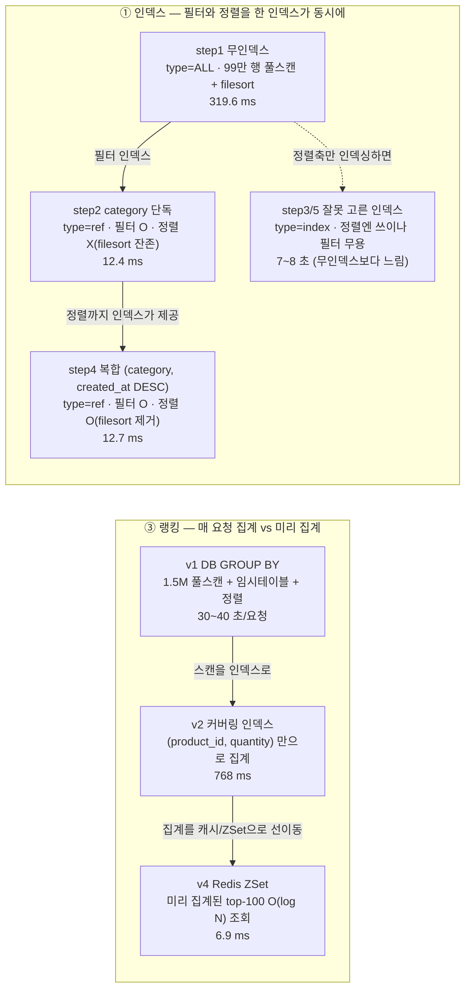

# Phase 3-6 회고 — 데이터 스케일업, 대용량에서의 거동 재측정

> 인덱스(시나리오 ①)와 랭킹(시나리오 ③)의 최적화는 phase 3-1·3-2에서 이미 설계·검증됐다. 그러나 그
> 측정은 product 100K / order_item 150K 규모였다. 이 작업은 데이터를 **product 1,000,000 /
> order_item 1,500,000**으로 키운 뒤 두 시나리오를 재측정해, 포폴 헤드라인("100만 규모")을 실데이터로
> 입증하고 **대용량에서 무엇이 달라지는가**를 본다. 이 문서는 그 과정과 발견을 정리한다.

| 항목 | 내용 |
|------|------|
| **범위** | 데이터 스케일업(100K→1M/1.5M) + 시나리오 ①인덱스·③랭킹 재측정. ②N+1은 3-7로 분리(order_item 1.5M은 이번에 적재해 재적재 회피), ④동시성은 스케일 무관(범위 밖) |
| **브랜치** | `phase/3-6-scale-up` |
| **핵심 결과** | 본체 데이터로 헤드라인 재현 — **인덱스 step1→step4 25.2×**(풀스캔+filesort → 복합인덱스 ref), **랭킹 v1→v4 ≈5700×**(1.5M GROUP BY 풀스캔 → Redis ZSet). 대용량 거동 = 무인덱스 스캔량 100K→1M **10배**, GROUP BY 풀스캔 요청당 **30~40초**, 복합인덱스·ZSet은 규모 무관 평탄(12ms·7ms) |
| **상태** | `results/phase3-6-scale-up/P3-RESULTS.md` 실측 — 본체 docker 스택(mysql/redis), 진실 소스 = EXPLAIN + k6 json |
| **성격** | 스케일업 **재측정** — 채택 결정이 아니다(인덱스·랭킹 최종안은 phase 3-1·3-2에서 이미 결정). 산출물은 "대용량에서의 거동·before/after" 프로파일 |

> ⚠️ **측정 규율 (이 문서의 전제, §9 정리)**: ① 헤드라인은 **동일 규모 런 내부**의 step1≫step4 / v1≫v4
> (동시점·동인프라라 confound 없음). ② 100K↔1M **cross-scale 비교는 k6 p95가 아니라 EXPLAIN rows**(스캔량)로만
> 정량한다 — 시점·인프라 핀이 분리돼 레이턴시 직접 비교는 불가. ③ before(100K) 비교 근거는 라이브 DB가
> 아니라 **저장 파일**(`results/phase3-1-*`·`phase3-2-*`). ④ 부하 모델은 **VU < 커넥션 풀**(엄격)로 고정해
> p95가 큐 대기가 아닌 순수 쿼리 비용이 되게 한다.

---

## 1. 한 줄 요약

같은 쿼리·같은 인덱스라도 **데이터가 10배가 되면 비용이 드러난다**. 무인덱스 풀스캔은 스캔 행이 99,742→993,313으로
10배가 되고, 1.5M GROUP BY 랭킹은 요청당 30~40초까지 늘어진다. 그 위에서 최적화의 값어치도 같이 커진다 —
복합 인덱스는 1M에서도 type=ref·filesort 제거로 **12.7ms**(step1 대비 25.2×), Redis ZSet은 O(log N)으로
**6.9ms**(v1 대비 ≈5700×) 평탄을 유지한다. **무엇을 했나**: 결정론 규율로 1M/1.5M를 서버사이드 적재하고,
적재 무결성·측정 비포화를 게이트로 깐 뒤, 인덱스 5스텝과 랭킹 4버전을 재측정했다. **무엇을 봤나**: 최적화의
효과는 규모가 클수록 선명해지고, 잘못 고른 인덱스는 대용량에서 무인덱스보다도 느려진다.

---

## 2. 배경 — 왜 스케일업이 필요했나

**100K는 "대용량"의 거동을 숨긴다.** product 100K는 MySQL 기본 buffer pool(128MB) 안에 사실상 다 들어간다 —
풀스캔조차 디스크를 거의 안 쳐서 무인덱스와 인덱스의 격차가 실제 운영보다 좁게 보인다. 포폴 헤드라인이 "100만
규모"인데 측정이 100K면, 숫자가 *진짜 대용량을 돌렸다*고 스스로 말하지 못한다. 그래서 **병목 테이블을 실제로
키운다** — 회원(users 1K)은 인덱스·Redis 수치를 바꾸지 않으므로 그대로 두고, `product`(100K→1M)·`order_item`
(150K→1.5M)을 10배로 늘린다.

| 테이블 | before | after | 비고 |
|--------|--------|-------|------|
| users | 1,000 | 1,000 | 유지(스케일 무관) |
| **product** | 100K | **1,000,000** | 인덱스 시나리오 병목 |
| orders | 50K | 500,000 | order_item의 부모 |
| **order_item** | ~150K | **1,500,000** | 랭킹 GROUP BY 대상 (= ORDER_COUNT×3) |

**무엇을 재측정하나.** ① 인덱스 — `WHERE category=? ORDER BY created_at DESC LIMIT 20`을 인덱스 없음(step1)부터
복합 인덱스(step4)까지 5스텝으로. ③ 랭킹 — `SUM(quantity) GROUP BY product_id ORDER BY … LIMIT 100`을
DB 풀스캔(v1)부터 Redis ZSet(v4)까지 4버전으로. ②N+1은 3-7로 분리하되 order_item 1.5M을 이번에 적재해 두어
3-7이 재적재 없이 바로 측정에 들어가게 했다.

---

## 3. 접근 — 측정 타당성을 먼저 깔고 시작했다

대용량 적재와 부하 측정은 둘 다 조용히 거짓을 만들기 쉽다. 수치를 내기 전에 **그 수치를 신뢰할 수 있는 상태**부터
만들었다.

**(1) 결정론 적재 + 무결성 게이트.** 100K용 단건 INSERT 루프는 1M에 비현실적이라, 숫자 테이블(tally)을
`ROW_NUMBER()`로 연속 생성하고 **청크 단위 `INSERT … SELECT`**(product 10만/커밋, order_item ~7.5만/커밋)로
적재한다. 1.5M을 단일 트랜잭션으로 넣으면 undo/binlog가 폭증하고 `lock_wait_timeout`에 걸리기 때문이다.
재현성을 위해 **RAND 사용을 규율화**했다 — JOIN 카디널리티(order_item 행수 = `1+(id%5)`)와 정렬축
(`created_at = NOW() − INTERVAL (n%365) DAY`)에는 RAND을 금지하고, `product_id`·`quantity`·`price` 같은 행별
독립 스칼라에만 허용한다. 이 규율이 보장하는 건 *구조·측정 속성의 재현*(행수·정렬 분포·EXPLAIN 형태)이지
비트-동일 데이터셋이 아니다.

적재의 진실성은 **assert + 음성 테스트**로 닫았다:

```
적재-전 assert : product·orders  MIN(id)=1 ∧ MAX(id)=COUNT(*)=목표   (id 연속성 — 위반 시 abort)
적재-후 assert : COUNT(order_item)=ORDER_COUNT×3 ∧ product_id NOT NULL·범위 내
음성 테스트    : order_item 1행 고의 삭제 → 같은 assert가 *실제로* abort(rc≠0)해야 PASS → 자기복원
```

음성 테스트는 "assert가 있다"와 "assert가 작동한다"를 가르는 장치다 — 오염 데이터를 일부러 만들어, 검증이
틀린 데이터 앞에서 정말 멈추는지(항상-참 가짜 assert가 아닌지) 실행으로 증명한 뒤 원상복구한다. 소규모 스모크
적재를 본런 전에 돌려, MySQL 8.0 `INSERT … SELECT`의 auto_increment **갭** 함정(연속성 불변식 붕괴)을 1M 낭비
전에 잡고 `id=n` 명시 삽입으로 막았다.

**(2) 부하 모델 = VU < 커넥션 풀(엄격).** 무인덱스 풀스캔을 과도한 동시 요청으로 때리면 p95가 *쿼리 지연*이
아니라 *커넥션 풀 대기·타임아웃*이 된다(같은 지연이라도 원인이 "쿼리 비용"이 아니라 "풀 포화"). VU=8 < pool=10
으로 고정하면 acquire 큐가 구조적으로 안 생겨 p95가 순수 쿼리 비용을 반영한다. 이를 **비포화 3신호**로 매 step
검증했다: ① `http_req_failed≈0` ② `hikaricp_connections_pending` 전 샘플 0(0.5초 주기 백그라운드 샘플) ③
statement-timeout 0건.

> **교훈 — VU는 측정 목적의 함수다(소규모 측정의 결함 교정).** 옛 100K 런은 랭킹을 VU=100(≥pool)으로 재서
> p95에 커넥션 풀 대기가 섞였다 — "동시접속 100명"이 마치 쿼리 비용인 양 읽혔지만 실은 풀 포화 지연이 들어간
> 값이었다. 같은 풀(10)에 VU를 **8(<pool)로 낮추면 순수 쿼리 비용**이, **500(≫pool)으로 높이면 경합 그 자체**가
> 측정된다(후자가 쿠폰 동시성 phase3-3의 부하 모델 = constant-vus 500). 즉 같은 k6라도 **무엇을 통제변수로 둘지가
> VU 값을 정한다** — 인덱스·랭킹·캐시처럼 "쿼리가 얼마나 싼가"를 보려면 VU<pool, 쿠폰처럼 "동시성에서 정합이
> 깨지는가"를 보려면 VU≫pool. 소규모에서 이 구분 없이 VU≥pool로 쟀던 게 측정 방법의 결함이었고, 스케일업이 그
> 결함을 드러내 교정하게 했다.

**(3) 캐시-불변 주 증거 = EXPLAIN.** k6 p95는 buffer pool 상태에 흔들리지만 EXPLAIN의 type·rows·Extra는
구조라 인프라와 무관하다. 그래서 헤드라인의 1차 증거를 EXPLAIN에 두고, 랭킹 v1에는 매 측정 진입 시 멱등
`DROP INDEX IF EXISTS` + `type=ALL` 재확인을 둬 인덱스 잔존 오염을 차단했다(오염 시 즉시 측정 무효 abort).

---

## 4. 검증 — 대용량에서의 거동

### 4.1 인덱스 — step1(풀스캔) ≫ step4(복합)

같은 1M product에 인덱스만 갈아끼우며 5스텝을 측정했다(동일 런 내부 비교라 confound 없음).

| step | EXPLAIN type | key | rows | filesort | p95(ms) | N | 게이트 |
|------|--------------|-----|------|----------|---------|----|----|
| 1 무인덱스 | **ALL** | NULL | 993,313 | filesort | 319.6 | 622 | PASS |
| 2 category 단독 | ref | idx_product_category | 384,134 | filesort | 12.4 | 2,224 | PASS |
| 3 created_at 단독 | index | idx_product_created_at | 20 | — | 7,154.6 | 40 | PASS |
| **4 복합(cat,created)** | **ref** | idx_product_category_created | 399,796 | **none** | **12.7** | 2,224 | PASS |
| 5 역순 복합 | index | idx_product_created_category | 20 | — | 7,753.2 | 40 | PASS |

```
인덱스 5스텝 p95 (1M product, 낮을수록 좋음)

  step4 복합        │▌ 12.7 ms        ← type=ref + filesort 제거 (헤드라인)
  step2 category    │▌ 12.4 ms        ← 필터는 잡으나 정렬 미해결(filesort 잔존)
  step1 무인덱스    │██████ 319.6 ms   ← type=ALL + filesort (baseline)
  step3 created 단독│██████████████████████████████████████ 7154.6 ms
  step5 역순 복합   │█████████████████████████████████████████ 7753.2 ms
                     └ step3/5 = 잘못 고른 인덱스가 무인덱스보다도 느림 (안티패턴)
```

- **헤드라인 step1 → step4 = 25.2×.** step1은 `type=ALL`(약 99만 행 풀스캔)+filesort, step4는 복합 인덱스
  `(category, created_at DESC)`가 첫 컬럼 등치로 필터를 잡고 두 번째 컬럼이 정렬을 이미 정렬된 순서로 제공해
  **filesort를 제거**한다(Extra=none). 100K 때보다 격차가 선명하다.
- **잘못 고른 단일 인덱스가 무인덱스보다 느린 안티패턴(step3·5).** `type=index` rows=20은 LIMIT에 의한
  옵티마이저 추정치일 뿐, 실제로는 created_at 정렬 인덱스를 끝까지 워크하며 category 필터를 PK 랜덤 조회로
  검증한다 — 무인덱스 풀스캔(320ms)보다도 느린 **7~8초**. "인덱스를 걸었다"가 곧 "빨라진다"가 아님을 대용량이
  증명한다.

### 4.2 랭킹 — v1(1.5M GROUP BY 풀스캔) ≫ v4(ZSet)

`SUM(quantity) … GROUP BY product_id ORDER BY … LIMIT 100`을 4버전으로(부하 VU=8, warmup 15s + steady 60s).

| ver | 방식 | p95(ms) | N | v1 대비 | 게이트 |
|-----|------|---------|----|---------|----|
| v1 | DB 1.5M GROUP BY 풀스캔 (type=ALL) | **39,335.7** | 128 | — | PASS |
| v2 | 커버링 인덱스 (product_id, quantity) | 768.0 | 603 | 51× | PASS |
| v3 | Redis String 캐시 | 12.6 | 4,416 | 3,122× | PASS |
| **v4** | **Redis Sorted Set** | **6.9** | 4,584 | **≈5,700×** | PASS |

- **헤드라인 v1 → v4 ≈5,700×.** v1 EXPLAIN은 `type=ALL` rows=1,495,284 + `Using temporary; Using filesort` —
  150만 행 전부를 읽어 product_id로 그룹핑(임시 테이블)하고 정렬한다. v4는 미리 집계된 ZSet을 O(log N)으로
  조회한다(top-100 적재, ZCARD=100).
- **대용량이 v1을 무너뜨린다.** v1은 요청당 **30~40초**라 60초 steady에선 표본이 굶는다(초회 N=20). 이건 동시성
  문제가 아니라 *측정 시간* 문제라, v1만 측정축을 420초로 늘려 N=128(≥최소표본 100)을 확보했다(VU<pool은 불변).
  v2(커버링 인덱스)만으로도 768ms로 떨어지지만, 매 요청 집계라 캐시(v3)·ZSet(v4)의 한 자릿수 ms와는 격이 다르다.
- **깨진 v4가 '빠름'으로 위장하는 것을 차단했다.** 빈 ZSet이나 즉시 에러도 "평탄·빠름"으로 보일 수 있어,
  v4는 `ZCARD=100` ∧ `GET /api/v4/rankings` HTTP 200 ∧ `rankings_len=100` ∧ counter Δ>0의 비공집 4종을 통과해야만
  헤드라인에 올렸다.

### 4.3 cross-scale 구조 증거 — 인프라-불변(EXPLAIN rows)

within-scale 헤드라인이 주 증거다. 100K↔1M cross-scale은 시점·인프라 핀이 분리돼 k6 p95 직접 비교가 불가하므로,
**인프라와 무관한 EXPLAIN rows(스캔량)로만** 정량한다.

| | 100K 저장 baseline | 1M/1.5M 본체 | 배수 |
|---|---|---|---|
| 인덱스 step1 rows_examined | 99,742 | **993,313** | ~10× (ALL+filesort 구조 동일) |
| 랭킹 v1 rows | ~150,000 | **1,495,284** | ~10× (ALL + temporary + filesort) |

→ 데이터가 10배가 되면 무인덱스가 읽어야 할 행도 10배가 된다(구조적 사실). 반면 복합 인덱스(12.7ms)·ZSet(6.9ms)은
규모와 무관하게 평탄하다 — **이게 "대용량일수록 최적화가 값지다"의 정량 근거**다. before 저장 출처는 라이브 DB가
아니라 `results/phase3-1-index-optimization/`·`results/phase3-2-ranking-optimization/`.

---

## 5. 구조 — 왜 그렇게 빠르고, 왜 그렇게 느린가



- **인덱스 — 복합 인덱스의 값어치는 정렬을 없애는 데 있다.** category 단독(step2)도 풀스캔은 면하지만 정렬을
  못 줄여 filesort가 남는다. 복합 `(category, created_at DESC)`는 등치 필터 뒤가 이미 created_at 내림차순으로
  물리 정렬돼 있어 `ORDER BY … LIMIT 20`을 인덱스 워크 20행으로 끝낸다. 그래서 step2(12.4ms)와 step4(12.7ms)는
  비슷해 보여도, step4만 filesort가 0이라 데이터·LIMIT가 커질수록 벌어진다.
- **랭킹 — 일을 요청 시점에서 미리 집계 시점으로 옮긴다.** v1은 매 요청이 150만 행을 집계한다(O(N)). v2는 같은
  집계를 커버링 인덱스로 싸게 만들고, v3/v4는 아예 집계 결과를 캐시·ZSet으로 *미리* 만들어 요청은 조회만 한다.
  ZSet은 점수순 정렬을 자료구조가 내장해 top-100을 O(log N)에 준다.

---

## 6. 무엇을 결론으로 두는가 — 대용량에서의 거동

이 작업은 채택 결정을 내리지 않는다 — 인덱스의 복합 인덱스, 랭킹의 ZSet은 phase 3-1·3-2에서 이미 최종안으로
결정됐고, 이 작업은 그 결정을 **대용량에서 재확인**한다. 남기는 건 "100만 규모에서 무엇이 일어나는가"다.

1. **최적화의 효과는 규모에 비례해 커진다.** 무인덱스 스캔량은 데이터를 따라 10배(99,742→993,313)가 되지만,
   복합 인덱스(12.7ms)·ZSet(6.9ms)은 규모와 무관하게 평탄하다. 100K에서 좁게 보이던 격차가 1M에서 25배·5,700배로
   벌어진다.
2. **대용량은 잘못된 설계의 비용도 키운다.** 정렬축만 인덱싱한 step3/5는 1M에서 무인덱스보다 느린 7~8초가 된다.
   "인덱스를 걸었다 = 빨라진다"는 대용량에서 틀린다 — 필터와 정렬을 *한 인덱스가 동시에* 만족해야 한다.
3. **매 요청 집계는 대용량에서 무너진다.** 1.5M GROUP BY 풀스캔(v1)은 요청당 30~40초로, 표본 확보조차 측정축을
   7배(60s→420s) 늘려야 했다. 집계를 요청 시점 밖(캐시·ZSet)으로 옮기는 것이 한 자릿수 ms의 전제다.

**범위 한정.** 랭킹 v4의 top-100 *내용*은 product_id가 1M에 균등 분포한 난수 집합이라 **레이턴시 데모지
인기-랭킹 데모가 아니다** — v1≫v4 레이턴시 격차는 분포와 무관하므로 헤드라인에 영향이 없지만, "의미 있는 인기
상품"으로 전시하면 overclaim이다. 진짜 편중 랭킹이 필요하면 Zipf 등 편중 분포 생성이 필요하나 범위 밖.

---

## 7. 회수한 것

1. **헤드라인을 실데이터로 입증** — 본체 1M/1.5M에서 인덱스 25.2×·랭킹 ≈5,700×를 재현하고, cross-scale 스캔량
   10배를 EXPLAIN으로 정량했다. "100만 규모를 돌렸다"를 숫자가 스스로 말한다.
2. **대용량 특유의 거동 3종 규명** — (a) 최적화 효과의 규모 비례, (b) 잘못된 인덱스가 무인덱스보다 느려지는
   안티패턴, (c) 매 요청 집계의 표본 기아(측정축 연장 필요).
3. **방법론 자산** — 결정론 적재(서버사이드 청크 + RAND 규율) + assert·음성 테스트로 적재 무결성을 닫고,
   VU<pool·비포화 3신호로 p95를 순수 쿼리 비용으로 만들고, EXPLAIN을 캐시-불변 주 증거로 둔 측정 틀. 3-7에
   그대로 재사용 가능(order_item 1.5M 적재분 포함).

---

## 8. 남은 것 (스코프 밖)

- **랭킹 before/after 대시보드 스샷** — Grafana 패널 캡처는 사람 게이트(레이턴시 데모로 캡션, actuator avg ≠ k6 p95
  분리). 헤드라인 증거는 스샷이 아니라 저장 파일(EXPLAIN/k6 json).
- **인덱스 다계열 대시보드(부록 A)** — uri→step 측정축 교정은 전시(presentation) polish라 헤드라인과 디커플.
  인덱스 증거는 EXPLAIN + step별 k6 json 파일.
- **②N+1(phase 3-7)** — order_item 1.5M은 적재해 뒀으니 재적재 없이 측정 진입. ④동시성은 스케일 무관(동시 요청 수
  의존)이라 이 작업 대상 아님.
- **편중 분포 랭킹** — top-100을 "의미 있는 인기 상품"으로 전시하려면 Zipf 분포 생성 필요(별도 과제).

---

## 9. 메타 회고 — 측정 규율과 환경 함정

**(1) 비교 규율을 조항으로 박았다.** ① 헤드라인은 동일 규모 런 내부(confound 없음). ② cross-scale은 k6 p95가
아니라 EXPLAIN rows로만(시점·인프라 핀 분리). ③ before는 라이브 DB 아닌 저장 파일. ④ VU<pool로 p95를 순수
쿼리 비용으로. 이 규율 덕에 "100K p95 ↔ 1M p95"를 막대 하나로 그리는 오독을 막았다 — 스케일 격차의 정량은
스캔 행 수(인프라 불변)에 있지 레이턴시 절댓값에 있지 않다.

**(2) 검증 설계가 적재 사고를 선제 차단했다.** 음성 테스트(고의 오염 → assert가 실제 abort하는지)와 소규모 스모크
선행이, 1M 본런을 낭비하기 전에 두 함정을 잡았다: MySQL 8.0 `INSERT … SELECT`의 auto_increment 갭(연속성 불변식
붕괴 → id 명시 삽입으로 교정), k6 summary json 키 형태. "assert가 있다"와 "assert가 작동한다"는 다른 명제다.

**(3) 본체 부하 측정의 환경 함정 3종(실측 중 발견).** 측정 자체는 정상이었으나 환경이 측정을 깨뜨린 사례 —
교훈으로 기록한다(상세 `P3-RESULTS.md` §6):

| 함정 | 무엇 | 처방 |
|------|------|------|
| 스택 teardown 훅 | 다른 세션 종료 시 `SessionEnd` 훅이 `docker compose down`을 실행 → 측정 중 mysql/redis가 앱 밑에서 사라져 JVM 사망(데이터는 볼륨 보존, `up -d`로 복구) | teardown을 무조건 세션-종료 훅으로 두지 않는다(조건부/수동). pre(up)는 자동화 OK |
| 앱 로그 stale | 측정 스크립트 `APP_LOG` 디폴트가 과거 세션 로그라 statement-timeout 검출 무작동 | 라이브 앱 로그로 override |
| 메모리 기아 | 장기 부하(v1 420s) 중 unused RAM이 바닥나면 측정 프로세스가 스왑아웃돼 freeze(앱 health는 즉답) | 측정 불필요한 grafana/prometheus 중지 + 헤드룸 >1G 확보 후 실행 |

---

## 10. 참조

- **[results/phase3-6-scale-up/P3-RESULTS.md](../../results/phase3-6-scale-up/P3-RESULTS.md)** — 모든 실측의 1차 출처(인덱스 5스텝·랭킹 4버전 게이트표 + cross-scale 구조 증거 + 환경 함정).
- **EXPLAIN(주 증거):** `results/phase3-6-scale-up/explain/step{1..5}-*.{txt,json}`, `explain/ranking-v1-no-index.{txt,json}`. **k6 summary:** `results/phase3-6-scale-up/k6/`.
- 적재기·측정 오케스트레이터: `scripts/scale/load-scale-up.sh`, `scripts/scale/measure-{index,ranking}.sh`, 부하 스크립트 `test/load/{index,ranking}-test-scale.js`.
- before(100K) baseline: `results/phase3-1-index-optimization/`, `results/phase3-2-ranking-optimization/`(무수정 보존).
- 스펙: [specs/phase3/phase3-6-scale-up.md](../../specs/phase3/phase3-6-scale-up.md).
- 계승: [phase 3-3 회고](phase3-3-concurrency-lock.md) · [phase 3-4 회고](phase3-4-async-issuance.md) — 측정 규율(통제변수 핀·진실 소스·loud-fail)의 연속.
