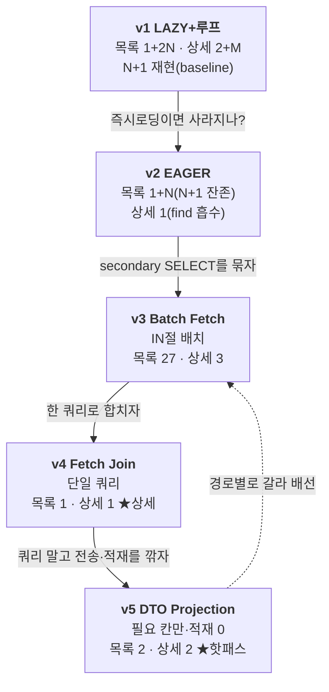
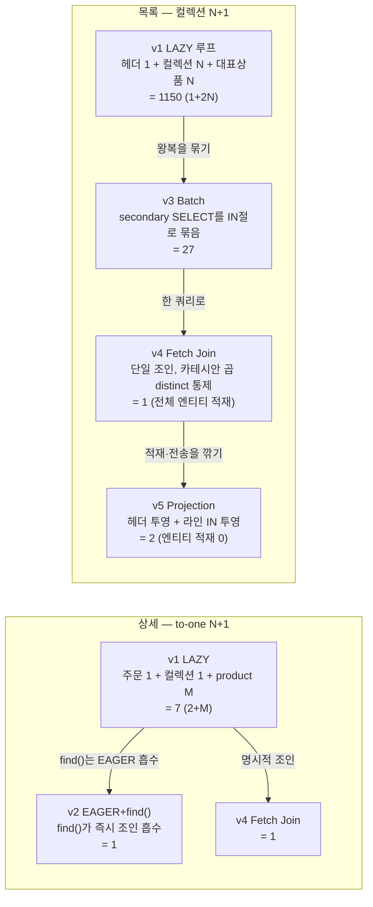

# Phase 3-7 회고 — 주문 조회 N+1, v1~v5 사다리와 경로별 배선

> 주문 **목록**(컬렉션 N+1)과 **상세**(to-one N+1) 두 조회 경로에서 N+1을 재현하고, v1~v5 다섯 전략으로
> 해소했다. 끝은 "쿼리 1회(v4)"라는 단일 정답이 아니라, **경로의 성격에 따라 v3·v4·v5를 갈라 쓰는
> 경로별 배선**이다. 이 문서는 그 측정 과정과 선택의 근거를 정리한다.

| 항목 | 내용 |
|------|------|
| **범위** | 주문 목록·상세 두 경로의 N+1 — 5버전 사다리(v1 LAZY → v2 EAGER → v3 batch → v4 fetch join → v5 DTO projection). 스키마 변경 0 |
| **브랜치** | `phase/3-7-n-plus-one` |
| **핵심 결과** | 목록 쿼리 수 **1150 → 1(v4)/2(v5)/27(v3)**, 상세 **7 → 1**. v1은 콜드 부하에서 요청이 완료조차 못 함(운영 불가). 단일 우승자 대신 **경로별 배선**(목록+페이징=v3, 단건 상세=v4, 조회 전용 핫패스=v5), 기준은 속도가 아니라 **예측 가능성** |
| **상태** | `results/phase3-7-n-plus-one/results.md` 실측 — 진실 소스 = `org.hibernate.SQL` 로그 카운트(쿼리 수) + k6 json(p95) + EXPLAIN |
| **성격** | N+1 해소 사다리 + **경로별 배선** 의사결정. 데이터 규모 orders 500K / order_item 1.5M / product 1M(3-6 스케일업분 재사용) |

> ⚠️ **측정 규율 (이 문서의 전제, §9 정리)**: ① **1차 지표는 쿼리 수**(격리 VU=1 런) — N+1의 본질은
> DB 왕복 횟수이고, 이는 인덱스·버퍼풀과 무관한 불변량이다. ② **p95(부하 런)는 보조** — 접근 경로 컬럼이
> 무인덱스라 풀스캔이 섞여 절대치가 부풀려진다(§4.3 EXPLAIN 백스톱). ③ 쿼리 수와 p95는 **2단계로 분리
> 측정**한다(Statistics 전역 누적·요청 인터리브 함정 회피, R2). ④ 부하 런은 userId를 ~1,000명에 랜덤
> 분산(버퍼풀 ≪ 워킹셋이라 디스크 I/O 유발, R3) + VU<pool로 비포화.

---

## 1. 한 줄 요약

N+1은 **DB 왕복 횟수**의 문제다. 목록은 주문 575건을 그리며 v1이 요청당 **1,150 쿼리**를 쏴 콜드 부하에서
요청이 86~154초가 되도록(완료조차 못 함) 만들고, v4 fetch join은 그걸 **1 쿼리**로 닫는다. 그런데 사다리의
끝은 v4가 아니다 — v5 DTO projection은 쿼리가 2회로 v4보다 많지만 **전송량·적재가 작아 목록 p95가 가장
빠르다(470ms)**. "쿼리 수가 전부가 아니다." 그래서 단일 우승자 대신 **경로별 배선**으로 닫았다: 목록+페이징은
v3(batch), 단건 상세는 v4(fetch join), 조회 전용 핫패스는 v5(projection). 우승 기준은 속도가 아니라 **데이터가
커져도 쿼리·메모리가 고정되는 예측 가능성**이다.

---

## 2. 배경 — 왜 N+1, 왜 두 경로, 왜 5버전

**도메인 — 집합을 그리면 터지는 비용.** 손님이 마이페이지 "내 주문 목록"을 연다. 주문 수백 건(실측 평균
~500/유저, max 584)을 조회한 뒤 각 주문의 요약(상품 개수 + 대표상품명)을 그리려 `order.getOrderItems()`
(주문당 컬렉션 SELECT)와 첫 아이템의 `product`(주문당 product SELECT)를 루프로 접근한다 — 헤더 1 + 2N.
이것이 N+1이다: 부모 1번 조회가 자식 N번 조회를 유발한다.

**왜 두 경로인가 — 컬렉션 N+1과 to-one N+1은 거동이 다르다.**

| 경로 | 화면 | N+1 유형 | baseline 쿼리 |
|------|------|----------|---------------|
| `GET /api/v{n}/users/{userId}/orders` | 주문 목록 | 컬렉션 N+1 (Order→OrderItems) | `1+2N` |
| `GET /api/v{n}/orders/{orderId}` | 주문 상세 | to-one N+1 (OrderItem→Product) | `2+M` |

목록은 N개 주문의 컬렉션을 펼쳐 폭발하고, 상세는 *한* 주문의 아이템 M개의 product를 펼친다. 같은 "N+1"이라도
규모(N≈500 vs M≈3)와 해법이 갈린다 — 이 비대칭이 §6 경로별 배선의 출발점이다.

**왜 사다리인가 — 각 칸은 더 낫고 못한 단계가 아니라 서로 다른 조건의 정답이다.** v4가 쿼리 수 최소라고
사다리의 끝이 아니다. 세 축으로 읽으면 우승자가 경로마다 갈린다:



| 축 | 무엇 | 줄이는 칸 |
|----|------|-----------|
| ① 쿼리 횟수 | DB 왕복 수 | v3(IN 묶기) → v4(단일 조인) |
| ② 전송량 | 실어 오는 행·컬럼 크기 | v5(필요 칸만) |
| ③ 적재 비용 | 영속성 컨텍스트 1차 캐시·dirty checking 메모리 | v5(엔티티 미적재) |

v4는 축① 최강이지만 축②·③을 못 건드린다. v5는 축①을 한 칸 양보하고 축②·③을 가져간다. 한 버전이 세 축에서
다르게 움직이므로 "가장 빠른 하나"라는 질문 자체가 경로 의존이 된다.

---

## 3. 접근 — 측정 타당성을 먼저 깔고 시작했다

N+1 측정은 두 곳에서 조용히 거짓을 만든다: 쿼리 수를 부하 중에 세면 요청이 인터리브돼 오염되고, p95를 핫
userId에 집중시키면 버퍼 워밍으로 N+1이 사라진 듯 보인다. 수치를 내기 전에 이 둘을 닫았다.

**(1) 버전 격리 — baseline 오염 차단(R1).** v2(EAGER 매핑)·v3(batch 설정)은 본래 **엔티티/전역** 변수라,
전역으로 박으면 v1 순수 N+1 baseline이 오염된다(연관에 batch를 달면 v1도 자동 배치 → 1+2N이 깨진다).
그래서 v4·v5는 쿼리 메서드 레벨이라 영구 공존시키되, **v2·v3은 해당 버전의 단독 측정 런에서만 토글**했다:

| 버전 | 토글 방식 | 원복·검증 |
|------|-----------|-----------|
| v2 EAGER | 엔티티 `@ManyToOne(EAGER)`·`@OneToMany(EAGER)` 소스 토글 + 리빌드 | 측정 후 `git checkout` 원복(LAZY 복귀 확인) |
| v3 batch | `--spring.jpa.properties.hibernate.default_batch_fetch_size=100` 부팅 인자 | 소스 무변경(부팅 인자만) |
| v1 baseline | (토글 없음) | 측정 직전 **assert**: 엔티티 fetch=LAZY ∧ batch 미설정 → 불일치 시 abort |

**(2) 쿼리 수는 격리 런, p95는 부하 런(R2 2단계 분리).** Hibernate `Statistics`는 프로세스 전역 누적이라
k6 동시부하 중엔 요청당 쿼리 수를 못 뽑는다(여러 요청 인터리브). 그래서 **쿼리 수는 VU=1 단발 요청**으로
재고(`org.hibernate.SQL: DEBUG` 로그의 statement 이벤트 수 카운트), **p95는 별도 부하 런**으로 잰다. 멀티라인
SQL이라도 로거 필드는 첫 줄에만 찍히므로 `org.hibernate.SQL` 매칭 = 이벤트 수다.

**(3) 버퍼 워밍 함정 차단(R3).** 목록을 단일 핫 userId에 집중시키면 첫 요청이 그 유저의 ~500주문·아이템을
InnoDB 버퍼풀에 적재 → 이후 요청은 디스크 I/O 0으로 완전 워밍 → v1의 ~1,000 왕복이 전부 메모리에서 µs급
처리 → **v1 p95 ≈ v4 p95**로 N+1을 못 가른다. 측정 전 전제부터 확인했다:

```
전제 검증 : innodb_buffer_pool_size(128 MiB) < 워킹셋(orders 26 + order_item 124 + product 152 = ~302 MiB)
            → PASS. 풀이 데이터셋을 다 못 담으므로 userId를 ~1,000명에 랜덤 분산하면 실제 디스크 I/O 발생.
부하 모델 : VU=8 < maximumPoolSize=10 → Hikari pending 구조적 0(비포화). userId 매 요청 랜덤(R3).
```

---

## 4. 검증

### 4.1 쿼리 수 (격리 런 · 1차 지표) — 실측

N=575주문 사용자, M=5아이템 주문으로 격리 측정했다(VU=1 단발).

| 버전 | 전략 | 목록 쿼리수 | 상세 쿼리수 | 거동 |
|------|------|-------------|-------------|------|
| **v1** | LAZY + 루프 | **1150** | **7** | N+1 재현. 1+2N(=1151)−product 1건 1차캐시 dedup. 상세 2+M |
| **v2** | 정통 EAGER | **576** | **1** | **EAGER로도 목록 N+1 잔존**(1+N); 상세는 `find()`가 흡수 |
| **v3** | Batch (size=100) | **27** | **3** | secondary SELECT를 IN절 배치 |
| **v4** | Fetch Join | **1** | **1** | `join fetch … distinct` 단일 쿼리 |
| **v5** | DTO Projection | **2** | **2** | 헤더 + 라인 투영, 엔티티 적재 0 |

```
목록 쿼리 수 (N=575, 로그 스케일에 가깝게 — 낮을수록 좋음)

  v4 Fetch Join │▏ 1
  v5 Projection │▏ 2
  v3 Batch      │█ 27
  v2 EAGER      │████████████████████ 576      ← N+1 잔존(1+N)
  v1 LAZY+루프  │████████████████████████████████████████ 1150   baseline(1+2N−1)
```

**v2가 서사의 반전이다 — "EAGER로 N+1이 사라진다"는 통념을 실측으로 깬다.** 목록(`findByUserId`, 파생
JPQL)은 쿼리 실행 후 각 Order의 EAGER 컬렉션을 **secondary SELECT N회**로 채운다 → N+1 잔존. 단 컬렉션
SELECT마다 EAGER `@ManyToOne product`(기본 style=JOIN)가 조인 흡수돼 대표상품은 별도 SELECT가 아니다 →
**1+N(=576)**, v1의 1+2N(=1150)과 **구조가 다르다**. 반면 상세(`findById`=`em.find` by PK)는 find()가 EAGER를
즉시 조인 로딩으로 흡수 → **단일 쿼리(=1), N+1 미발생**. 결론: **EAGER+`find()`는 흡수, EAGER+파생쿼리는
못 흡수.** 즉시로딩은 N+1을 없애는 게 아니라 시점만 옮긴다.

> 로그로 확인한 v2 목록 구성: `from orders` 1회 + `from order_item` 575회 + `from product` **0회**(JOIN 흡수).

### 4.2 p95 부하 런 (보조 지표) — 목록 경로

VU=8, 30s, userId 랜덤 분산. 비포화 게이트(`http_req_failed`=0, Hikari `pending` max=0) 전 버전 통과.
상세 경로 p95는 측정하지 않는다(M≈5라 워밍 노이즈가 지배 → 상세는 쿼리 수로만 가름, R3).

| 버전 | 목록 p95 | 30s 완료 요청수 | 비고 |
|------|----------|-----------------|------|
| **v1** | 단일 콜드 요청 **86–154s** (8VU/30s **0건 완료**, 전부 interrupted) | 0 | N+1 × 풀스캔 = 운영 불가 |
| **v3** | **3347 ms** | 103 | 27쿼리, 단 컬렉션 IN 배치도 무인덱스 풀스캔 6회 |
| **v4** | **1586 ms** | 152 | 단일 조인(1 스캔) + 전체 엔티티 하이드레이션 |
| **v5** | **470 ms** | 459 | 투영 2쿼리·엔티티 미적재 → 전송·하이드레이션 최소 → **최속** |

```
목록 p95 (낮을수록 좋음) — v5가 쿼리 수는 v4보다 많아도 최속

  v5 Projection │███ 470 ms          ← 전송량·적재(축②③) 최소
  v4 Fetch Join │██████████ 1586 ms  ← 단일 쿼리지만 전체 엔티티 하이드레이션
  v3 Batch      │█████████████████████ 3347 ms
  v1 LAZY       │ (측정 불가 — 콜드 단일 요청 86~154s, 부하 0건 완료)
```

**여기서 v5가 v4를 뒤집는다.** v5는 쿼리가 2회(v4는 1회)인데도 가장 빠르다 — v4는 단일 fetch join이 575주문 ×
아이템을 카테시안으로 끌고 와 575 Order + 1,700 OrderItem + product를 영속성 컨텍스트에 하이드레이션하지만,
v5는 필요 칸만 투영해 엔티티를 0개 적재한다. **쿼리 수(축①)를 한 칸 양보하고 전송량·적재(축②③)를 가져간**
결과가 p95로 드러난다.

### 4.3 EXPLAIN 백스톱 — p95 캐비엇 (왜 p95가 1차 지표가 아닌가)

p95의 절대치를 곧이곧대로 읽으면 틀린다. 접근 경로 컬럼이 무인덱스라 모든 목록 쿼리에 풀스캔이 섞여 있다:

| 쿼리 | EXPLAIN type | key | rows |
|------|--------------|-----|------|
| 목록 헤더 `orders WHERE user_id=?` | **ALL** | NULL | 498,576 |
| 컬렉션 로드 `order_item WHERE order_id=?` | **ALL** | NULL | 1,495,284 |
| product by PK | const | PRIMARY | 1 |

`orders.user_id`·`order_item.order_id`가 무인덱스다(`@ForeignKey(NO_CONSTRAINT)`가 FK 인덱스 생성을 막는다).
∴ p95 절대치 = **N+1 왕복 수 × 풀스캔 비용**이라 부풀려진다. 그러나 **인덱스가 있어도 v1의 왕복 수(1150)는
동일하다** — 쿼리 수가 N+1의 인덱스-무관 불변량이라 이것을 1차 지표로 둔다. p95는 "v1≫나머지, v5<v4"의
*순서*만 읽고 절대치는 캐비엇과 함께 본다. 스펙의 **스키마 변경 0** 규칙에 따라 인덱스는 추가하지 않았다
(별도 인덱스 시나리오는 phase 3-1에서 다룬다).

---

## 5. 구조 — 왜 그렇게 갈리는가



- **목록 — 일을 N개의 왕복에서 1~2개로 옮긴다.** v1은 컬렉션과 대표상품을 주문마다 따로 가져온다(2N 왕복).
  v3는 그 왕복을 IN절로 묶고, v4는 한 조인으로 합치며, v5는 합치는 대신 *필요한 칸만* 두 번 투영해 엔티티
  하이드레이션 자체를 없앤다. 그래서 v4와 v5는 쿼리 수(1 vs 2)는 비슷해 보여도, v5만 적재가 0이라 응답이
  커질수록 벌어진다(4.2 p95).
- **상세 — `find()` by PK가 EAGER를 흡수한다.** 상세는 단일 주문이라 `em.find`가 EAGER 연관을 즉시 조인으로
  당겨와 v2조차 1쿼리다. 목록의 파생쿼리(`findByUserId`)는 이 흡수가 안 일어나 N+1이 남는다 — 같은 EAGER
  매핑이 접근 방식(PK find vs 파생쿼리)에 따라 다르게 거동하는 게 핵심이다.

---

## 6. 결론 — 경로별 배선 (우승 기준 = 예측 가능성)

v4 "쿼리 1회"가 사다리의 끝이 아니다. 세 축(§2)에서 우승자가 경로마다 갈리므로, 단일 정답 대신 **경로의
성격에 맞춰 배선**한다.

| 경로 | 권장 | 근거 |
|------|------|------|
| **목록 + 페이징** | **v3 Batch Fetch** | fetch join은 1:N+페이징에서 메모리 페이징(HHH000104)이라 막힌다 → IN 배치가 부작용 없이 꽂힌다. 페이징 시 N이 page size로 고정돼 쿼리·메모리가 예측 가능 |
| **단건 상세** (1:N 하나, 화면 데이터 확정) | **v4 Fetch Join** | 쿼리 1회, 컬렉션 하나라 `distinct`로 카테시안 곱 통제 |
| **조회 전용 핫패스·대용량 응답** | **v5 DTO Projection** | 전송량·적재까지 깎아야 하는 경로(목록 p95 최속이 방증). 복잡도를 감수하고 씀 |

**우승 기준은 속도가 아니라 예측 가능성이다.** p95 차이가 측정 노이즈 수준이거나(여기선 무인덱스 풀스캔으로
오히려 부풀려진 보조 지표) 워크로드에 따라 뒤집힐 수 있으므로, 우승 근거를 "이 런에서 몇 ms 빨랐다"에 두지
않는다. **데이터가 커져도 쿼리·메모리가 고정**되는 구조적 성질로 가른다 — v3는 page size에, v4는 단일 조인에,
v5는 투영 칸 수에 고정된다. v1만 N에 비례해 무한정 늘어난다.

> **실무 목록 조회는 대개 페이징을 쓰므로, 페이징 목록에는 v3가 무난하게 들어맞는 편이다 — "정석"이라는
> 뜻은 아니다.** 1:N이 얕은(컬렉션 하나) 이 스키마에서 v3가 *예측 가능성*(페이징 시 N이 page size로 고정)으로
> 우세하다는 것이지, batch fetch가 어디서나 정답이라는 게 아니다. 비페이징 단건이면 v4가, 전송·적재가 임계인
> 핫패스면 v5가 같은 기준으로 낫다. 워크로드(페이징 여부·1:N 깊이·적재 필요)가 바뀌면 배선도 바뀐다.

> **다중 컬렉션 함정은 이 스키마에서 재현 불가.** 컬렉션이 `Order.orderItems` 하나뿐이라
> `MultipleBagFetchException`은 안 난다(이론 노트). v4 함정은 **1:N fetch join + 실제 페이징**으로 한정된다.

---

## 7. 회수한 것

1. **N+1 해소 + 두 경로의 비대칭 규명** — 목록 1150→1~27·상세 7→1을 닫고, 같은 EAGER가 목록(파생쿼리)엔
   N+1 잔존·상세(`find()`)엔 흡수로 다르게 거동함을 로그로 실증했다.
2. **단일 우승자 대신 경로별 배선** — v4가 쿼리 최소지만 v5가 목록 p95 최속인 반전을 통해, "가장 적은 쿼리"가
   아니라 경로 성격(페이징 여부·적재 필요·전송량)으로 v3/v4/v5를 갈라 배선했다.
3. **방법론 자산** — 버전 격리(전역 토글의 단독 런 + baseline assert), 쿼리 수/p95 2단계 분리, EXPLAIN 백스톱이
   잡은 무인덱스 confounder 분리(쿼리 수를 인덱스-무관 1차 지표로 격상).

---

## 8. 남은 것 (스코프 밖)

- **무인덱스 confounder 분리 측정** — `order_id`·`user_id` 인덱스를 추가하면 순수 N+1 왕복 비용의 p95를 분리할
  수 있으나, 스펙의 스키마 변경 0 규칙상 이번엔 캐비엇으로만 기록. 인덱스 효과는 phase 3-1이 별도로 다룬다.
- **v5 전송량·적재 대리지표 정량** — 응답 바이트·적재 엔티티 수=0을 수치로 노출하는 것(축②③의 직접 정량)은
  보조 측정으로 범위 한정. 현재는 p95(470ms 최속)로 간접 입증.
- **v4 페이징 변종 실측** — 1:N fetch join + `Pageable`의 메모리 페이징(HHH000104)을 실측으로 뒷받침(현재는
  비페이징 v4 + 원리 설명). 페이징 적용 v4 변종은 백로그.
- **트러블슈팅 문서** — `docs/n-plus-one-troubleshooting-01.md`(한 파일 한 주제) 별도 작성.

---

## 9. 메타 회고 — 측정 규율

**(1) 1차 지표를 인덱스-무관 불변량(쿼리 수)에 뒀다.** EXPLAIN 백스톱이 `order_id`·`user_id` 무인덱스 →
풀스캔을 잡아냈을 때, p95 절대치가 "N+1 왕복 × 풀스캔"으로 오염됐음이 드러났다. 여기서 헤드라인을 p95에
뒀다면 "v1이 느린 건 인덱스 탓인가 N+1 탓인가"가 엉켰을 것이다. **쿼리 수는 인덱스·버퍼풀과 무관하게
1150 vs 1**이라, 이것을 1차 지표로 격상하고 p95는 *순서*만 읽는 보조로 내렸다. 측정값을 정확히 재고도
무엇을 헤드라인으로 둘지에서 결론이 갈리는 지점이다.

**(2) 격리 카운트의 인터리브 함정 — orphan 요청에 한 번 오염됐다.** v1 목록 쿼리 수를 처음 쟀을 때 **1588**이
나왔다(기대 ~1150). 원인은 앞서 던진 `curl -m 30` 프로브가 클라이언트에서 타임아웃됐지만 **서버 스레드는
그 요청(~1,150쿼리)을 계속 처리**하고 있었고, 그 로그가 다음 카운트 윈도우에 섞인 것이었다. 즉 R2가 경고한
"요청 인터리브"가 단일 VU에서도 orphan 요청으로 일어난다. 측정 전 로그가 idle(증가 멈춤)인지 확인하고
재측정해 **1150**으로 확정했다 — "VU=1이면 격리"가 아니라 "**in-flight 요청 0이어야 격리**"다.

**(3) 전역 토글은 단독 런에서만, 그리고 반드시 원복.** v2 EAGER는 엔티티 소스를 고쳐야 하는 전역 변수라,
측정 런에서만 토글하고 `git checkout`으로 원복했다(LAZY 복귀 확인). v3 batch는 부팅 인자로만 토글해 소스를
안 건드렸다. v1 baseline은 측정 직전 fetch=LAZY ∧ batch 미설정을 assert해, 토글 잔존이 baseline을 오염시키는
것을 차단했다. 인덱스 시나리오의 "v1 무인덱스 baseline 유지" 함정과 동형이다.

**(4) 측정 환경의 배타성.** N+1 p95는 InnoDB 버퍼풀 상태에 민감하므로(R3), 같은 MySQL을 쓰는 다른 프로세스가
버퍼풀을 경합하면 수치가 흔들린다. 측정 전 포트·DB 커넥션의 배타적 점유를 확인하고(다른 로컬 앱이 같은
MySQL에 붙어 있지 않은지) 시작했다 — 버퍼풀이 측정 대상 데이터만 담도록.

---

## 10. 참조

- **[results/phase3-7-n-plus-one/results.md](../../results/phase3-7-n-plus-one/results.md)** — 모든 실측의 1차 출처(쿼리 수·p95 게이트표 + EXPLAIN 캐비엇 + 경로별 배선).
- **쿼리 수 원시:** `results/phase3-7-n-plus-one/querycount.tsv`. **p95:** `results/phase3-7-n-plus-one/load.tsv`·`k6/`. **EXPLAIN:** `results/phase3-7-n-plus-one/explain/explain-backstop.txt`. **R3 전제:** `r3-precheck.md`.
- 구현: `src/main/java/com/project/service/order/OrderQueryServiceV1..V5.java`, `api/order/OrderQueryController.java`, `api/order/dto/`, `domain/order/OrderRepository.java`.
- 측정 스크립트: `scripts/measure/run-nplusone-querycount.sh`(격리 쿼리 수), `run-nplusone-load.sh`(p95+비포화 게이트), 부하 스크립트 `test/load/nplusone-{list,detail}-test.js`.
- 스펙: [specs/phase3/phase3-7-n-plus-one.md](../../specs/phase3/phase3-7-n-plus-one.md).
- 계승: [phase 3-6 회고](phase3-6-scale-up.md)(order_item 1.5M 적재분·VU<pool 부하 모델 재사용) · [phase 3-3 회고](phase3-3-concurrency-lock.md)(통제변수 핀·경로별 배선의 측정 규율 연속).
- PR: [#16](https://github.com/data-sy/high-traffic-performance-tuning/pull/16)
