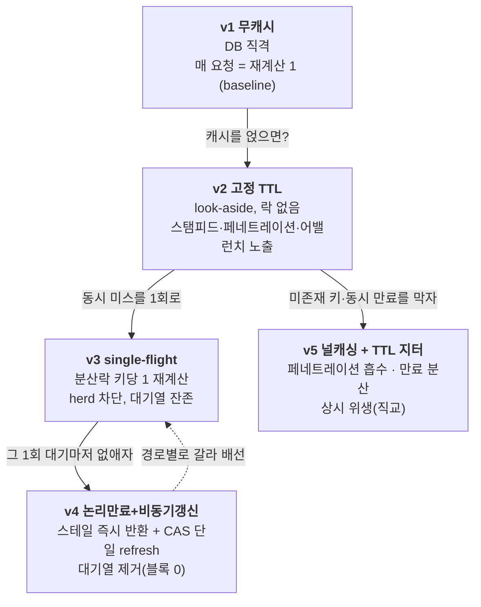
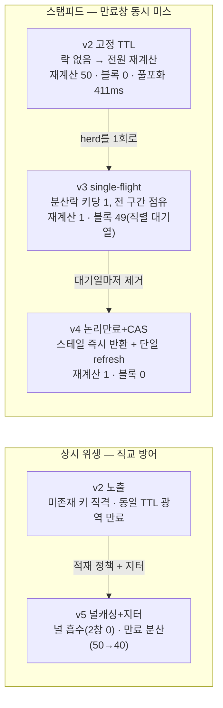

# Phase 3-8 회고 — 읽기 캐시 + 스탬피드 방어, v1~v5 사다리와 경로별 배선

> 상품목록 핫 경로(page1) 하나에 **look-aside 캐시**를 얹고, 그 캐시가 부하 아래에서 깨지는 **세 축**
> (스탬피드·페네트레이션·어밸런치)을 v1~v5 다섯 전략으로 방어했다. 끝은 "캐시 적중이 빠르다"가 아니라
> **부하 형상이 변해도 오리진(DB) 재계산이 구조적으로 상한되나**이며, 단일 우승자가 아니라 워크로드별로
> v3·v4·v5를 갈라 쓰는 **경로별 배선**이다. 이 문서는 그 측정 과정과 선택의 근거를 정리한다.

| 항목 | 내용 |
|------|------|
| **범위** | 상품목록 page1 핫 경로의 look-aside 캐시 — 5버전 사다리(v1 무캐시 → v2 고정TTL → v3 single-flight → v4 논리만료+비동기갱신 → v5 널캐싱+지터). **스키마 변경 0**(캐시는 Redis) |
| **브랜치** | `phase/3-8-cache-stampede` |
| **핵심 결과** | 만료창 동시 미스 C=50에서 오리진 재계산 **v2 50(herd) → v3/v4 1**, 만료창 블록 요청 **v3 49 → v4 0**, 페네트레이션 2번째 창 **v2 50 → v5 0**. herd의 실제 비용은 **커넥션풀 포화(p99 411ms@pool=10)**. 단일 우승자 대신 **경로별 배선**, 기준은 속도가 아니라 **예측 가능성** |
| **상태** | `results/phase3-8-cache-stampede/analysis.md` 실측 — 진실 소스 = 오리진 재계산 카운터 + 블록 카운터(구조량) + ops 핀/게이트 |
| **성격** | 캐시 안정화의 **비용·실패 프로파일** 측정 + 경로별 배선 의사결정. 데이터 규모 product 1,000,000(카테고리 5종 × 200,000) |

> ⚠️ **측정 규율 (이 문서의 전제, §9 정리)**: ① **1차 지표는 두 개의 구조량** — (A) 오리진 재계산 수,
> (A2) 만료창 블록 *요청 수*(시간 아님). 둘 다 캐시 불변·부하 잡음 무관 카운트다. ② **캐시 적중 지연·throughput은
> 참조 전용** — Redis RTT·런별 잡음 confound, 버전 간 비교 금지. ③ **콜드/만료 전환점을 의도적으로 잡는다**
> (따뜻한 캐시로 재면 herd가 안 보임). ④ **서버측 배리어로 C개를 같은 만료창에 동기 release**(k6 램프는 도착
> 타이밍 미보장). ⑤ 통제변수는 단일 소스 핀(`CachePins`) + 부팅 assert로 강제, 사다리 단일 변수 = 방어 기법만 차이.

---

## 1. 한 줄 요약

캐시는 "적중하면 빠르다"가 본질이 아니다. **미스/만료 버스트에서 오리진이 어떻게 증폭되나**가 본질이다.
핫 키 하나가 만료되는 순간 50개 동시 요청이 들이치면, 고정 TTL(v2)은 **50번 재계산**하고 그 50개가 커넥션풀
(10개)을 물어 **p99가 411ms**로 치솟는다. single-flight(v3)는 그걸 **재계산 1번**으로 닫지만 나머지 49개를
**락 대기 큐**에 세운다(블록 49). 논리 만료+비동기 갱신(v4)은 스테일을 즉시 돌려주며 그 **대기열마저 0**으로
없앤다(재계산 1·블록 0). 그런데 v3·v4는 재계산 수(둘 다 1)로는 안 갈린다 — **블록 수(49 vs 0)** 로 갈린다.
그래서 단일 우승자 대신 **경로별 배선**으로 닫았다: 중간 동시성 핫 경로는 v3, 만료창 대기가 보이는 초핫 키는
v4, 페네트레이션·어밸런치 위생은 v5(상시). 우승 기준은 ms가 아니라 **재계산 수가 부하 형상과 무관하게 ≤1로
상한되는 예측 가능성**이다.

---

## 2. 배경 — 왜 캐시, 왜 세 축, 왜 5버전

**도메인 — 핫 키 하나가 만료되면 터진다.** 상품목록 page1(`category` 5종 × page1)은 카디널리티 5의 자연
핫 키다. look-aside 캐시는 미스 시 오리진(DB)을 읽어 채운다. 평상시엔 적중으로 오리진 0이지만, **TTL 만료
전환점**에 동시 미스가 일제히 오리진을 때리면 캐시가 *증폭기*로 변한다 — 이것이 스탬피드(thundering herd)다.

**왜 세 축인가 — 캐시가 깨지는 방식이 다르다.**

| 축 | 무엇이 터지나 | 닫는 칸 | 새 실패면 |
|----|---------------|---------|-----------|
| **스탬피드** | 핫 키 만료 순간 동시 미스 → 오리진 증폭 | v3 single-flight | 락 직렬화·대기열·리스·홀더 크래시 |
| **만료 전환 지연** | single-flight라도 *그 1회*를 기다리는 대기열 | v4 논리만료+비동기갱신 | 스테일 허용·신선도 |
| **페네트레이션** | 미존재 키가 캐시 우회·오리진 직격 | v5 널 캐싱 | 널 메모리·키 생성 정합 |
| **어밸런치** | 다수 키 동시 만료 → 광역 herd | v5 TTL 지터 | 지터 폭이 충분히 분산하나 |

**왜 사다리인가 — 각 칸은 더 낫고 못한 단계가 아니라 서로 다른 결함의 정답이다.**



v3는 herd(축①)를 닫지만 대기열(축②)을 남긴다. v4는 대기열을 닫지만 *존재하는 핫 키의 만료 전환*만 다룬다
(물리 콜드 미스엔 무력). v5는 herd 자체를 안 닫는 대신 페네트레이션·어밸런치(축③④)를 흡수한다. 한 칸이
다음 칸을 폐기하지 않는 **직교** 관계라, "가장 좋은 하나"라는 질문 자체가 경로 의존이 된다.

---

## 3. 접근 — 측정 타당성을 먼저 깔고 시작했다

캐시 측정은 세 곳에서 조용히 거짓을 만든다. 수치를 내기 전에 셋을 닫았다.

**(1) 따뜻한 캐시 함정.** 캐시가 이미 따뜻한 상태로 재면 미스가 안 나 herd가 안 보이고 "캐시 빠름"만 측정된다.
부하 모델은 **핫 키를 강제 만료시킨 직후** C개를 발사해 만료 전환점을 의도적으로 잡는다(ops `POST /expire`).

**(2) 도착 타이밍 함정.** "C개 동시 요청"이라도 k6 램프로 흩뿌리면 첫 요청이 populate 창 안에 캐시를 채워
나머지는 적중 → herd ≪ C로 *과소관측*된다. 그래서 **서버측 배리어**(ops `/barrier?key=&n=C`로 latch 무장 →
각 요청이 캐시 get 진입점에서 check-in → n개가 모이면 동시 release)로 C개를 같은 만료창에 밀어 넣는다.
재계산/블록 카운터가 버전별 캐시 get 안에서 증가하므로 v{n}에 정상 귀속된다.

**(3) 1차 지표를 구조량에 뒀다 — 두 축.** 재계산 수만으로는 v3·v4가 둘 다 만료창당 1로 *포화*해 사다리
위쪽을 반증 못 한다. 그래서 **블록 요청 수**(만료창에서 그 1회 재계산을 기다려 대기에 들어간 *요청 수*, 시간
아님)를 두 번째 정식 구조 축으로 승격했다. 대기 *시간*은 봉인(참조 전용)하되 대기 *개수*는 캐시 불변 카운트다.

> **부팅 게이트로 전제를 강제했다.** `CachePinsBootAssert`가 기동 시 ① 전용 Redis 포트 6380 ② datasource 본체
> 3306 ③ Hikari pool=10 ④ Hibernate 2차 캐시 off(켜지면 재계산이 ORM 캐시에 흡수돼 카운터 거짓 0) ⑤ 락 불변
> `LOCK_WAIT≥LOCK_TIMEOUT` ⑥ 동시성 C < tomcat threads(배리어 latch가 스레드 천장에 막히지 않게) ⑦ **캐시
> 직렬화 라운드트립 self-check** ⑧ 키 prefix를 대조해 불일치 시 기동 실패한다. ⑦은 실제로 버그를 잡았다(§9).

---

## 4. 검증

C=50 동시성, 핫 키 `전자기기`(200,000행), 전용 Redis 6380. 게이트(핀·인덱스 type=ref·격리) 전부 PASS.

### 4.1 축 A — 오리진 재계산 수 (만료창당, 1차 지표) — 실측

| 버전 | 전략 | 재계산 수 | 거동 |
|------|------|-----------|------|
| **v1** | 무캐시 | **50** | baseline — 매 요청 = 재계산 1 |
| **v2** | 고정 TTL | **50** | 락 없음 → 동시 미스 전원 재계산(**herd**) |
| **v3** | single-flight | **1** | 키당 1회, 나머지는 락 대기 후 적중 |
| **v4** | 논리만료+CAS | **1** | 스테일 반환 + 백그라운드 단일 refresh |
| **v5** | 널캐싱+지터 | **50** | 스탬피드와 직교 — herd 안 닫음 |

```
만료창당 오리진 재계산 수 (C=50, 낮을수록 좋음)

  v3 single-flight │▏ 1
  v4 논리만료+CAS  │▏ 1
  v1 무캐시        │████████████████████████████████████████ 50   baseline
  v2 고정 TTL      │████████████████████████████████████████ 50   ← herd(캐시가 증폭기)
  v5 널캐싱+지터   │████████████████████████████████████████ 50   ← 스탬피드 직교
```

**v2가 이 phase의 반전이다 — "캐시 얹으면 안전하다"는 통념을 깬다.** 적중 시엔 오리진 0이지만 만료 전환점에
캐시는 **증폭기**가 된다(50개 동시 미스 → 50회 재계산). v3/v4가 이를 **1**로 닫는다. v5는 herd를 *안* 닫는다
(50) — 페네트레이션·어밸런치 전용이라 스탬피드와 직교임을 카운트가 증명한다.

### 4.2 축 A2 — 만료 전환창 블록 요청 수 (v3 vs v4 분리, 1차 지표) — 실측

| 버전 | 블록 요청 수 | 거동 |
|------|--------------|------|
| **v2** | **0** | 락 없음 → 전원 herd로 직접 재계산(대기 없음) |
| **v3** | **49** | herd를 직렬 대기열로 흡수(C-1) |
| **v4** | **0** | 유효/스테일 캐시 즉시 반환 → 대기 없음 |

```
만료 전환창 블록 요청 수 (C=50)

  v2 │▏ 0
  v4 │▏ 0      ← 스테일 즉시 반환으로 대기열 제거
  v3 │████████████████████████████████████████ 49   ← single-flight의 대기 비용(C-1)
```

**여기서 v4가 v3와 갈린다.** 재계산 수는 v3·v4 둘 다 1이라 축 A로는 구별 불가다. **블록 수(49 vs 0)** 가
v4 칸의 존재 이유 — single-flight가 herd를 직렬 대기열로 *흡수*한 비용을, v4는 스테일 제공으로 *제거*한다.
이건 지연 *분포*(참조 전용)가 아니라 대기에 들어간 *요청 수*(구조 카운트)라 버전 간 비교가 합법이다.

### 4.3 herd의 실제 비용 — 커넥션풀 포화 (관찰값, 캐비엇)

재계산 수가 1차 지표인 이유는 지연이 confound되기 때문이지만, herd의 *비용*은 지연으로 드러난다:

| 시나리오 | 전 구간 로더 지연 |
|----------|-------------------|
| v3 홀더 **단독** 로드(나머지는 캐시 폴) | p50 **39ms** |
| v1/v2 herd — 50개 동시 풀로드 @ pool=10 | p99 **411ms** |
| v3 warm 적중(Redis) | p50 **0.97ms** |

```
herd가 만드는 비용 (전 구간 로더 p99, pool=10)

  v3 홀더 단독   │███ 39 ms       ← 1개만 DB, 나머지 49는 캐시 폴(풀 무경합)
  v1/v2 herd     │████████████████████████████████ 411 ms   ← 50개가 커넥션 10개를 물어 포화
```

**herd는 재계산을 50배 늘릴 뿐 아니라 50개 요청이 커넥션풀(10개)을 물어 p99를 411ms로 끌어올린다.** v3는
재계산을 1로 닫으면서 **동시에** 이 풀 포화를 없앤다(홀더 1개만 커넥션 사용). 즉 single-flight의 가치는
"DB 호출 절감"만이 아니라 **풀 포화 차단**이다. 이 411ms는 v3가 제거하는 병리의 크기다.

### 4.4 축 B — 페네트레이션 (미존재 키) — 실측

| 버전 | 1번째 창 | 2번째 창 | 거동 |
|------|----------|----------|------|
| **v2** | 50 | **50** | `EMPTY_AS_MISS=true` — 빈 결과 미적재 → 매 창 직격 |
| **v5** | 50 | **0** | 빈 결과를 짧은 널 TTL로 적재 → 이후 창 널 적중 |

**v5의 페네트레이션 흡수는 '첫 1회'가 아니라 '첫 창 herd 후 0'이다.** v5엔 single-flight가 없어(직교) 널 적재
*전* 창에 동시 도착한 50개는 전원 직격(첫 창 50). 적재 *후* 창은 널 적중(0). v2는 빈 결과를 합법 적재값으로
보지 않아(빈 Page는 null이 아니다) 매 창 직격한다 — 단일 변수는 **적재 정책**(v2 노출 / v5 흡수)이다.

### 4.5 축 C — 어밸런치 (다수 키 동시 만료) — 실측

5키를 동일 TTL(v2) vs 지터(v5)로 워밍 후, 만료창에 키당 10개씩 광역 부하:

| 버전 | 총 재계산 | 키별 | 거동 |
|------|-----------|------|------|
| **v2** | **50** | 전부 10 | 5키 동시 만료 → 광역 herd |
| **v5** | **40** | 전자기기=0, 나머지 10 | 지터가 전자기기 TTL(11.3s)을 만료창(10.5s) 밖으로 밀어 생존 |

**지터가 만료를 분산한다는 메커니즘은 확인됐으나 효과 크기는 규모 의존이다.** 키당 herd=10(>1)이라 합법
카운트 축이 성립했고(per-key 동기 도착 보장), 지터로 1/5 키가 만료창을 벗어나 50→40으로 줄었다. 다만
5키·단일 만료창이라 분산 효과는 부분적으로만 가시다 — 키 모집단·지터폭이 커야 효과가 또렷해진다(§8 남은 것).

---

## 5. 구조 — 왜 그렇게 갈리는가



- **스탬피드 — 일을 50개의 재계산에서 1개로 옮긴다.** v2는 락이 없어 동시 미스 전원이 각자 오리진을 때린다.
  v3는 분산락(SET NX PX)으로 키당 1개만 재계산하게 하되, 락을 **오리진 로더 전 구간**(커넥션 체크아웃 +
  SELECT + COUNT + 직렬화)에 걸어야 single-flight다 — 내부 SELECT만 감싸면 비홀더가 미스로 새 재계산을 시작한다.
  나머지 49는 락 대기 후 캐시 적중(블록 49). v4는 스테일을 즉시 돌려주며 그 대기열을 0으로 만든다.
- **v3·v4의 분기는 대기열에 있다.** 둘 다 재계산 1이라 "DB 호출"로는 같다. v3는 herd를 *직렬 대기열로 흡수*
  (블록 49), v4는 *대기 자체를 제거*(블록 0)한다. v4의 대가는 스테일니스(잠깐 옛 데이터) — 상품목록 읽기
  전용·약한 신선도라 허용된다.
- **v5는 직교 위생이다.** herd(v3)·대기열(v4)과 무관하게, 미존재 키 흡수(널 캐싱)와 만료 분산(지터)을 깐다.
  스탬피드를 안 닫는 것(재계산 50)이 결함이 아니라 설계다.

---

## 6. 결론 — 경로별 배선 (우승 기준 = 예측 가능성)

"single-flight 하나로 끝"이 아니다. 네 축에서 닫는 칸이 다르므로 워크로드 성격에 맞춰 **배선**한다.

| 경로 | 권장 | 근거 |
|------|------|------|
| **중간 동시성 핫 경로** | **v3 single-flight** | herd를 키당 1로 닫고 풀 포화(411ms)까지 제거. 대부분 충분 |
| **초핫 단일 키**(만료창 대기가 보이는) | **v4 논리만료+비동기갱신** | 만료 전환점의 직렬 대기(블록 49)까지 없애야 하는 경로. 스테일 허용 가능할 때 |
| **모든 배선의 기본 위생** | **v5 널캐싱 + TTL 지터** | 페네트레이션·어밸런치는 트래픽 성격과 무관하게 상존 — 어느 배선이든 깔아둔다 |

**우승 기준은 속도가 아니라 예측 가능성이다.** 캐시 적중 p95(0.97ms)는 측정 노이즈에 가깝고 버전 간 비교가
금지된 축이다. 가르는 근거는 **부하 형상(C)이 변해도 오리진 재계산이 키당 만료창당 ≤1로 구조적으로 상한
되나**이다 — v3/v4는 C가 50이든 500이든 재계산 1, v1/v2는 C에 비례해 무한정 늘어난다(그리고 풀을 포화시킨다).

> **v2는 고치는 칸이 아니라 드러내는 칸이다.** herd·페네트레이션·어밸런치의 baseline으로 남겨, 캐시를
> 정합·안정하게 만들 때 *무엇을 더 떠안는가*(락 직렬화·대기열·스테일·널 메모리·지터 튜닝)를 측정하게 한다.
> "캐시 정합성" 강주장은 하지 않는다 — 달성한 것은 동시 재계산 억제 + 만료 분산 + 페네트레이션 흡수로
> **오리진 증폭을 구조적으로 상한**하는 것까지다.

---

## 7. 회수한 것

1. **스탬피드 방어 사다리 + 두 축 분리 측정** — 만료창 재계산 50→1(v3/v4), 블록 49→0(v4)을 닫고, v3·v4가
   재계산이 아니라 **블록 수**로 갈림을 구조 카운트로 실증했다.
2. **herd 비용의 정량 = 풀 포화** — single-flight의 가치가 "DB 호출 절감"을 넘어 커넥션풀 포화(p99 411ms@pool=10)
   차단임을 측정으로 드러냈다.
3. **단일 우승자 대신 경로별 배선** — 직교 방어(v3 herd / v4 대기열 / v5 위생)를 워크로드 성격으로 갈라 배선하고,
   기준을 ms가 아니라 예측 가능성(재계산 ≤1 상한)에 뒀다.
4. **방법론 자산** — 서버측 배리어(도착 동기화), 두 구조 축(재계산 수 + 블록 수), 부팅 self-check가 잡은 직렬화
   결함과 latent charset 버그(§9), 락 리스 불변의 실측 검증.

---

## 8. 남은 것 (스코프 밖)

- **어밸런치 규모** — 5키·단일 만료창이라 지터 분산 효과가 부분(50→40)으로만 가시. 키 모집단(카테고리×페이지)과
  지터폭을 키운 변종은 백로그.
- **v3 락 폴백·홀더 크래시 재현** — `LOCK_WAIT` 초과 503 폴백과 홀더 크래시 시 리스 인계는 불변 검증으로만
  기록(폴백은 예외 경로라 정상 런에선 미발화). 카오스 주입 재현은 백로그.
- **v4 콜드 경로 single-flight 결합** — v4는 물리 콜드 미스엔 single-flight 보호가 없어(논리만료 측정만) herd로
  회귀한다. 콜드 경로 결합은 '한 칸만 변경' 규율과 상충 검토(백로그).
- **다중 인스턴스** — 본 측정은 단일 인스턴스. 분산락 vs 로컬락의 herd 차단 차이는 백로그.
- **쓰기 경로 무효화·다계층 캐시·CDN** — 읽기 look-aside 단일 계층으로 한정. 범위 밖.

---

## 9. 메타 회고 — 측정 규율

**(1) 부팅 self-check가 직렬화 결함을 기동에서 잡았다.** 캐시 값은 `Page<ProductListResponse>`(=`PageImpl`)를 그대로
적재하면 역직렬화에 실패한다(no-arg 계약 부재). 전용 레코드(`CachedProductList`)로 변환하고 타입 명시 JSON으로
저장하되, **부팅 시 적재→재로드→동치 self-check**를 걸었다. 이게 실제로 버그를 잡았다 — `CachedProductList.isEmpty()`
헬퍼가 Jackson에 `"empty"` 프로퍼티로 직렬화돼 역직렬화에서 `UnrecognizedPropertyException`을 냈고, 기동이 즉시
실패했다(`@JsonIgnore`로 수정). **역직렬화 실패를 '미스'로 흡수했다면** 매 요청이 재계산돼 전 버전이 herd처럼
보이는 거짓 수렴이 됐을 것이다 — silent 흡수를 금지하고 abort로 둔 이유다.

**(2) latent charset 버그 — 측정이 데이터 무결성 버그를 드러냈다.** 캐시 측정은 *내용*이 필요하다(빈 결과는
적재 안 됨 → 거짓 herd). 그런데 앱이 `category='전자기기'`로 0행을 반환했다. 추적해보니 1M 데이터가 latin1/cp1252
세션 클라이언트로 적재돼 `product.category`가 **이중 인코딩**(utf8 바이트→cp1252 해석→utf8 재인코딩)으로 저장돼
있었다(실측: latin1 세션 COUNT=200000 / utf8mb4 세션=0). **이전 phase들은 k6가 `status==200`만 검사해 이 버그를
못 잡았다** — 빈 결과도 200이다. 측정 스택 한정으로 `SET NAMES latin1`(+`characterEncoding=UTF-8`)을 걸어 저장
인코딩과 매칭시켜 200000행을 확정했다. 정공법(컬럼 데이터 재인코딩)은 공유 1M 데이터셋 변경이라 범위 밖으로
두되, **"내용을 검증하지 않는 부하 테스트는 빈 결과를 성공으로 센다"**는 교훈을 남긴다.

**(3) 락 리스 불변은 *홀더 단독* 비용으로 핀해야 한다.** 락 리스(`LOCK_TIMEOUT`=200ms)는 "재계산시간 < 리스"여야
홀더 생존 중 리스 만료(→ 이중 재계산)를 막는다. 여기서 "재계산시간"은 두 값이 다르다: herd 풀포화 p99(411ms)가
아니라 **홀더 단독 로드 p50(39ms)** 다. v3에선 홀더 1개만 DB를 치고 나머지 49는 캐시를 폴하므로 홀더는 풀 무경합
→ 39ms ≪ 200ms로 불변 성립(v3 재계산=1이 무캐스케이드를 입증). 단 홀더가 무관 부하와 풀을 경합하면 411ms로
튀어 리스를 넘는다 — 격리 측정 전제를 벗어나면 `LOCK_TIMEOUT` 재핀이 필요하다(Q3/AD-5).

**(4) populate 창은 내부 SELECT가 아니라 전 구간이다.** `Page` 반환이라 1회 로더가 SELECT(1.4ms) + 별도
`COUNT(*)`(40ms)를 실행한다 — populate 창은 인용된 단건 SELECT ≈12.7ms가 아니라 **COUNT가 지배하는 ≈39ms**다.
이 차이가 도착 동기화에 영향을 준다: populate 창이 넓어(~40ms) 배리어 없이 20ms 산포로 발사해도 herd가
과소관측되지 않았다(자가검증 NOTE). 창이 좁았다면 배리어가 필수였을 것이다 — 측정 대상의 비용 구조가
측정 방법의 필요조건을 바꾼다.

---

## 10. 참조

- **[results/phase3-8-cache-stampede/analysis.md](../../results/phase3-8-cache-stampede/analysis.md)** — 모든 실측의 1차 출처(축 A/A2/B/C + 게이트 + 락 불변 + 자가검증).
- **원시:** `results/phase3-8-cache-stampede/{stampede,penetration,avalanche}/*.tsv`, `index-gate.txt`.
- 구현: `src/main/java/com/project/service/product/cache/ProductListCacheServiceV1..V5.java`, `infrastructure/cache/`(`CachePins`·`CachePinsBootAssert`·`LookAsideCache`·`OriginRecomputeCounter`·`BlockedRequestCounter`·`StampedeBarrier`), `api/cache/ProductCacheController.java`, `api/product/ProductCacheOpsController.java`.
- 측정: `scripts/measure/run-product-cache.sh`(gate/stampede/penetration/avalanche/selftest), `test/load/product-cache-test.js`, `scripts/ensure-product-index.sh`.
- 스펙: [specs/phase3/phase3-8-cache-stampede.md](../../specs/phase3/phase3-8-cache-stampede.md).
- 계승: [phase 3-7 회고](phase3-7-n-plus-one.md)(vN 사다리·경로별 배선·측정 2단계 분리·워밍 함정) · [phase 3-3 회고](phase3-3-concurrency-lock.md)(통제변수 핀·분산락 SET NX PX·예측 가능성 기준).
