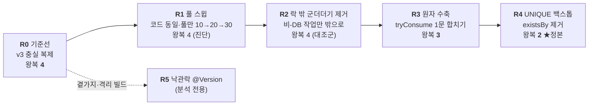
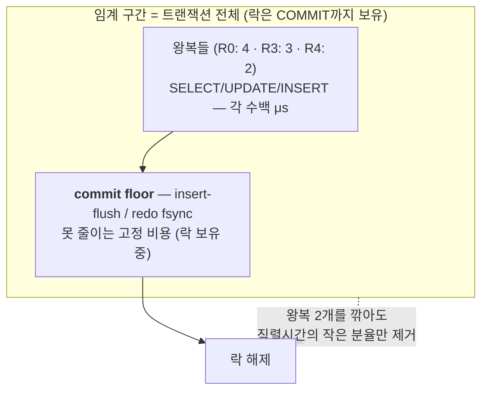

# Phase 3-9 회고 — 직렬 임계 구간 점유: in-lock 왕복 단축의 throughput 번역 (반증 가능 측정)

> phase 3-3(동시성 락 사다리)이 *어느 락이 정합을 지키나*를 닫고 **v3(SELECT FOR UPDATE)** 를 발급 경로에
> 배선했다면, 3-9는 그 v3가 남긴 **지연**(p95 2630ms · pending 189)의 원천 — 직렬 임계 구간의 **in-lock DB 왕복** —
> 을 한 칸씩 줄이고, 그 단축이 사용자 체감(throughput)으로 번역되는지를 *반증 가능하게* 측정한다.

| 항목 | 내용 |
|------|------|
| **범위** | 쿠폰 발급 임계 구간의 in-lock DB 왕복 수를 4→3→2로 바꾸는 사다리(R0~R4) + 낙관락 곁가지(R5, 분석 전용) |
| **브랜치** | `phase/3-9-critical-section-occupancy` |
| **핵심 결과** | 왕복 4→3→2 단축은 **구조적으로 실재**(프로브로 확정)하나 throughput으로는 **약하게만 번역**된다(`r=tput(R4)/tput(R0)=1.20`, H_왕복 예측 2.0과 거리 멀고 반증 문턱 1.5 미달). 임계 구간 비용은 왕복 *수*가 아니라 **commit floor**가 지배 — 헤드라인 입증. |
| **상태** | `results/phase3-9-critical-section-occupancy/analysis.md` 확정. 프로브 3게이트·정합 게이트 전부 PASS. |
| **성격** | 임계 구간 점유 비용의 **구조·측정 회고** — **채택 결정 아님**(3-7·4-1 규율 계승). "무엇을 줄이면 무엇이 commit floor에 가려지는가"를 측정으로 가른다. |

> ⚠️ **측정 규율 둘**: (1) **채택 결정이 아니다** — 가장 빠른 칸을 배선하려는 게 아니라, 구조적 단축이 천장에
> 가려지는 지점을 드러낸다. (2) throughput은 그냥 비교하지 않고 **런 전에 등록한 두 경쟁 가설(H_floor·H_왕복)** 을
> 숫자 규칙으로 가른다. 부하 런이 헤드라인을 **반증할 수 있게** 설계했다. 이유는 §9.

---

## 1. 한 줄 요약

임계 구간의 in-lock DB 왕복을 **4문(R0) → 3문(R3) → 2문(R4)** 으로 줄였고, 그 감소를 **동시성 0 단일요청
프로브로 결정론 확정**했다. 하지만 그 구조적 단축이 throughput으로 번역되는 정도는 작았다 —
`r = tput(R4)/tput(R0) = 1.20`으로, "왕복 수에 반비례(2×)"라는 반증 후보(H_왕복)와 거리가 멀고, R1 풀 스윕이
pool 10→30에서 **평평**해 천장이 풀이 아니라 **점유시간**임을 독립 보강한다. 결론: **단일 핫 로우 비관락
워크로드에서 임계 구간 비용은 왕복 *수*가 아니라 commit floor(X-락을 COMMIT까지 쥐는 insert-flush/fsync)가
지배한다** — 헤드라인 입증. 정직 단서로, r=1.20은 "제로 번역"이 아니라 **~20% 부분 번역**이다(§6·§9).

---

## 2. 배경 — 왜 이 문제, 왜 프로브 카운트가 1차, 왜 사다리

**문제 — v3가 남긴 지연.** 3-3은 정합을 닫았지만 성능축에서 v3는 p95 2630ms · Hikari active 10/10 ·
pending 189를 남겼다. 이 지연의 원천은 **임계 구간 = 트랜잭션 전체**라는 v3의 구조다. `findByIdForUpdate`가
행 락을 잡은 뒤 커밋까지 락을 쥐고, 그 사이 DB 왕복 4문이 발생한다:

```
① FOR UPDATE SELECT   (행 락 획득)
② existsBy SELECT      (중복 검사)
③ INSERT coupon_issue  (발급 기록)
④ UPDATE coupon        (커밋 dirty-flush — coupon.issue()가 managed 엔티티를 더럽혀 커밋 flush에서 발화, 락 보유 중)
```

직관은 "왕복을 줄이면 락 점유가 짧아지고 throughput이 오른다"이다. 3-9는 이 직관을 **반증 가능하게** 시험한다.

**왜 프로브 카운트가 1차 지표인가 — 구조는 부하 실험의 산물이 아니라 코드 사실이다.** phase 3-8이 스탬피드
방어의 1차 지표를 "오리진 재계산 *수*"(부하 아닌 결정론 카운트)로 둔 것과 같은 규율이다. 요청당 in-lock 왕복
수는 **동시성 0 단일요청 프로브 1회 + 코드 정적 카운트**로 모호함 없이 확정된다 — 포화 인터리브 로그에서
트랜잭션 경계를 추론하지 않는다(closed-loop 연속 처리+warmup이 "문수/요청수" 평균을 비정수로 오염). 그래서
카운트는 "입증"이 아니라 **"확정"** 으로 다룬다.

**왜 사다리인가 — 단일변수를 한 칸씩 격리해 무엇이 번역되고 무엇이 가려지는지 가르려고.**



각 칸은 정책(park·503=0)·핫키·부하모델을 고정하고 **변하는 단일 변수 = in-lock 왕복 수**뿐이라 throughput
직접 비교가 합법이다(R1만 풀이라는 제2변수가 변해 판정에서 제외 → 자기 진단 규칙으로 따로).

---

## 3. 접근 — 측정 타당성을 먼저 깔고 시작했다

**측정 기판을 base 프로파일로 고정했다.** phase 3-8의 캐시 측정 프로파일(`SET NAMES latin1`, 이중인코딩
category 우회)은 dirty-flush `UPDATE coupon`의 `name` 컬럼을 latin1 라운드트립으로 누적 재인코딩→길이 초과
(1406 Data truncation)시켜 지속 부하에서 v3가 500으로 샌다. 그래서 3-9는 **base(utf8mb4) 필수** — phase3-8
프로파일 금지를 기판 요구사항으로 못박았다.

**핀 단일 소스 + 부팅 assert로 통제변수를 코드가 집행하게 했다(3-3 계승).** `CriticalSectionPins`(VU 500 ·
핫키 · Hikari pool 10 · Tomcat threads 200 · 정책 park · 풀 스윕 10/20/30 · 판정 문턱 파생식)를 한 곳에 두고,
`CriticalSectionPinsBootAssert`(측정 전용 `@Profile` 게이트 — 운영 무오염)가 **실제** Hikari 풀·Tomcat 스레드를
핀과 대조해 불일치면 기동을 막는다. R1 풀 스윕은 이 assert로 "의도 풀값이 실제로 먹었는지"를 확증한다.

| 변수 | 핀 값 | 검증 방식 |
|------|-------|-----------|
| Hikari `maximum-pool-size` | 10 (R1만 10/20/30) | **부팅 assert가 실제 `getMaximumPoolSize()` 실측 대조**, 불일치 시 기동 실패 |
| Tomcat `threads.max` | 200 | 부팅 assert가 커넥터 executor 실측 대조 |
| MySQL `innodb_lock_wait_timeout` | 50s | 런타임 assert(불일치 abort) |
| MySQL `transaction_isolation` | REPEATABLE-READ | 런타임 assert(불일치 abort) |

부팅 assert의 건전성은 **고의 불일치 자가검증**으로 닫았다: 기대 풀값을 실제와 다르게 주입하면
`IllegalStateException`으로 기동이 중단된다(핀이 substrate 무결성을 집행함을 실증).

**부하 런에서 SQL 로깅을 껐다 — 이것이 편향 제거다.** 문장당 DEBUG 로깅 비용은 왕복 *수*에 비례(R0 4문 >
R4 2문)해, 켜두면 왕복 차이를 **인위적으로 증폭**(H_왕복 쪽으로 편향)한다. 끄는 것이 H_floor 시험에 보수적이며,
전 칸(R0~R4)에 동일 적용해 통제변수로 유지했다. 프로브 보트만 로깅 ON(카운트 판독용).

**ε(노이즈밴드)를 실측으로 재확정했다.** 사전 등록 판정이 성립하려면 v3 성공 throughput의 런-간 노이즈가
반증 문턱과 겹치지 않아야 한다. 파일럿 잠정치(R0 단독 `ε_hi=21.9%`)를 R4 빌드 후 **R0·R4 각 n=6의 결합 CV
신뢰구간 상한** `ε_hi = √(CV_R0² + CV_R4²)`의 χ² σ-bound로 재산출했다: **26.12% < 0.5** → 판정 유효.

---

## 4. 검증

### 4.1 구조 축 — 프로브 카운트 (결정론·정적, 1차 지표)

동시성 0 단일요청 프로브로 각 칸의 in-lock 왕복 수를 확정했다. **3개 배선 게이트를 전부 충족**: (i) 칸별
프로브 카운트, (ii) 전 칸 flush 순서, (iii) 채점 게이트 배선.

```
요청당 in-lock DB 왕복 수 (프로브 확정 — 코드 사실)

  R0 │████ 4   FOR UPDATE · existsBy · INSERT · 커밋 UPDATE(dirty-flush)
  R2 │████ 4   (동일 — 락 밖으로 뺀 건 DB 미접촉 작업뿐, existsBy 앞 UPDATE 없음)
  R3 │███  3   tryConsume UPDATE · existsBy · INSERT (dirty-flush UPDATE 소멸)
  R4 │██   2   tryConsume UPDATE · INSERT (existsBy 제거)
```

- **flush 순서 게이트**가 R2의 함정을 실측으로 닫았다: `FlushModeType.AUTO`가 existsBy 직전 dirty `UPDATE`를
  조기 flush하면 카운트가 조용히 어긋난다. 프로브 시퀀스가 `FORUPDATE, ISSUESEL, INSERT, UPDCOUPON`(UPDATE가
  맨 뒤 = 커밋 시)임을 확인해 **existsBy 앞 managed 접근 없음**을 검증했다.
- **R3/R4의 UPDATE는 tryConsume**(bulk `@Modifying`)이라 엔티티를 managed로 적재하지 않아 커밋 dirty-flush
  UPDATE가 **소멸**한다 — 이것이 4→3 감소의 실체다. R4는 여기서 existsBy SELECT까지 제거(3→2)하고 중복
  방어를 `UNIQUE(coupon_id, user_id)`에 위임(1062→`DuplicateIssueException` 명시 번역).

### 4.2 채점 축 — 사전 등록 판정 (반증 가능한 throughput)

런 전에 두 경쟁 가설을 등록하고, 관측 `r`이 어느 밴드에 드는지 숫자 규칙으로 갈랐다.

- **H_floor (헤드라인):** 직렬시간 ≈ `commit_floor + k·(왕복수)`, 단 `commit_floor ≫ k·왕복` → 예측 `r ≈ 1`.
- **H_왕복 (반증 후보):** 직렬시간 ≈ `k·(왕복수)`, commit_floor 무시 → 예측 `r ≈ count(R0)/count(R4) = 4/2 = 2.0`.

```
성공 throughput (500 VU 단일 핫키 폐루프 · steady 30s · pool=10 · SQL 로깅 OFF)

  R0 (4문) │███████████████████████████████       307.8/s  (n=6, CV 11.5%)
  R2 (4문) │████████████████████████████████      316.7/s  (n=1, 대조군)
  R3 (3문) │██████████████████████████████████    344.7/s  (n=3, 정성만)
  R4 (2문) │█████████████████████████████████████ 370.4/s  (n=6, ★정본 정량점)
           └ 정확성 축 전 칸 행수==100(초과 0) · 코드 동일 칸 503=0·other=0

관측 비 r = tput(R4)/tput(R0) = 1.20

  1.0        1+ε_hi=1.26   반증문턱 1.5              H_왕복 예측 2.0
  ├───────────┤    ×    ├──────────────────────────────┤
  │◀─ 지지밴드 ─▶│  r=1.20                              │
  [0.74 ─────── 1.26]   (지지밴드 안 → H_floor 지지)
```

**판정 — H_floor 지지(헤드라인 입증).** `ε_hi = 26.12% < 0.5`라 밴드 비겹침이 성립(판정 유효), `r = 1.20`이
지지밴드 `[0.74, 1.26]` 안에 든다. H_왕복 예측(2.0)과 거리가 멀고 반증 문턱(1.5)에 못 미친다 → 구조적 단축이
throughput으로 (거의) 번역되지 않음이 **측정으로 확인**됐다.

> 게이트는 점추정이 아니라 **보수적 상한 `ε_hi`** 로 집행한다 — 소표본 CV 과소추정이 겹친 밴드를 조용히
> 통과시키는 비대칭을 구조적으로 막기 위해서다(§9).

### 4.3 진단 축 — R1 풀 스윕 (음성 대조군)

풀(의자)을 10→20→30으로 늘려도 throughput이 오르지 않으면 천장은 점유시간(H_floor 측), 오르면 천장은 풀
(전제 반증). 코드는 R0와 동일, 풀만 변경했다.

```
R1 풀 스윕 throughput (r1 endpoint = R0 코드)

  pool 10 │██████████████████████████████████  329.8/s   503=0
  pool 20 │█████████████████████████████████   325.7/s   503=0
  pool 30 │██████████████████████████████████  332.4/s   503=0
          └ 평평(~308–332/s, 노이즈밴드 내) → 천장 = 점유시간, not 풀. 전제 반증 안 됨.
```

풀을 3배로 늘려도 평평했다 → **천장은 의자(풀)가 아니라 점유시간**. 이것이 §4.2의 H_floor 지지를 독립
보강한다. 스펙이 허용한 R1 503>0 시나리오(pool 30에서 큐깊이×fsync 꼬리가 50s 초과)는 이 스케일에선
미발화(503=0 관측치로 기록, abort 아님).

### 4.4 R3 거울 (정성 보강만, 정량 반증권 없음)

ε-가드는 R4 비(ρ*=2, 문턱 1.5)에만 도출됐다. R3를 정량 분리(ρ_R3=1.33)하려면 더 빡센 `ε < 0.165`가 필요한데
`ε_hi=26.12% ≥ 16.5%`라 **R3 정량 판정은 보류**한다. R0·R3·R4 3점 **정성 추세**로만 읽는다:

```
  R0 307.8  <  R3 344.7  <  R4 370.4  (/s)  — 왕복 4→3→2에 따라 단조 상승
```

세 점이 단조 상승하나 기울기가 기준비 선(ρ*=2.0)에 크게 못 미쳐(총 ~20%), H_floor 지배와 정합한다. **정본은
R4**(유일하게 ε-가드된 정량 시험)이며 R3 정성 추세와 어긋나지 않는다.

---

## 5. 구조 — 왜 commit floor가 지배하는가



락을 쥔 채 치르는 시간은 `왕복들 + commit floor`인데, **commit floor가 왕복 비용을 압도**한다. 그래서
왕복을 4→2로 절반 깎아도(R4) 직렬시간은 절반이 되지 않는다 — `r=1.20`(≪2.0)이 이 비대칭의 측정 증거다.
R1 풀 스윕의 평평함이 같은 결론을 다른 각도(풀↑에도 불변)에서 확인한다.

---

## 6. 결론 — 헤드라인 입증 + 정직 후퇴

1. **구조적 단축은 실재한다** — R0=4·R3=3·R4=2 왕복을 프로브가 결정론으로 확정(3개 배선 게이트 통과).
2. **그 단축의 throughput 번역은 약하다** — `r=1.20 ≪ 2.0`, `ε_hi<0.5`로 판정 유효, **H_floor 지지**. commit
   floor가 임계 구간 비용을 지배한다는 헤드라인이 **부하 런으로 반증 가능하게 입증**됐다.
3. **정직 후퇴** — 점 신호는 "거의 0 번역"이 아니라 **~20% 부분 번역**이다(r=1.20은 지지밴드 상단 가장자리라,
   점추정 밴드로 읽으면 미결에 걸친다). "왕복 수에 *비례*(2×)"는 명확히 반증됐으나, 왕복 감축이 소폭 실익을
   주는 것도 사실이다 — 과대 단정("완전 무번역")과 과소 단정("왕복이 천장") 사이의 **혼합**이 가장 정직한
   서술이며, 게이트 규칙상 공식 라벨은 "지지"다.
4. **채택 결정 아님** — 3-9는 "가장 빠른 칸"을 배선하지 않는다. R4가 R0보다 소폭 빠르지만, 이 실험의 산물은
   *속도 순위*가 아니라 **"무엇을 줄이면 무엇이 commit floor에 가려지는가"** 라는 구조적 앎이다.

---

## 7. 회수한 것

1. **구조/채점 축 분리** — 왕복 수(결정론 프로브)와 throughput(반증 가능 판정)을 다른 종류의 증거로 다뤄,
   "구조가 줄었다"와 "체감이 좋아졌다"를 혼동하지 않았다.
2. **반증 가능한 부하 채점** — 500-VU 런을 정합 게이트만 찍는 장치가 아니라 **헤드라인을 반증할 수 있는
   채점 장치**로 만들었다(사전 등록 H_floor vs H_왕복 + `ε_hi` 가드).
3. **방법론 자산** — (a) 부팅 assert가 실제 풀/스레드를 집행(고의 불일치 자가검증), (b) 로깅 편향을 통제변수로
   제거, (c) 소표본 CV 과소추정을 `ε_hi`로 차단.

---

## 8. 남은 것 (스코프 밖)

- **DB 앞단 Redis 입구 게이트 · 비동기 발급(3-4) · 다중 인스턴스 분산락 · exactly-once** — 백로그.
- **R5 낙관락 @Version** — 단일 빌드 혼합 금지(R0/R2는 managed 적재+dirty로 버전검사 ON ↔ R3/R4의 bulk
  tryConsume은 영속성 컨텍스트 우회로 버전검사 OFF, 비대칭이 조용히 생김). 별도 격리 빌드에서 분포로만, 기본
  분석 전용(왜 단일 핫키 초고경합에서 재시도 폭풍으로 불리한가 정성 논증).
- **더 큰 n / 개루프(constant-arrival-rate)** — r=1.20이 지지↔미결 경계라, ε_hi를 더 좁히면 "부분 번역"을 더
  또렷이 가를 수 있다(§9).

---

## 9. 메타 회고 — 측정 규율

**(1) 게이트는 `ε_hi`로 집행하되, `ε_point`도 나란히 읽었다.** 게이트가 쓰는 값은 CV 점추정이 아니라 결합
CV의 신뢰구간 상한 `ε_hi`(χ² σ-bound)다 — 소표본에서 참 ε가 큰데 점추정이 작게 나와 겹친 밴드가 *조용히*
통과하는 비대칭을 막는다. 다만 이 보수성은 **양날**이다: n=3에서 `ε_hi`는 팽창계수 ~4.4로 점 CV를 4배 넘게
부풀려 실재 부분신호(r=1.20)를 "지지"로 삼킨다. 그래서 n을 3→6으로 올려 `ε_hi`를 34%→26%로 좁혔고, 공식
라벨(지지)과 함께 점추정 밴드로 읽으면 "상단 가장자리·부분 번역"임을 **정직히 병기**했다.

**(2) 로깅을 통제변수로 다뤘다.** SQL DEBUG 로깅 비용은 왕복 수에 비례해, 켜두면 H_왕복 쪽으로 편향된다.
부하 런에서 끄는 것이 H_floor 시험에 보수적이며, 전 칸 동일 적용이 핵심이다("값"이 아니라 "전 칸 동일").

**(3) 문턱은 예측이 아니라 결정 경계다.** 반증 문턱 1.5는 구조적 카운트비(`ρ*=count(R0)/count(R4)=2`)에서
*도출된* 결정 경계지, 예측 outcome이 아니다. 문턱을 ε에 맞춰 키우면 H_왕복 신호 영역을 잠식해 무의미해지므로,
겹치면 문턱이 아니라 **ε를 줄이거나 판정을 포기**한다.

이 규율들은 phase 3-3(통제변수 핀·throughput 직접비교 회피), 3-7(우승=예측 가능성·채택 아님), 3-8(1차=구조
카운트·부팅 assert)에서 이어받아, "부하 런이 헤드라인을 반증할 수 있는가"라는 한 질문으로 벼렸다.

---

## 10. 참조

- **[results/phase3-9-critical-section-occupancy/analysis.md](../../results/phase3-9-critical-section-occupancy/analysis.md)** — 모든 실측의 1차 출처(프로브 카운트·throughput 배열·판정 verdict).
- **[specs/phase3/phase3-9-critical-section-occupancy.md](../../specs/phase3/phase3-9-critical-section-occupancy.md)** — 실행 정본 스펙(사다리·사전 등록 판정·측정 규율).
- 구현: `src/main/java/com/project/service/coupon/occupancy/CouponOccupancyServiceR0..R4.java`, `CriticalSectionPins(BootAssert).java`, `api/coupon/CouponOccupancyController.java`, `domain/coupon/CouponRepository#tryConsume`.
- 게이트/하네스: `scripts/coupon/probe-occupancy.sh`(구조 카운트), `scripts/coupon/adjudication-gate.py`(사전 등록 판정), `scripts/measure/run-occupancy.sh`(부하).
- 계보: [phase3-3 동시성 락](phase3-3-concurrency-lock.md)(v3 채택·지연 출발점) · [phase3-7 N+1](phase3-7-n-plus-one.md)(우승=예측 가능성) · [phase3-8 캐시 스탬피드](phase3-8-cache-stampede.md)(1차=구조 카운트).
