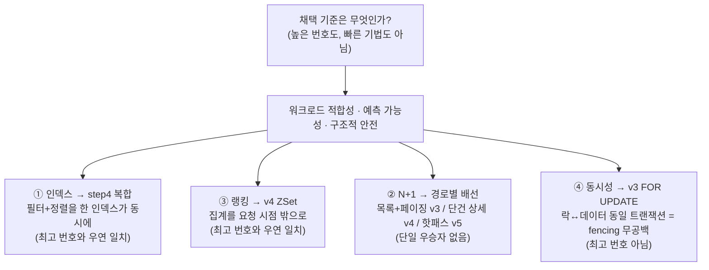

# 종합 리포트 — 4개 시나리오를 관통하는 판단과 측정 규율

> 이 프로젝트는 e-커머스 백엔드의 병목 4종(인덱스·N+1·랭킹·동시성)을 각각 `v1~vN` 사다리로
> 재현·측정·판단했다. 각 시나리오의 깊은 수치는 개별 `results/`·회고의 몫이고, 이 문서는 **그 위를
> 가로지르는 메타 서사**다 — 4개를 관통하는 *판단 기준*과 *측정 규율*은 무엇이며, 왜 그것이 "가장
> 고급 기법을 골랐다"보다 중요한가.

| 항목 | 내용 |
|------|------|
| **범위** | 코어 4개 시나리오의 종합(① 인덱스 ② N+1 ③ 랭킹 ④ 동시성). 개별 수치가 아니라 횡단 주제(판단·측정 규율·trade-off)가 대상 |
| **입력** | `results/phase3-1`·`phase3-2`·`phase3-3`·`phase3-4`·`phase3-6`·`phase3-7`, 회고 5편(아래 §6 참조), `results/environment.md` |
| **핵심 주장** | 4개 시나리오의 **1차 증거가 전부 인프라·캐시에 불변한 *구조량***(EXPLAIN type/rows·쿼리 수·행 수)이고, 레이턴시·throughput은 보조이거나 비교 금지다. 채택은 "가장 빠른/높은 번호"가 아니라 **워크로드 적합성·예측 가능성·구조적 안전**으로 가른다 |
| **성격** | 포트폴리오 종합 — 새 측정이 아니라 기존 실측의 **횡단 해석**. 수치 정본은 각 `results/` 원본 |

> ⚠️ **이 문서의 규율**: 시나리오 **간** 절대 수치를 직접 비교하지 않는다(서로 다른 워크로드). 각
> 시나리오는 **자체 before→after 배수**만 말한다. "인덱스 25배가 동시성보다 크다" 같은 문장은 성립하지
> 않는다 — 측정 대상도, 부하 모델도, 비교 합법 축도 다르다.

---

## 1. 한 줄 요약

4개 시나리오는 서로 다른 병목을 다루지만 **같은 한 가지 규율**로 묶인다 — 헤드라인의 1차 근거를
*레이턴시가 아니라 구조량*에 둔다. 인덱스는 `EXPLAIN type=ALL→ref`와 filesort 제거로, 랭킹은 풀스캔
`rows=1,495,284`로, N+1은 요청당 쿼리 수 `1150→1`로, 동시성은 `coupon_issue` 행 수 `999→0`으로 말한다.
이것들은 buffer pool 상태나 측정 시점에 흔들리지 않는 불변량이라, 숫자가 *계기의 산물*일 가능성(거짓
수렴)을 구조적으로 차단한다. 그 위에서 채택을 정할 때도 기준은 같다 — **가장 높은 번호도, 가장 빠른
기법도 아니고, 이 워크로드에서 예측 가능하고 구조적으로 안전한 것**. 그래서 동시성은 최고 번호 v5가
아니라 v3을, N+1은 단일 우승자가 아니라 경로별 v3/v4/v5를 배선한다.

---

## 2. 4개 헤드라인 — 측정 조건과 1차 증거

각 헤드라인은 **자체 before→after 배수**와 함께, 그것을 떠받치는 **구조 증거**를 1차 근거로 단다.
레이턴시 배수는 "그래서 얼마나"를 보이는 보조이고, 그것이 노이즈가 아님을 보증하는 건 구조 증거다.

| # | 시나리오 | baseline → 채택/배선 | 자체 배수 | 1차 증거(구조량·인프라 불변) | 측정 조건 |
|---|----------|----------------------|-----------|------------------------------|-----------|
| ① | 인덱스 | step1 무인덱스 → step4 복합 `(category, created_at DESC)` | p95 319.6 → **12.7 ms (25.2×)** | EXPLAIN `type=ALL`(rows 993,313)+filesort → `type=ref`+**filesort 제거** | 1M product, 동일 런 내부, VU=8<pool |
| ② | N+1 | v1 LAZY 루프 → **경로별 배선** | 목록 쿼리 **1150 → 1**(v4)/2(v5)/27(v3), 상세 **7 → 1** | `org.hibernate.SQL` 격리 카운트(VU=1, 인덱스-무관 불변량) | orders 500K·order_item 1.5M, 격리 런 |
| ③ | 랭킹 | v1 DB GROUP BY 풀스캔 → v4 Redis ZSet | p95 39,336 → **6.9 ms (≈5,700×)** | EXPLAIN `type=ALL` rows **1,495,284**+temp+filesort → ZSet O(log N)·ZCARD=100 | 1.5M order_item, VU=8<pool, v1만 측정축 420s |
| ④ | 동시성 | v1 무락 → v3 `SELECT FOR UPDATE` | 초과발급 **+899 → 0** | `SELECT COUNT(*) coupon_issue`=actual 행 수(카운터 아님) | total_qty=100, 500VU(≫pool)로 경합 유발 |

- **①·③은 채택이 최고 번호와 *일치*하지만, 그 이유는 "최고라서"가 아니다.** 복합 인덱스(step4)는
  필터와 정렬을 *한 인덱스가 동시에* 만족해 filesort를 없애므로 채택됐고, ZSet(v4)은 집계를 요청 시점
  밖으로 옮겨 O(log N)이라 채택됐다. 같은 기준(구조적 적합)이 우연히 최고 번호를 가리킨 경우다 —
  실제로 인덱스 step3/5(정렬축만 인덱싱)는 더 높은 변형인데도 무인덱스보다 느린 7~8초의 **안티패턴**이다.
- **②·④는 채택이 최고 번호가 *아니다*.** N+1은 v4가 쿼리 최소(1회)지만 목록 p95는 v5(2쿼리)가 470ms로
  최속이라, 단일 우승자 대신 경로별로 갈랐다. 동시성은 분산 락(v4/v5)까지 구현하고도 v3(DB 행 락)을
  배선했다 — 락↔데이터가 같은 트랜잭션이라 fencing 공백이 구조적으로 없기 때문이다.

> **④의 확장(비동기 발급, v6a/b/c)은 채택 결정이 아니다.** 동기 발급을 큐 뒤로 미뤘을 때의 *비용·실패
> 프로파일*을 측정한 별도 실험으로, v3 배선을 흔들지 않는다(컨슈머도 v3 경로 재사용). 핵심 발견은 "컨슈머
> 죽음의 유실은 큐 매체가 아니라 *종료 방식*(kill -9 vs SIGTERM)에 특정된다"이다. 상세는 회고
> [phase3-4](phase3-4-async-issuance.md).

---

## 3. 횡단 주제 ① — 단일 우승자 거부, 워크로드별 배선

4개 시나리오의 사다리는 *더 낫고 못한 단계*의 줄이 아니다. 각 칸은 **서로 다른 조건에서 각자 정답**인
별개 도구이고, 채택은 좌표(워크로드)를 고정한 뒤 정해진다.

- **N+1의 경로별 배선** — 목록(컬렉션 N+1)과 상세(to-one N+1)는 규모(N≈500 vs M≈3)와 해법이 갈린다.
  목록+페이징은 v3(batch)을 쓴다(fetch join은 1:N+페이징에서 메모리 페이징으로 막히지만 IN 배치는
  page size로 N이 고정돼 예측 가능). 단건 상세는 v4(fetch join, 컬렉션 하나라 distinct로 통제). 조회
  전용 핫패스는 v5(투영으로 전송·적재까지 절감). **기준은 속도가 아니라 "데이터가 커져도 쿼리·메모리가
  고정되는 예측 가능성"**이다.
- **동시성의 v3 채택** — 좌표는 *단일 스키마 모놀리식 + 단일 핫키 고경합 + 임계 구간이 곧 DB 쓰기*다.
  이 좌표에선 보호 대상(coupon 행)이 이미 DB 안에 있어, 락과 데이터가 같은 트랜잭션인 v3가 원자적이고
  fencing 공백이 구조적으로 없다. 분산 락(v4/v5)이 더해주는 건 *비-DB 임계 구간 보호*뿐인데 이 좌표엔
  쓸 데가 없고, 대신 Redis SPOF와 fencing 공백을 떠안는다. 분산 락(v4/v5)까지 구현해 비교한 뒤 이
  워크로드엔 DB 행 락이 맞다고 판단했다.
- **인덱스·랭킹도 같은 기준의 산물**이다. 채택이 최고 번호와 일치한 건 결과지 기준이 아니다. 인덱스
  step3/5는 "인덱스를 걸었다 = 빨라진다"가 대용량에서 틀림을 증명하고(무인덱스보다 느림), 랭킹 v2(커버링
  인덱스)는 768ms로 v1을 51× 개선하지만 매 요청 집계라 한 자릿수 ms의 캐시/ZSet과는 격이 다르다.

어느 기법이 맞는지는 좌표에 달려 있다. 같은 사다리라도 페이징 여부·1:N 깊이·임계 구간 위치·인프라
맥락이 바뀌면 배선이 바뀐다.

---

## 4. 횡단 주제 ② — 측정 규율: 1차 증거를 구조량에 둔다

4개 시나리오가 공유하는 측정 규율의 핵심은 **"레이턴시를 함부로 믿지 않는다"**이다. p95·throughput은
buffer pool 상태·측정 시점·부하 모델에 흔들리지만, EXPLAIN·쿼리 수·행 수는 구조라 인프라와 무관하다.

**(1) 1차 증거 = 인프라 불변 구조량.** 모든 헤드라인의 1차 근거가 구조량이다(§2 표). 이것이 측정값이
*계기의 산물*일 가능성을 차단한다:

| 시나리오 | 1차 지표(구조·불변) | 보조 지표(환경 의존) | 왜 보조가 1차가 못 되나 |
|----------|---------------------|----------------------|--------------------------|
| ① 인덱스 | EXPLAIN type·rows·filesort | p95 | cross-scale(100K↔1M) p95는 시점·인프라 핀 분리로 직접 비교 불가 → 스캔 행 수로만 정량 |
| ② N+1 | 요청당 쿼리 수(VU=1 격리) | p95 | 접근 경로 컬럼 무인덱스라 p95 = N+1 왕복 × 풀스캔으로 부풀려짐(EXPLAIN 백스톱이 잡음) |
| ③ 랭킹 | EXPLAIN rows(스캔량) | p95 | within-scale만 헤드라인, cross-scale은 스캔량으로 |
| ④ 동시성 | `COUNT(*)` 행 수(=actual) | throughput | 경합 전략 confound로 throughput 버전 간 비교 무의미(§아래 3) |

- **N+1의 1차 지표 격상이 가장 선명한 예다.** EXPLAIN 백스톱이 `order_id`·`user_id` 무인덱스(풀스캔)를
  잡아내, p95 절대치가 "N+1 왕복 × 풀스캔"으로 오염됨이 드러났다. 헤드라인을 p95에 뒀다면 "v1이 느린 건
  인덱스 탓인가 N+1 탓인가"가 엉켰을 것이다. **쿼리 수는 인덱스·버퍼풀과 무관하게 1150 vs 1**이라, 이걸
  1차로 격상하고 p95는 *순서*만 읽는 보조로 내렸다.
- **동시성의 진실 소스가 행 수인 이유는 v1에서 드러났다.** 무락 v1은 `coupon.issued` 카운터가 **100**으로
  천장에 캡돼(lost update) "한도 지켜짐"으로 보이지만, 진실은 `coupon_issue` 행 수 **999**다. 카운터만
  믿으면 오판한다. 이 한 칸이 "정합 판정은 항상 행 수로"라는 규율의 근거가 됐다.

**(2) 통제변수 핀 — 값이 정답이 아니라 "전 버전 동일"이 핵심.** 동시성은 pool/connTO/Tomcat/innodb/RR을
같은 값으로 핀했고, N+1은 v2(EAGER)·v3(batch)이 전역 변수라 단독 측정 런에서만 토글하고 v1 baseline에
`fetch=LAZY ∧ batch 미설정` assert를 박았다. 이 핀이 없으면 "v3=커넥션 고갈" 같은 간판이 *측정*이 아니라
두 기본값 대소관계로 **선결정**된다.

**(3) throughput 직접 비교 회피 — 경합 전략 confound.** 동시성·비동기 두 시나리오에서는 throughput 막대를
**한 장도 그리지 않았다**. 버전 간 throughput 격차(v3 317 > v2 264 등)의 지배 변수는 락 위치가 아니라
경합 전략이 같이 움직인 교란(v1/v2/v3=대기 흡수, v4/v5=fail-fast 거절)이라, 같은 컬럼이라도 의미가 다르다.
비교 합법 축은 정합(초과발급 0)이라는 이진 질문 하나뿐이다.

**(4) VU 모델은 측정 목적의 함수.** 같은 k6라도 무엇을 통제변수로 둘지가 VU 값을 정한다 — 인덱스·랭킹·
N+1처럼 "쿼리가 얼마나 싼가"를 보려면 **VU<pool**(비포화, p95=순수 쿼리 비용), 쿠폰처럼 "동시성에서 정합이
깨지는가"를 보려면 **VU≫pool**(경합 자체를 측정). 소규모 옛 랭킹 런이 VU=100(≥pool)으로 재 p95에 커넥션
풀 대기를 섞었던 것을, 스케일업이 드러내 VU=8로 교정했다.

**(5) 거짓 수렴 방어.** "빠름·평탄"으로 위장하는 깨진 측정을 비공집 게이트로 차단했다 — 랭킹 v4는 `ZCARD=100
∧ HTTP 200 ∧ rankings_len=100 ∧ counter Δ>0`을 통과해야 헤드라인에 올렸고(빈 ZSet·즉시 에러도 평탄하게
보임), 비동기는 "응답 직후 행 수" 대신 **수렴 게이트**(큐 깊이 0 ∧ 행 수 3연속 동일)로 판정했다.

---

## 5. 횡단 주제 ③ — trade-off의 정직한 노출과 한계 꼬리표

채택은 *무엇을 양보하고 무엇을 얻는지*를 함께 적을 때만 정직하다. 4개 시나리오 모두 얻은 것 옆에 양보한
것과 미실증 한계를 꼬리표로 단다.

| 시나리오 | 채택안이 얻는 것 | 함께 떠안는 것 / 양보 | 미실증 한계(스코프 밖) |
|----------|------------------|------------------------|------------------------|
| ① 인덱스 | filesort 제거·type=ref | 쓰기 시 인덱스 유지 비용(미측정) | cross-scale 레이턴시 직접 비교 불가(스캔량으로 대체) |
| ② N+1 v5 | 전송량·적재(축②③) 절감 | 쿼리 1칸 양보(2회)·DTO 복잡도 | v5 전송량·적재의 직접 정량(현재 p95로 간접 입증), v4 페이징 변종 실측 |
| ③ 랭킹 v4 | O(log N) 평탄·미리 집계 | Redis 운영·캐시 일관성(스냅샷) | top-100 *내용*은 난수 분포라 레이턴시 데모지 인기-랭킹 데모 아님 |
| ④ 동시성 v3 | 원자적 정합+다중 인스턴스 정합 | 풀 압박(active 10/10·pending 189 실측) | 다중 인스턴스 정합은 단일 JVM 측정으론 개념적 보장(추론→실측은 보강 과제) |

- **N+1 v5의 trade-off가 사다리의 반전이다.** v5는 쿼리가 2회로 v4(1회)보다 많은데도 목록 p95가 470ms로
  최속이다 — v4는 단일 fetch join이 575주문 × 아이템을 카테시안으로 끌고 와 엔티티를 하이드레이션하지만,
  v5는 필요 칸만 투영해 엔티티를 0개 적재한다. **쿼리 수(축①)를 한 칸 양보하고 전송·적재(축②③)를 가져간**
  결과다. "쿼리 수가 전부가 아니다."
- **동시성 v3의 풀 압박은 숨기지 않는다.** FOR UPDATE가 커넥션을 쥔 채 행 락을 대기해 풀이 포화하지만(실측
  pending 189), 임계 구간이 짧아(check+insert+commit 수 ms) 커넥션이 빠르게 순환 → 이 워크로드에선 경합을
  *거절(503)이 아니라 지연(성공 p95 2.6s)으로 흡수*했다 — 풀 압박이 곧 정합 실패는 아니다.
- **분산 락의 fencing 공백을 데모로 실증했다.** `ttl=1s < stall=3s` 통제로 만료-중간탈취를 주입하니
  `actual=2 > total=1`이 났다 — **안전한 release(오해제 차단) ≠ 상호배제(동시 점유 차단)**. fencing token
  없이는 어느 분산 락도 이 공백을 못 막는다. v3는 만료-중간탈취 자체가 불가라 이 공백이 구조적으로 없다.
- **랭킹 데모의 범위를 정직하게 한정했다.** v4 top-100은 product_id가 1M에 균등 분포한 난수라 v1≫v4
  레이턴시 격차(분포 무관)는 유효하지만, "의미 있는 인기 상품"으로 전시하면 overclaim이다.

---

## 6. 종합 비교표

> 각 시나리오는 **자체 before→after**만 말한다. **시나리오 간 절대 수치를 가로로 비교하지 않는다** —
> 측정 대상·부하 모델·비교 합법 축이 전부 다르다.

| # | 문제 | baseline | 채택 / 배선 | 핵심 수치(자체) | 1차 증거 | 채택 근거 |
|---|------|----------|-------------|-----------------|----------|-----------|
| ① 인덱스 | 상품 목록 `WHERE category ORDER BY created_at` 풀스캔+filesort | step1 무인덱스 `type=ALL` 99만 행 | **step4 복합** `(category, created_at DESC)` | p95 319.6→12.7 ms (**25.2×**) | EXPLAIN type ALL→ref·**filesort 제거** | 필터+정렬을 한 인덱스가 동시에(최고 번호와 우연 일치) |
| ② N+1 | 주문 목록 `1+2N`·상세 `2+M` | v1 LAZY 목록 1150·상세 7 | **경로별**: 목록+페이징 v3 / 단건 상세 v4 / 핫패스 v5 | 목록 쿼리 1150→**1~27**, 상세 7→**1**, 목록 p95 v5 **470 ms** 최속 | `org.hibernate.SQL` 쿼리 수(인덱스-무관) | 예측 가능성(데이터 커져도 쿼리·메모리 고정)·경로 성격 |
| ③ 랭킹 | `SUM…GROUP BY…LIMIT 100` 1.5M 풀스캔+temp+filesort | v1 `type=ALL` 150만 행, 30~40 s/요청 | **v4 Redis Sorted Set** | p95 39,336→6.9 ms (**≈5,700×**) | EXPLAIN rows 1,495,284·ZCARD=100 | 집계를 요청 시점 밖으로·O(log N)(최고 번호와 우연 일치) |
| ④ 동시성 | 한정수량 초과발급(read-check-incr 비원자) | v1 무락 actual **999** (+899) | **v3 `SELECT FOR UPDATE`** | 초과 +899→**0** | `COUNT(*) coupon_issue`=행 수 | 락↔데이터 동일 트랜잭션=fencing 무공백(최고 번호 아님) |

**구조량으로 본 대용량 거동(③·① cross-scale).** 데이터가 10배가 되면 무인덱스가 읽어야 할 행도 10배가
된다 — 인덱스 step1 rows_examined 99,742→993,313, 랭킹 v1 rows ~150,000→1,495,284. 반면 복합 인덱스(12.7ms)·
ZSet(6.9ms)은 규모와 무관하게 평탄하다. **이게 "대용량일수록 최적화가 값지다"의 정량 근거**이고, cross-scale
정량을 레이턴시 절댓값이 아니라 스캔 행 수(인프라 불변)에 둔 이유다.

---

## 7. 무엇을 증명하는가 — 기법 나열이 아니라 판단

이 포트폴리오가 보이려는 건 "인덱스·캐시·락·페치 조인을 쓸 줄 안다"가 아니다. 그건 입력이지 결론이
아니다. 4개 시나리오를 관통해 증명하려는 능력은 **병목을 재현 → 통제 측정 → 판단**의 한 사이클이다.

1. **재현** — 병목을 baseline으로 *성공적으로 실패*시킨다. v1 무락의 999 초과, v1 N+1의 1150 쿼리,
   무인덱스 풀스캔의 99만 행은 전부 "여기서 PASS가 났다면 그게 버그"인 기준선이다. baseline의 FAIL은
   결함이 아니라 측정의 성공 신호다.
2. **통제 측정** — 그 수치를 *신뢰할 수 있는 상태*를 먼저 만든다. 통제변수 핀, 1차 증거를 구조량에,
   VU 모델을 측정 목적에 맞춰, 거짓 수렴을 비공집 게이트로 차단한 뒤에야 숫자를 낸다.
3. **판단** — 좌표를 고정하고 채택을 정한다. 최고 번호도 최고 속도도 아닌, *이 워크로드에서 예측
   가능하고 구조적으로 안전한 것*. 그리고 양보한 것과 미실증 한계를 꼬리표로 단다.

**핵심은 측정값을 정확히 재고도 *무엇을 헤드라인으로 둘지*에서 결론이 갈린다는 것이다.** N+1에서 p95를
헤드라인으로 뒀다면 인덱스 confounder와 엉켰을 것이고, 동시성에서 카운터를 믿었다면 999를 100으로 오판했을
것이며, throughput을 비교했다면 "DB 락이 빠르다"는 틀린 인과를 세웠을 것이다. 4개 시나리오 모두에서 그
갈림길마다 구조량을 1차 지표로 뒀다.

---

## 8. 한계 (스코프 밖)

이 종합 리포트는 횡단 해석이지 새 측정이 아니다. 개별 시나리오의 미실증 한계가 그대로 이어진다.

- **다중 인스턴스 정합 실증** — 동시성 v2(JVM 모니터) 붕괴·v3~v5 경계초월 정합은 단일 JVM 측정으론 개념적
  보장에 머문다. Docker Compose N인스턴스 + LB + 공유 Redis 보강에서만 *추론→실측* 승격.
- **cross-scenario 비교는 원천적으로 불가** — 네 배수(25.2×·≈5,700×·1150→1·999→0)는 서로 다른 워크로드의
  자체 값이라 가로로 비교하면 무의미하다. 이 문서가 표를 세로로만 읽는 이유다.
- **레이턴시 절댓값의 한계** — 모든 p95는 로컬 단일 머신(M2·16GB·Docker 기본 설정, `results/environment.md`)
  측정이라 프로덕션 절댓값이 아니다. 헤드라인이 구조량에 선 것은 이 한계의 다른 얼굴이기도 하다.
- **개별 시나리오 백로그** — N+1 v4 페이징 변종·v5 전송량 직접 정량, 랭킹 편중 분포(Zipf), 비동기 DLQ·
  exactly-once 부수효과, Redis 장애 fallback은 각 회고의 스코프 밖 절에 있다.

---

## 9. 참조

- **시나리오 회고(1차 출처)**:
  [① 인덱스·③ 랭킹 — phase3-6 스케일업](phase3-6-scale-up.md) ·
  [② N+1 — phase3-7](phase3-7-n-plus-one.md) ·
  [④ 동시성 — phase3-3 락 사다리](phase3-3-concurrency-lock.md) ·
  [④ 확장: 비동기 발급 — phase3-4](phase3-4-async-issuance.md) ([예측 채점](phase3-4-retro.md))
- **실측 원본(수치 정본)**: `results/phase3-1-index-optimization/` · `phase3-2-ranking-optimization/` ·
  `phase3-3-concurrency/` · `phase3-4-async/` · `phase3-6-scale-up/` · `phase3-7-n-plus-one/`
- **측정 환경**: [`results/environment.md`](../../results/environment.md)
- **시나리오 지도**: [`README.md`](../../README.md) §4
